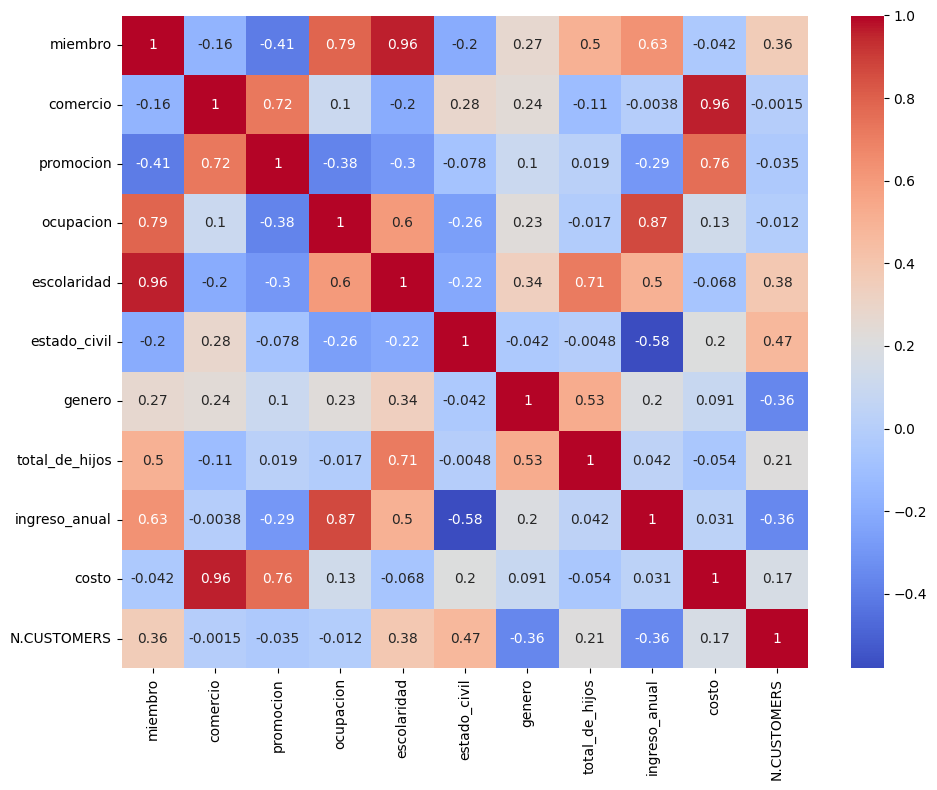

<div style="display: flex; flex-direction: column; align-items: center;">
    
    <a style="color: blue; font-size: 20px; display: block; text-align: center;" href="https://soysena-my.sharepoint.com/:p:/g/personal/mayad_soy_sena_edu_co/Ea_gsdQ3aDFFqF3NC5rS7ZIBNEomWCLsmv0hcuzLXyug5g?e=1zvrOC" target="_blank">Presentacion de Negocios - DataInsider</a>
</div>

#1. Configuración del Ambiente

Para desarrollar este desafío te recomendamos trabajar directamente desde la plataforma **Google Colab**. (Recuerda que debes tener una cuenta en gmail, si aún no la tienes, debes crearla).

- Accede a la siguiente URL: [Google Colaboratory](https://colab.research.google.com/)
- Debes crear un nuevo Notebook, y asignarle el nombre que desees: Ej. La esencia del cliente 1
- Tras seguir los pasos anteriores, debes conectar tu notebook con tu cuenta de **Google Drive**. Para ello, en una nueva celda de código digita y ejecuta:

```
from google.colab import drive
drive.mount('/content/drive')
```

- Accede a las siguientes URLs para descargar el dataset que estaremos utilizando: Cost [Prediction on acquiring Customers.](https://www.kaggle.com/datasets/ramjasmaurya/medias-cost-prediction-in-foodmart)
- Después de descargar el dataset, crea un directorio en tu cuenta de Drive y haz el upload de este.
- Ya estás listo para avanzar a la siguiente etapa. ¡Te deseo muchos Éxitos!

```python
from google.colab import drive
drive.mount('/content/drive')
```

#2. Obtención de los datos

1. Para que puedas cargar en tu notebook los archivos que almacenaste previamente en tu cuenta de Drive, debes utilizar la biblioteca [pandas](https://pandas.pydata.org/docs/user_guide/index.html).

2. Como el dataset original está en inglés, lo vas a dejar todo en español para que puedas tener una mejor comprensión del mismo. La idea no es que inviertas tu tiempo en la traducción del dataset y, por este motivo, aquí te voy a dejar un link con un archivo de python que contiene los diccionarios:

[Diccionarios](https://caelum-online-public.s3.amazonaws.com/challenge-esencia-del-cliente/diccionarios.py)

3. Tu dataset para el análisis lo debes exportar en formato `.csv` y almacenarlo en tu directorio de Drive, pues será necesario para la segunda parte del desafío.

¡Ahora sí puedes avanzar a la siguiente fase! :)

```python
import pandas as pd

media_prediction = pd.read_csv("/content/drive/MyDrive/BootCamp/CHALLENGE/Spring_3/media prediction and its cost.csv");

media_prediction.head()
```

  <div id="df-ac6dd9b6-b906-4a8e-9c00-da6640280e97">
    <div class="colab-df-container">
      <div>
<style scoped>
    .dataframe tbody tr th:only-of-type {
        vertical-align: middle;
    }

    .dataframe tbody tr th {
        vertical-align: top;
    }

    .dataframe thead th {
        text-align: right;
    }

</style>
<table border="1" class="dataframe">
  <thead>
    <tr style="text-align: right;">
      <th></th>
      <th>food_category</th>
      <th>food_department</th>
      <th>food_family</th>
      <th>store_sales(in millions)</th>
      <th>store_cost(in millions)</th>
      <th>unit_sales(in millions)</th>
      <th>promotion_name</th>
      <th>sales_country</th>
      <th>marital_status</th>
      <th>gender</th>
      <th>...</th>
      <th>grocery_sqft</th>
      <th>frozen_sqft</th>
      <th>meat_sqft</th>
      <th>coffee_bar</th>
      <th>video_store</th>
      <th>salad_bar</th>
      <th>prepared_food</th>
      <th>florist</th>
      <th>media_type</th>
      <th>cost</th>
    </tr>
  </thead>
  <tbody>
    <tr>
      <th>0</th>
      <td>Breakfast Foods</td>
      <td>Frozen Foods</td>
      <td>Food</td>
      <td>7.36</td>
      <td>2.7232</td>
      <td>4.0</td>
      <td>Bag Stuffers</td>
      <td>USA</td>
      <td>M</td>
      <td>F</td>
      <td>...</td>
      <td>18670.0</td>
      <td>5415.0</td>
      <td>3610.0</td>
      <td>1.0</td>
      <td>1.0</td>
      <td>1.0</td>
      <td>1.0</td>
      <td>1.0</td>
      <td>Daily Paper, Radio</td>
      <td>126.62</td>
    </tr>
    <tr>
      <th>1</th>
      <td>Breakfast Foods</td>
      <td>Frozen Foods</td>
      <td>Food</td>
      <td>5.52</td>
      <td>2.5944</td>
      <td>3.0</td>
      <td>Cash Register Lottery</td>
      <td>USA</td>
      <td>M</td>
      <td>M</td>
      <td>...</td>
      <td>18670.0</td>
      <td>5415.0</td>
      <td>3610.0</td>
      <td>1.0</td>
      <td>1.0</td>
      <td>1.0</td>
      <td>1.0</td>
      <td>1.0</td>
      <td>Daily Paper, Radio</td>
      <td>59.86</td>
    </tr>
    <tr>
      <th>2</th>
      <td>Breakfast Foods</td>
      <td>Frozen Foods</td>
      <td>Food</td>
      <td>3.68</td>
      <td>1.3616</td>
      <td>2.0</td>
      <td>High Roller Savings</td>
      <td>USA</td>
      <td>S</td>
      <td>F</td>
      <td>...</td>
      <td>18670.0</td>
      <td>5415.0</td>
      <td>3610.0</td>
      <td>1.0</td>
      <td>1.0</td>
      <td>1.0</td>
      <td>1.0</td>
      <td>1.0</td>
      <td>Daily Paper, Radio</td>
      <td>84.16</td>
    </tr>
    <tr>
      <th>3</th>
      <td>Breakfast Foods</td>
      <td>Frozen Foods</td>
      <td>Food</td>
      <td>3.68</td>
      <td>1.1776</td>
      <td>2.0</td>
      <td>Cash Register Lottery</td>
      <td>USA</td>
      <td>M</td>
      <td>F</td>
      <td>...</td>
      <td>18670.0</td>
      <td>5415.0</td>
      <td>3610.0</td>
      <td>1.0</td>
      <td>1.0</td>
      <td>1.0</td>
      <td>1.0</td>
      <td>1.0</td>
      <td>In-Store Coupon</td>
      <td>95.78</td>
    </tr>
    <tr>
      <th>4</th>
      <td>Breakfast Foods</td>
      <td>Frozen Foods</td>
      <td>Food</td>
      <td>4.08</td>
      <td>1.4280</td>
      <td>3.0</td>
      <td>Double Down Sale</td>
      <td>USA</td>
      <td>M</td>
      <td>M</td>
      <td>...</td>
      <td>18670.0</td>
      <td>5415.0</td>
      <td>3610.0</td>
      <td>1.0</td>
      <td>1.0</td>
      <td>1.0</td>
      <td>1.0</td>
      <td>1.0</td>
      <td>Radio</td>
      <td>50.79</td>
    </tr>
  </tbody>
</table>
<p>5 rows × 40 columns</p>
</div>

```python
print(list(media_prediction.columns))
```

    ['food_category', 'food_department', 'food_family', 'store_sales(in millions)', 'store_cost(in millions)', 'unit_sales(in millions)', 'promotion_name', 'sales_country', 'marital_status', 'gender', 'total_children', 'education', 'member_card', 'occupation', 'houseowner', 'avg_cars_at home(approx)', 'avg. yearly_income', 'num_children_at_home', 'avg_cars_at home(approx).1', 'brand_name', 'SRP', 'gross_weight', 'net_weight', 'recyclable_package', 'low_fat', 'units_per_case', 'store_type', 'store_city', 'store_state', 'store_sqft', 'grocery_sqft', 'frozen_sqft', 'meat_sqft', 'coffee_bar', 'video_store', 'salad_bar', 'prepared_food', 'florist', 'media_type', 'cost']

```python
import drive.MyDrive.BootCamp.CHALLENGE.Spring_3.diccionarios as diccionarios

df = media_prediction.copy()

# Obtener el diccionario de mapeo de columnas
column_mappings = diccionarios.columnas

# Mapeo de la columna media_prediction
df['food_category'] = df['food_category'].map(diccionarios.categoria_alimento);
df['food_department'] = df['food_department'].map(diccionarios.departamento);
df['food_family'] = df['food_family'].map(diccionarios.tipo);
df['promotion_name'] = df['promotion_name'].map(diccionarios.promocion);
df['education'] = df['education'].map(diccionarios.escolaridad);
df['member_card'] = df['member_card'].map(diccionarios.miembro);
df['occupation'] = df['occupation'].map(diccionarios.ocupacion);
df['sales_country'] = df['sales_country'].map(diccionarios.pais);
df['marital_status'] = df['marital_status'].map(diccionarios.estado_civil);
df['gender'] = df['gender'].map(diccionarios.genero);
df['avg. yearly_income'] = df['avg. yearly_income'].map(diccionarios.ingreso_anual);
df['houseowner'] = df['houseowner'].map(diccionarios.vivienda_propia);
df['store_type'] = df['store_type'].map(diccionarios.comercio);
df['media_type'] = df['media_type'].map(diccionarios.divulgacion);

df = df.rename(columns=column_mappings)

pd.set_option('display.max_rows', 5)
pd.set_option('display.max_columns', None)
pd.set_option('display.max_rows', None)

df.sample(5)
```

  <div id="df-2c3a29af-fa15-49bd-ae22-11f6876851a4">
    <div class="colab-df-container">
      <div>
<style scoped>
    .dataframe tbody tr th:only-of-type {
        vertical-align: middle;
    }

    .dataframe tbody tr th {
        vertical-align: top;
    }

    .dataframe thead th {
        text-align: right;
    }

</style>
<table border="1" class="dataframe">
  <thead>
    <tr style="text-align: right;">
      <th></th>
      <th>categoria_alimento</th>
      <th>departamento</th>
      <th>tipo</th>
      <th>ventas_tienda(en millones)</th>
      <th>costo_tienda(en millones)</th>
      <th>ventas_unitarias(en millones)</th>
      <th>promocion</th>
      <th>pais</th>
      <th>estado_civil</th>
      <th>genero</th>
      <th>total_de_hijos</th>
      <th>escolaridad</th>
      <th>miembro</th>
      <th>ocupacion</th>
      <th>vivienda_propia</th>
      <th>promedio_autos(aprox)</th>
      <th>ingreso_anual</th>
      <th>numero_hijos</th>
      <th>promedio_autos(aprox)</th>
      <th>marca</th>
      <th>precio_recomendado</th>
      <th>peso_bruto</th>
      <th>peso_neto</th>
      <th>empaque_reciclable</th>
      <th>bajo_en_grasa</th>
      <th>unidades_por_caja</th>
      <th>comercio</th>
      <th>ciudad</th>
      <th>estado</th>
      <th>pies_cuadrados_tienda</th>
      <th>pies_cuadrados_comestibles</th>
      <th>pies_cuadrados_congelados</th>
      <th>pies_cuadrados_carne</th>
      <th>cafeteria</th>
      <th>tienda_de_videos</th>
      <th>barra_de_ensaladas</th>
      <th>comida_preparada</th>
      <th>floristeria</th>
      <th>divulgacion</th>
      <th>costo</th>
    </tr>
  </thead>
  <tbody>
    <tr>
      <th>7514</th>
      <td>Dulces</td>
      <td>Snacks</td>
      <td>Comida</td>
      <td>8.40</td>
      <td>3.1080</td>
      <td>4.0</td>
      <td>Rebajadores de precios</td>
      <td>Estados Unidos</td>
      <td>Casado</td>
      <td>Masculino</td>
      <td>1.0</td>
      <td>Primaria</td>
      <td>NaN</td>
      <td>Técnico</td>
      <td>Sí</td>
      <td>1.0</td>
      <td>20000</td>
      <td>1.0</td>
      <td>1.0</td>
      <td>Musial</td>
      <td>2.10</td>
      <td>19.7</td>
      <td>16.7</td>
      <td>1.0</td>
      <td>0.0</td>
      <td>33.0</td>
      <td>Supermercado de lujo</td>
      <td>Salem</td>
      <td>OR</td>
      <td>27694.0</td>
      <td>18670.0</td>
      <td>5415.0</td>
      <td>3610.0</td>
      <td>1.0</td>
      <td>1.0</td>
      <td>1.0</td>
      <td>1.0</td>
      <td>1.0</td>
      <td>Periódico dominical, radio, televisión</td>
      <td>54.11</td>
    </tr>
    <tr>
      <th>55638</th>
      <td>Productos de cocina</td>
      <td>Artículos para el hogar</td>
      <td>No comestible</td>
      <td>5.70</td>
      <td>1.8810</td>
      <td>3.0</td>
      <td>Días de dólar</td>
      <td>Estados Unidos</td>
      <td>Casado</td>
      <td>Femenino</td>
      <td>5.0</td>
      <td>Secundaria</td>
      <td>Bronce</td>
      <td>Técnico</td>
      <td>Sí</td>
      <td>3.0</td>
      <td>40000</td>
      <td>1.0</td>
      <td>3.0</td>
      <td>Sunset</td>
      <td>1.90</td>
      <td>17.4</td>
      <td>15.3</td>
      <td>1.0</td>
      <td>0.0</td>
      <td>19.0</td>
      <td>Supermercado de lujo</td>
      <td>Tacoma</td>
      <td>WA</td>
      <td>33858.0</td>
      <td>22123.0</td>
      <td>7041.0</td>
      <td>4694.0</td>
      <td>1.0</td>
      <td>0.0</td>
      <td>1.0</td>
      <td>1.0</td>
      <td>1.0</td>
      <td>Periódico diario, radio</td>
      <td>138.81</td>
    </tr>
    <tr>
      <th>17745</th>
      <td>Alimentos para picar</td>
      <td>Alimentos para picar</td>
      <td>Comida</td>
      <td>6.20</td>
      <td>2.6040</td>
      <td>4.0</td>
      <td>Venta Doble</td>
      <td>Estados Unidos</td>
      <td>Casado</td>
      <td>Masculino</td>
      <td>4.0</td>
      <td>Secundaria</td>
      <td>Oro</td>
      <td>Obrero</td>
      <td>No</td>
      <td>4.0</td>
      <td>40000</td>
      <td>4.0</td>
      <td>4.0</td>
      <td>Fort West</td>
      <td>1.55</td>
      <td>18.0</td>
      <td>17.0</td>
      <td>0.0</td>
      <td>0.0</td>
      <td>15.0</td>
      <td>Supermercado de lujo</td>
      <td>Salem</td>
      <td>OR</td>
      <td>27694.0</td>
      <td>18670.0</td>
      <td>5415.0</td>
      <td>3610.0</td>
      <td>1.0</td>
      <td>1.0</td>
      <td>1.0</td>
      <td>1.0</td>
      <td>1.0</td>
      <td>Radio</td>
      <td>50.79</td>
    </tr>
    <tr>
      <th>50526</th>
      <td>Anchoas enlatadas</td>
      <td>Alimentos enlatados</td>
      <td>Comida</td>
      <td>11.40</td>
      <td>5.3580</td>
      <td>4.0</td>
      <td>Duplica tus ahorros</td>
      <td>Canadá</td>
      <td>Soltero</td>
      <td>Masculino</td>
      <td>2.0</td>
      <td>Superior</td>
      <td>Bronce</td>
      <td>Profesional</td>
      <td>Sí</td>
      <td>2.0</td>
      <td>100000</td>
      <td>0.0</td>
      <td>2.0</td>
      <td>Just Right</td>
      <td>2.85</td>
      <td>10.1</td>
      <td>7.1</td>
      <td>1.0</td>
      <td>1.0</td>
      <td>9.0</td>
      <td>Supermercado mediano</td>
      <td>Victoria</td>
      <td>BC</td>
      <td>34452.0</td>
      <td>27463.0</td>
      <td>4193.0</td>
      <td>2795.0</td>
      <td>1.0</td>
      <td>0.0</td>
      <td>0.0</td>
      <td>0.0</td>
      <td>1.0</td>
      <td>Panfletos</td>
      <td>114.72</td>
    </tr>
    <tr>
      <th>11976</th>
      <td>Alimentos ricos en almidón</td>
      <td>Alimentos ricos en almidón</td>
      <td>Comida</td>
      <td>10.92</td>
      <td>3.6036</td>
      <td>4.0</td>
      <td>Venta de dos días</td>
      <td>Estados Unidos</td>
      <td>Soltero</td>
      <td>Masculino</td>
      <td>1.0</td>
      <td>Secundaria</td>
      <td>NaN</td>
      <td>Profesional</td>
      <td>Sí</td>
      <td>2.0</td>
      <td>140000</td>
      <td>0.0</td>
      <td>2.0</td>
      <td>Discover</td>
      <td>2.73</td>
      <td>14.5</td>
      <td>13.5</td>
      <td>1.0</td>
      <td>0.0</td>
      <td>27.0</td>
      <td>Supermercado</td>
      <td>Seattle</td>
      <td>WA</td>
      <td>21215.0</td>
      <td>13305.0</td>
      <td>4746.0</td>
      <td>3164.0</td>
      <td>1.0</td>
      <td>0.0</td>
      <td>0.0</td>
      <td>0.0</td>
      <td>0.0</td>
      <td>Radio</td>
      <td>91.28</td>
    </tr>
  </tbody>
</table>
</div>

```python
df.info()
```

    <class 'pandas.core.frame.DataFrame'>
    RangeIndex: 60428 entries, 0 to 60427
    Data columns (total 40 columns):
     #   Column                         Non-Null Count  Dtype
    ---  ------                         --------------  -----
     0   categoria_alimento             60428 non-null  object
     1   departamento                   60428 non-null  object
     2   tipo                           60428 non-null  object
     3   ventas_tienda(en millones)     60428 non-null  float64
     4   costo_tienda(en millones)      60428 non-null  float64
     5   ventas_unitarias(en millones)  60428 non-null  float64
     6   promocion                      60428 non-null  object
     7   pais                           60428 non-null  object
     8   estado_civil                   60428 non-null  object
     9   genero                         60428 non-null  object
     10  total_de_hijos                 60428 non-null  float64
     11  escolaridad                    60428 non-null  object
     12  miembro                        46561 non-null  object
     13  ocupacion                      60428 non-null  object
     14  vivienda_propia                60428 non-null  object
     15  promedio_autos(aprox)          60428 non-null  float64
     16  ingreso_anual                  60428 non-null  int64
     17  numero_hijos                   60428 non-null  float64
     18  promedio_autos(aprox)          60428 non-null  float64
     19  marca                          60428 non-null  object
     20  precio_recomendado             60428 non-null  float64
     21  peso_bruto                     60428 non-null  float64
     22  peso_neto                      60428 non-null  float64
     23  empaque_reciclable             60428 non-null  float64
     24  bajo_en_grasa                  60428 non-null  float64
     25  unidades_por_caja              60428 non-null  float64
     26  comercio                       60428 non-null  object
     27  ciudad                         60428 non-null  object
     28  estado                         60428 non-null  object
     29  pies_cuadrados_tienda          60428 non-null  float64
     30  pies_cuadrados_comestibles     60428 non-null  float64
     31  pies_cuadrados_congelados      60428 non-null  float64
     32  pies_cuadrados_carne           60428 non-null  float64
     33  cafeteria                      60428 non-null  float64
     34  tienda_de_videos               60428 non-null  float64
     35  barra_de_ensaladas             60428 non-null  float64
     36  comida_preparada               60428 non-null  float64
     37  floristeria                    60428 non-null  float64
     38  divulgacion                    60428 non-null  object
     39  costo                          60428 non-null  float64
    dtypes: float64(23), int64(1), object(16)
    memory usage: 18.4+ MB

#3. Exploración de los datos

La exploración visual de datos permite a los científicos de datos examinar y explorar grandes volúmenes de datos de manera intuitiva y eficiente. Al representar los datos visualmente, se pueden identificar características importantes, como valores atípicos, distribuciones, correlaciones y agrupaciones, que podrían no ser evidentes al examinar solo los números o las tablas de datos.

Se trata de una herramienta poderosa para comprender, analizar y comunicar información clave presente en los conjuntos de datos, brindando una comprensión más profunda y facilitando la toma de decisiones informadas.

1. Haciendo uso de [Matplotlib](https://matplotlib.org/) y [Seaborn](https://seaborn.pydata.org/) vamos a generar diversos gráficos para entender mejor nuestros datos.

2. Ejemplo: A través de un histograma, podrás observar la distribución de ingresos anuales de los clientes, por ejemplo. (Siéntete libre de escoger las variables que desees visualizar, y genera varios gráficos, según lo consideres pertinente)

3. Es importante que escribas todas tus observaciones e hipótesis en la medida que generes los gráficos. Puedes utilizar una celda de texto de tu notebook para hacerlo.

Tip: Voy a dejar a continuación algunas variables que pueden ser de interés para tenerlas en cuenta en tu análisis visual: Escolaridad, Ocupación, Miembro, Género, Estado Civil, Número de Hijos, Ingresos_anuales, Categoría de alimentos, Tipo, entre otras.

```python
import seaborn as sns
import matplotlib.pyplot as plt

# Crear figura con dos subplots
fig, (ax1, ax2) = plt.subplots(1, 2, figsize=(14, 5))

# Gráfico izquierdo
sns.barplot(x='escolaridad', y='ingreso_anual', data=df, ax=ax1)
ax1.set_title("Ingreso Anual", fontsize=12)
ax1.set_xlabel("Escolaridad", fontsize=10)
ax1.set_ylabel("Ingreso", fontsize=10)

# Gráfico derecho
sns.barplot(x='escolaridad', y='numero_hijos', data=df, ax=ax2)
ax2.set_title("Número de Hijos", fontsize=12)
ax2.set_xlabel("Escolaridad", fontsize=10)
ax2.set_ylabel("Número de Hijos", fontsize=10)

# Ajustar espaciado entre subplots
plt.tight_layout()

plt.show()
```


```python
import seaborn as sns
import matplotlib.pyplot as plt

# Crear figura con dos subplots
fig, (ax1, ax2) = plt.subplots(1, 2, figsize=(14, 5))

# Gráfico izquierdo
sns.violinplot(x='ocupacion', y='ventas_unitarias(en millones)', data=df, ax=ax1)
ax1.set_title("Ventas Unitarias por Ocupación (en millones)", fontsize=12)
ax1.set_xlabel("Ocupación", fontsize=10)
ax1.set_ylabel("Ventas Unitarias", fontsize=10)

# Gráfico derecho
sns.violinplot(x='ocupacion', y='costo_tienda(en millones)', data=df, ax=ax2)
ax2.set_title("Costo Tienda por Ocupación (en millones)", fontsize=12)
ax2.set_xlabel("Ocupación", fontsize=10)
ax2.set_ylabel("Costo Tienda", fontsize=10)

# Ajustar espaciado entre subplots
plt.tight_layout()

plt.show()
```


```python
import seaborn as sns
import matplotlib.pyplot as plt

fig, (ax1, ax2) = plt.subplots(1, 2, figsize=(14, 5))

# Gráfico izquierdo
sns.boxplot(x='miembro', y='ingreso_anual', data=df, ax=ax1)
ax1.set_title('Ingreso Anual', fontsize=12)
ax1.set_xlabel('Miembro', fontsize=10)
ax1.set_ylabel('Ingreso', fontsize=10)

# Gráfico derecho
sns.boxplot(x='miembro', y='numero_hijos', data=df, ax=ax2)
ax2.set_title('Número de Hijos', fontsize=12)
ax2.set_xlabel('Miembro', fontsize=10)
ax2.set_ylabel('Número de Hijos', fontsize=10)

plt.tight_layout()
plt.show()
```


```python
import seaborn as sns
import matplotlib.pyplot as plt

# Crear figura con dos subplots
fig, (ax1, ax2) = plt.subplots(1, 2, figsize=(14, 5))

# Gráfico izquierdo
sns.lineplot(x='genero', y='ingreso_anual', data=df, ax=ax1)
ax1.set_title('Ingreso Anual', fontsize=12)
ax1.set_xlabel('Género', fontsize=10)
ax1.set_ylabel('Ingreso', fontsize=10)

# Gráfico derecho
sns.lineplot(x='genero', y='total_de_hijos', data=df, ax=ax2)
ax2.set_title('Total de Hijos', fontsize=12)
ax2.set_xlabel('Género', fontsize=10)
ax2.set_ylabel('Total de Hijos', fontsize=10)

plt.tight_layout()
plt.show()
```


```python
import seaborn as sns
import matplotlib.pyplot as plt

# Crear figura con dos subplots
fig, (ax1, ax2) = plt.subplots(1, 2, figsize=(14, 5))

# Gráfico izquierdo
sns.boxplot(x='estado_civil', y='ventas_tienda(en millones)', data=df, ax=ax1)
ax1.set_title('Ventas de la Tienda', fontsize=12)
ax1.set_xlabel('Estado Civil', fontsize=10)
ax1.set_ylabel('Ventas (millones)', fontsize=10)

# Gráfico derecho
sns.boxplot(x='estado_civil', y='peso_neto', data=df, ax=ax2)
ax2.set_title('Peso Neto', fontsize=12)
ax2.set_xlabel('Estado Civil', fontsize=10)
ax2.set_ylabel('Peso Neto (kg)', fontsize=10)

plt.tight_layout()
plt.show()
```


```python
import seaborn as sns
import matplotlib.pyplot as plt

# Crear figura
fig, ax = plt.subplots()

# Gráfico de violín
sns.violinplot(x='escolaridad', y='numero_hijos', data=df, ax=ax)

plt.tight_layout()
plt.show()
```


```python
import seaborn as sns
import matplotlib.pyplot as plt

# Crear figura con dos subplots
fig, (ax1, ax2) = plt.subplots(1, 2, figsize=(14, 5))

# Gráfico izquierdo
sns.barplot(x='pais', y='ingreso_anual', data=df, ax=ax1)
ax1.set_ylim(50000, 60000) # Acotar eje y
ax1.set_title("Ingreso Anual vs País", fontsize=12)
ax1.set_xlabel("País", fontsize=10)
ax1.set_ylabel("Ingreso Anual", fontsize=10)

# Gráfico derecho
sns.barplot(x='estado_civil', y='ingreso_anual', data=df, ax=ax2)
ax2.set_ylim(50000, 60000) # Acotar eje y
ax2.set_title("Ingreso Anual vs Estado Civil", fontsize=12)
ax2.set_xlabel("Estado Civil", fontsize=10)
ax2.set_ylabel("Ingreso Anual", fontsize=10)

# Ajustar espaciado entre subplots
plt.tight_layout()

plt.show()
```


```python
import seaborn as sns
import matplotlib.pyplot as plt

# Obtener top 10 categorías
top10_ventas = df['categoria_alimento'].value_counts().index[:10]
top10_costo = df.groupby('categoria_alimento')['costo'].mean().sort_values(ascending=False).index[:10]

# Filtrar df
df_top10 = df[df['categoria_alimento'].isin(top10_ventas) | df['categoria_alimento'].isin(top10_costo)]

# Crear figura con dos subplots
fig, (ax1, ax2) = plt.subplots(1, 2, figsize=(14, 5))

# Gráfico izquierdo
sns.boxplot(x='ventas_unitarias(en millones)', y='categoria_alimento', data=df_top10, ax=ax1)
ax1.set_title("Ventas Unitarias", fontsize=12)
ax1.set_ylabel("Categoría Alimento", fontsize=10)
ax1.set_xlabel("Ventas Unitarias", fontsize=10)

# Gráfico derecho - Barras
ax2.set_xlim(80, 120) # Establecer límites de eje x
sns.barplot(x='costo', y='categoria_alimento', data=df_top10, ax=ax2)
ax2.set_title("Costo", fontsize=12)
ax2.set_ylabel("Costo", fontsize=10)
ax2.set_xlabel("Categoría Alimento", fontsize=10)

# Ajustar espaciado
plt.tight_layout()

plt.show()
```


```python
import matplotlib.pyplot as plt

# Gráficos de torta más pequeños con figsize
fig, (ax1, ax2) = plt.subplots(1, 2, figsize=(10, 5))

# Ventas unitarias
ventas_por_tipo = df.groupby('tipo')['ventas_unitarias(en millones)'].sum()
ax1.pie(ventas_por_tipo, labels=ventas_por_tipo.index, autopct='%1.1f%%')
ax1.set_title("Ventas Unitarias por Tipo")

# Costos
costos_por_tipo = df.groupby('tipo')['costo'].sum()
ax2.pie(costos_por_tipo, labels=costos_por_tipo.index, autopct='%1.1f%%')
ax2.set_title("Costo por Tipo")

plt.tight_layout()
plt.show()
```


#4. Preprocesamiento y Obtención de Features

1. En esta fase es importante utilizar una forma de codificar las variables categóricas para que el modelo de clusterización las pueda reconocer. Puedes usar [one-hot-encoder](https://scikit-learn.org/stable/modules/generated/sklearn.preprocessing.OneHotEncoder.html), [get_dummies](https://pandas.pydata.org/pandas-docs/stable/reference/api/pandas.get_dummies.html), o establecer un valor numérico para las variables de acuerdo con tu percepción; por ejemplo, si queremos categorizar primaria, secundaria y universidad, podríamos decir que el valor numérico para primaria podría ser 1, el valor numérico para secundaria, 2, y así sucesivamente. (Es importante aclarar que en ejemplo citado, asignamos los valores a cada nivel porque sabemos que primaria es menor que secundaria, y secundaria menor que universidad)

2. Tras establecer un método de codificación para tus variables categóricas, debes reemplazar los valores numéricos asignados en el dataset para sustituir las cadenas de texto.

Tip: La pregunta que te debes estar haciendo es: ¿Será que tengo que codificar todas las columnas categóricas del dataset? La respuesta es no; únicamente codifica las columnas que tu consideres que puedan ser relevantes para la clusterización.

3. Teniendo en cuenta el paso anterior, debes en efecto seleccionar las variables que sean más relevantes para el caso de estudio: Se desea agrupar a los clientes en diversos clusters para entender sus características y brindarles el mejor servicio.

4. Con tus atributos seleccionados, **al menos 6 y máximo 12**, procederemos a estandarizar nuestros datos (que en este punto deben ser todos numéricos) para que todas las variables puedan ser tenidas en cuenta dentro de una misma escala. Varios de los hiperparámetros utilizados en las funciones de un modelo de Machine Learning asumen que todas las características están centradas alrededor de 0 y tienen varianza en el mismo orden. Si uno de los atributos del dataset tiene una varianza con orden de magnitud muy superior al de los demás atributos, puede dominar la función del modelo y hacer que el estimador no aprenda correctamente de los otros atributos como se espera. Vamos a utilizar con el [StandardScaler](https://scikit-learn.org/stable/modules/generated/sklearn.preprocessing.StandardScaler.html). Puedes almacenar los valores estandarizados en una variable llamada `X_std` , por ejemplo.

¡Vas a obtener un numpy array listo para avanzar a la próxima fase!

```python
df.sample(5)
```

  <div id="df-768c33ae-da98-4f81-a7e8-39f344ec61b9">
    <div class="colab-df-container">
      <div>
<style scoped>
    .dataframe tbody tr th:only-of-type {
        vertical-align: middle;
    }

    .dataframe tbody tr th {
        vertical-align: top;
    }

    .dataframe thead th {
        text-align: right;
    }

</style>
<table border="1" class="dataframe">
  <thead>
    <tr style="text-align: right;">
      <th></th>
      <th>categoria_alimento</th>
      <th>departamento</th>
      <th>tipo</th>
      <th>ventas_tienda(en millones)</th>
      <th>costo_tienda(en millones)</th>
      <th>ventas_unitarias(en millones)</th>
      <th>promocion</th>
      <th>pais</th>
      <th>estado_civil</th>
      <th>genero</th>
      <th>total_de_hijos</th>
      <th>escolaridad</th>
      <th>miembro</th>
      <th>ocupacion</th>
      <th>vivienda_propia</th>
      <th>promedio_autos(aprox)</th>
      <th>ingreso_anual</th>
      <th>numero_hijos</th>
      <th>promedio_autos(aprox)</th>
      <th>marca</th>
      <th>precio_recomendado</th>
      <th>peso_bruto</th>
      <th>peso_neto</th>
      <th>empaque_reciclable</th>
      <th>bajo_en_grasa</th>
      <th>unidades_por_caja</th>
      <th>comercio</th>
      <th>ciudad</th>
      <th>estado</th>
      <th>pies_cuadrados_tienda</th>
      <th>pies_cuadrados_comestibles</th>
      <th>pies_cuadrados_congelados</th>
      <th>pies_cuadrados_carne</th>
      <th>cafeteria</th>
      <th>tienda_de_videos</th>
      <th>barra_de_ensaladas</th>
      <th>comida_preparada</th>
      <th>floristeria</th>
      <th>divulgacion</th>
      <th>costo</th>
    </tr>
  </thead>
  <tbody>
    <tr>
      <th>49698</th>
      <td>Productos de baño</td>
      <td>Salud e higiene</td>
      <td>No comestible</td>
      <td>10.86</td>
      <td>3.3666</td>
      <td>3.0</td>
      <td>Adelante</td>
      <td>Estados Unidos</td>
      <td>Soltero</td>
      <td>Masculino</td>
      <td>0.0</td>
      <td>Secundaria</td>
      <td>Bronce</td>
      <td>Técnico</td>
      <td>No</td>
      <td>3.0</td>
      <td>40000</td>
      <td>0.0</td>
      <td>3.0</td>
      <td>Hilltop</td>
      <td>3.62</td>
      <td>19.30</td>
      <td>16.20</td>
      <td>0.0</td>
      <td>0.0</td>
      <td>32.0</td>
      <td>Supermercado</td>
      <td>Portland</td>
      <td>OR</td>
      <td>20319.0</td>
      <td>16232.0</td>
      <td>2452.0</td>
      <td>1635.0</td>
      <td>0.0</td>
      <td>0.0</td>
      <td>0.0</td>
      <td>0.0</td>
      <td>0.0</td>
      <td>Periódico diario, radio</td>
      <td>67.01</td>
    </tr>
    <tr>
      <th>38768</th>
      <td>Alimentos para picar</td>
      <td>Alimentos para picar</td>
      <td>Comida</td>
      <td>2.04</td>
      <td>0.6528</td>
      <td>4.0</td>
      <td>Ahorro para apostadores grandes</td>
      <td>Estados Unidos</td>
      <td>Casado</td>
      <td>Masculino</td>
      <td>1.0</td>
      <td>Superior</td>
      <td>Plata</td>
      <td>Profesional</td>
      <td>Sí</td>
      <td>3.0</td>
      <td>60000</td>
      <td>1.0</td>
      <td>3.0</td>
      <td>Fast</td>
      <td>0.51</td>
      <td>12.30</td>
      <td>11.30</td>
      <td>1.0</td>
      <td>1.0</td>
      <td>26.0</td>
      <td>Supermercado gourmet</td>
      <td>Beverly Hills</td>
      <td>CA</td>
      <td>23688.0</td>
      <td>15337.0</td>
      <td>5011.0</td>
      <td>3340.0</td>
      <td>1.0</td>
      <td>1.0</td>
      <td>1.0</td>
      <td>1.0</td>
      <td>1.0</td>
      <td>Periódico dominical, radio, televisión</td>
      <td>95.55</td>
    </tr>
    <tr>
      <th>36419</th>
      <td>Carne</td>
      <td>Charcutería</td>
      <td>Comida</td>
      <td>2.98</td>
      <td>1.0728</td>
      <td>2.0</td>
      <td>Descuento de fin de semana</td>
      <td>Estados Unidos</td>
      <td>Casado</td>
      <td>Femenino</td>
      <td>2.0</td>
      <td>Primaria</td>
      <td>NaN</td>
      <td>Obrero</td>
      <td>Sí</td>
      <td>1.0</td>
      <td>20000</td>
      <td>2.0</td>
      <td>1.0</td>
      <td>Moms</td>
      <td>1.49</td>
      <td>11.30</td>
      <td>10.30</td>
      <td>1.0</td>
      <td>0.0</td>
      <td>32.0</td>
      <td>Supermercado</td>
      <td>Los Angeles</td>
      <td>CA</td>
      <td>23598.0</td>
      <td>14210.0</td>
      <td>5633.0</td>
      <td>3755.0</td>
      <td>0.0</td>
      <td>0.0</td>
      <td>0.0</td>
      <td>0.0</td>
      <td>1.0</td>
      <td>Panfletos</td>
      <td>53.37</td>
    </tr>
    <tr>
      <th>4781</th>
      <td>Vegetales</td>
      <td>Productos frescos</td>
      <td>Comida</td>
      <td>7.32</td>
      <td>2.9280</td>
      <td>4.0</td>
      <td>Ahorro de precios</td>
      <td>México</td>
      <td>Soltero</td>
      <td>Masculino</td>
      <td>2.0</td>
      <td>Secundaria</td>
      <td>Bronce</td>
      <td>Profesional</td>
      <td>Sí</td>
      <td>4.0</td>
      <td>140000</td>
      <td>0.0</td>
      <td>4.0</td>
      <td>Hermanos</td>
      <td>1.83</td>
      <td>9.71</td>
      <td>8.71</td>
      <td>1.0</td>
      <td>0.0</td>
      <td>6.0</td>
      <td>Supermercado</td>
      <td>Orizaba</td>
      <td>Veracruz</td>
      <td>34791.0</td>
      <td>26354.0</td>
      <td>5062.0</td>
      <td>3375.0</td>
      <td>0.0</td>
      <td>0.0</td>
      <td>1.0</td>
      <td>1.0</td>
      <td>0.0</td>
      <td>Televisión</td>
      <td>77.72</td>
    </tr>
    <tr>
      <th>780</th>
      <td>Pan</td>
      <td>Productos horneados</td>
      <td>Comida</td>
      <td>6.54</td>
      <td>2.8122</td>
      <td>2.0</td>
      <td>Venta de dos días</td>
      <td>México</td>
      <td>Soltero</td>
      <td>Masculino</td>
      <td>1.0</td>
      <td>Técnico</td>
      <td>Bronce</td>
      <td>Cargo de Oficina</td>
      <td>Sí</td>
      <td>3.0</td>
      <td>40000</td>
      <td>0.0</td>
      <td>3.0</td>
      <td>Colony</td>
      <td>3.27</td>
      <td>7.71</td>
      <td>5.71</td>
      <td>0.0</td>
      <td>0.0</td>
      <td>18.0</td>
      <td>Supermercado de lujo</td>
      <td>Hidalgo</td>
      <td>Zacatecas</td>
      <td>30584.0</td>
      <td>21938.0</td>
      <td>5188.0</td>
      <td>3458.0</td>
      <td>1.0</td>
      <td>1.0</td>
      <td>1.0</td>
      <td>1.0</td>
      <td>1.0</td>
      <td>Radio</td>
      <td>94.79</td>
    </tr>
  </tbody>
</table>
</div>

```python
print(df["divulgacion"].unique())
```

    ['Periódico diario, radio' 'Cupón en la tienda' 'Radio' 'Periódico diario'
     'Anexo del producto' 'Periódico dominical, radio'
     'Periódico dominical, radio, televisión' 'Periódico dominical'
     'Panfletos' 'Televisión' 'Correo masivo' 'Entrega en el punto de venta'
     'Periódico diario, radio, televisión']

```python
import pandas as pd
import numpy as np

df_filter = df.copy()

# Mapear valores a números
categoria_alimento_map={'Alimentos para el desayuno':1,'Pan':2,'Camarones enlatados':3,
                        'Productos para hornear':4,'Vegetales':5,'Postres congelados':6,
                        'Dulces':7,'Alimentos para picar':8,'Productos lácteos':9,
                        'Alimentos ricos en almidón':10,'Suministros de limpieza':11,
                        'Descongestionantes':12,'Carne':13,'Bebidas calientes':14,
                        'Mermeladas y jaleas':15,'Bebidas carbonatadas':16,'Mariscos':17,
                        'Especialidades':18,'Productos de cocina':19,'Eléctrico':20,
                        'Cerveza y vino':21,'Velas':22,'Fruta':23,'Bebidas de jugo puro':24,
                        'Sopa enlatada':25,'Productos de papel':26,'Atún enlatado':27,
                        'Huevos':28,'Artículos de ferretería':29,'Sardinas enlatadas':30,
                        'Almejas enlatadas':31,'Analgésicos':32,'Acompañamientos':33,
                        'Productos de baño':34,'Revistas':35,'Platos preparados congelados':36,
                        'Pizza':37,'Remedios para el resfriado':38,'Anchoas enlatadas':39,
                        'Bebidas':40,'Higiene':41,'Productos de plástico':42,
                        'Ostras enlatadas':43,'Vegetales envasados':44,'Misceláneos':45}
departamento_map={'Alimentos congelados':1, 'Productos horneados':2,
                  'Alimentos enlatados':3,'Productos para hornear':4,
                  'Productos frescos':5, 'Snacks':6, 'Alimentos para picar':7,
                  'Productos lácteos':8, 'Alimentos ricos en almidón':9,
                  'Artículos para el hogar':10, 'Salud e higiene':11, 'Carne':12,
                  'Bebidas':13, 'Mariscos':14, 'Charcutería':15, 'Bebidas alcohólicas':16,
                  'Productos enlatados':17, 'Huevos':18, 'Publicaciones periódicas':19,
                  'Alimentos para el desayuno':20, 'Caja de salida':21, 'Carrusel':22}
tipo_map = {'Comida': 1, 'No comestible': 2, 'Bebida': 3}
promocion_map={'Bolsas llenas':1,'Lotería de la caja registradora':2,
               'Ahorro para apostadores grandes':3,'Venta Doble':4,'Días de luz verde':5,
               'Ahorro Enorme':6, 'Ahorro de precios':7,'Rebajadores de precios':8,
               'Días de dólar':9,'Venta de dos días':10,'Super Ahorradores':11,
               'Descuento de fin de semana':12,'Recortadores de dólares':13,
               'Promociones por montones':14,'Gran promoción':15,'Gratis para todos':16,
               'Ahorros por montones':17,'Ahorro de precios imbatible':18,
               'Aplastadores de precios':19,'Días de liquidación de estanterías':20,
               'Días de venta':21, 'Adelante':22,'Super Ahorro':23,'Ahorradores de billetera':24,
               'Venta Ahorra Ya':25,'Destructores de precios':26,'Dos por uno':27,
               'Descuentos de gran magnitud':28,'Estantes vacíos':29,'Adiós bebé':30,
               'Venta de un día':31,'Descuentos fantásticos':32,'Días de ahorro':33,
               'Ganadores de ventas':34,'Espectacular de cupones':35,'Tres por uno':36,
               'Ganadores de precios':37,'Más barato':38,'Venta No Puedo Creerlo':39,
               'Ahorradores de dinero':40,'Especial luz verde':41,'Rebajando precios':42,
               'Ahorro de primera clase':43,'Mejores ahorros':44,'Elige tus ahorros':45,
               'Duplica tus ahorros':46,'Venta misteriosa':47,
               'Super ahorradores de billetera':48}
pais_map ={'Estados Unidos':1, 'México':2, 'Canadá':3}
estado_civil_map={'Casado':1, 'Soltero':2}
genero_map={'Femenino':1, 'Masculino':2}
estado_map={'OR':1, 'WA':2, 'CA':3, 'Veracruz':4, 'Yucatan':5, 'Zacatecas':6, 'DF':7,
            'BC':8, 'Jalisco':9, 'Guerrero':10}
escolaridad_map={'Primaria':1, 'Superior':2, 'Secundaria':3, 'Maestría':4, 'Técnico':5}
miembro_map = {np.nan: 0, 'Plata': 1, 'Bronce': 2, 'Oro': 3}
ocupacion_map={'Técnico':1, 'Profesional':2, 'Obrero':3, 'Gestión':4, 'Cargo de Oficina':5}
vivienda_propia_map={'Sí':1, 'No':0}
marca_map={'Carrington':1,'Golden':2,'Imagine':3,'Big Time':4,'PigTail':5,'Fantastic':6,
           'Great':7,'Sphinx':8,'Modell':9,'Colony':10,'Blue Label':11,'Pleasant':12,
           'Bravo':13,'Better':14,'Just Right':15,'Plato':16,'BBB Best':17,'Landslide':18,
           'Super':19,'CDR':20,'High Top':21,'Tri-State':22,'Hermanos':23,'Tell Tale':24,
           'Ebony':25,'Thresher':26,'Gulf Coast':27,'Musial':28,'Atomic':29,'Choice':30,
           'Fort West':31,'Nationeel':32,'Horatio':33,'Best Choice':34,'Fast':35,'Gorilla':36,
           'Carlson':37,'Even Better':38,'Club':39,'Booker':40,'Shady Lake':41,'Monarch':42,
           'Discover':43,'Colossal':44,'Medalist':45,'Jardon':46,'Cormorant':47,'Sunset':48,
           'Red Wing':49,'High Quality':50,'Denny':51,'Faux Products':52,'Steady':53,
           'Consolidated':54,'Bird Call':55,'Hilltop':56,'Ship Shape':57,'Footnote':58,
           'Genteel':59,'Quick':60,'Gerolli':61,'Excellent':62,'Fabulous':63,'Token':64,
           'Skinner':65,'Washington':66,'Dual City':67,'Kiwi':68,'Tip Top':69,'Amigo':70,
           'Curlew':71,'Moms':72,'Cutting Edge':73,'Red Spade':74,'Lake':75,'American':76,
           'Walrus':77,'Pearl':78,'Good':79,'Top Measure':80,'Portsmouth':81,'Toucan':82,
           'Applause':83,'Swell':84,'Green Ribbon':85,'Big City':86,'National':87,
           'Blue Medal':88,'Urban':89,'Jumbo':90,'Giant':91,'Dollar':92,'Mighty Good':93,
           'Robust':94,'Gauss':95,'Excel':96,'Radius':97,'Best':98,'Jeffers':99,'Johnson':100,
           'Special':101,'Akron':102,'Framton':103,'Black Tie':104,'Queen':105,'James Bay':106,
           'Toretti':107,'Prelude':108,'Symphony':109,'ADJ':110,'King':111}
comercio_map={'Supermercado de lujo':1, 'Supermercado':2, 'Supermercado gourmet':3,
          'Pequeño supermercado':4, 'Supermercado mediano':5}
ciudad_map={'Salem':1,'Tacoma':2,'Seattle':3,'Spokane':4,'Los Angeles':5,'Beverly Hills':6,
            'Portland':7,'Bellingham':8,'Orizaba':9,'Merida':10,'Hidalgo':11,'Mexico City':12,
            'Vancouver':13,'Bremerton':14,'Camacho':15,'Guadalajara':16,'Acapulco':17,
            'San Francisco':18,'Victoria':19}
divulgacion_map={'Periódico diario, radio':1,'Cupón en la tienda':2,'Radio':3,
                 'Periódico diario':4,'Anexo del producto':5,'Periódico dominical, radio':6,
                 'Periódico dominical, radio, televisión':7,'Periódico dominical':8,
                 'Panfletos':9,'Televisión':10,'Correo masivo':11,
                 'Entrega en el punto de venta':12,'Periódico diario, radio, televisión':13}


df_filter['categoria_alimento'] = df_filter['categoria_alimento'].map(categoria_alimento_map)
df_filter['departamento'] = df_filter['departamento'].map(departamento_map)
df_filter['tipo'] = df_filter['tipo'].map(tipo_map)
df_filter['promocion'] = df_filter['promocion'].map(promocion_map)
df_filter['pais'] = df_filter['pais'].map(pais_map)
df_filter['estado_civil'] = df_filter['estado_civil'].map(estado_civil_map)
df_filter['genero'] = df_filter['genero'].map(genero_map)
df_filter['estado'] = df_filter['estado'].map(estado_map)
df_filter['escolaridad'] = df_filter['escolaridad'].map(escolaridad_map)
df_filter['miembro'] = df_filter['miembro'].map(miembro_map)
df_filter['ocupacion'] = df_filter['ocupacion'].map(ocupacion_map)
df_filter['vivienda_propia'] = df_filter['vivienda_propia'].map(vivienda_propia_map)
df_filter['marca'] = df_filter['marca'].map(marca_map)
df_filter['comercio'] = df_filter['comercio'].map(comercio_map)
df_filter['ciudad'] = df_filter['ciudad'].map(ciudad_map)
df_filter['divulgacion'] = df_filter['divulgacion'].map(divulgacion_map)

df_filter.sample(5)
```

  <div id="df-d9fcd20c-1745-4040-a1f1-4b122254b6fc">
    <div class="colab-df-container">
      <div>
<style scoped>
    .dataframe tbody tr th:only-of-type {
        vertical-align: middle;
    }

    .dataframe tbody tr th {
        vertical-align: top;
    }

    .dataframe thead th {
        text-align: right;
    }

</style>
<table border="1" class="dataframe">
  <thead>
    <tr style="text-align: right;">
      <th></th>
      <th>categoria_alimento</th>
      <th>departamento</th>
      <th>tipo</th>
      <th>ventas_tienda(en millones)</th>
      <th>costo_tienda(en millones)</th>
      <th>ventas_unitarias(en millones)</th>
      <th>promocion</th>
      <th>pais</th>
      <th>estado_civil</th>
      <th>genero</th>
      <th>total_de_hijos</th>
      <th>escolaridad</th>
      <th>miembro</th>
      <th>ocupacion</th>
      <th>vivienda_propia</th>
      <th>promedio_autos(aprox)</th>
      <th>ingreso_anual</th>
      <th>numero_hijos</th>
      <th>promedio_autos(aprox)</th>
      <th>marca</th>
      <th>precio_recomendado</th>
      <th>peso_bruto</th>
      <th>peso_neto</th>
      <th>empaque_reciclable</th>
      <th>bajo_en_grasa</th>
      <th>unidades_por_caja</th>
      <th>comercio</th>
      <th>ciudad</th>
      <th>estado</th>
      <th>pies_cuadrados_tienda</th>
      <th>pies_cuadrados_comestibles</th>
      <th>pies_cuadrados_congelados</th>
      <th>pies_cuadrados_carne</th>
      <th>cafeteria</th>
      <th>tienda_de_videos</th>
      <th>barra_de_ensaladas</th>
      <th>comida_preparada</th>
      <th>floristeria</th>
      <th>divulgacion</th>
      <th>costo</th>
    </tr>
  </thead>
  <tbody>
    <tr>
      <th>46056</th>
      <td>5</td>
      <td>3</td>
      <td>1</td>
      <td>2.61</td>
      <td>0.9918</td>
      <td>3.0</td>
      <td>5</td>
      <td>2</td>
      <td>1</td>
      <td>1</td>
      <td>2.0</td>
      <td>2</td>
      <td>2</td>
      <td>2</td>
      <td>0</td>
      <td>2.0</td>
      <td>60000</td>
      <td>1.0</td>
      <td>2.0</td>
      <td>13</td>
      <td>0.87</td>
      <td>13.40</td>
      <td>11.30</td>
      <td>0.0</td>
      <td>0.0</td>
      <td>32.0</td>
      <td>3</td>
      <td>15</td>
      <td>6</td>
      <td>23759.0</td>
      <td>16844.0</td>
      <td>4149.0</td>
      <td>2766.0</td>
      <td>1.0</td>
      <td>0.0</td>
      <td>1.0</td>
      <td>1.0</td>
      <td>1.0</td>
      <td>4</td>
      <td>75.76</td>
    </tr>
    <tr>
      <th>59222</th>
      <td>34</td>
      <td>11</td>
      <td>2</td>
      <td>4.47</td>
      <td>2.0562</td>
      <td>3.0</td>
      <td>5</td>
      <td>2</td>
      <td>2</td>
      <td>2</td>
      <td>3.0</td>
      <td>1</td>
      <td>2</td>
      <td>2</td>
      <td>0</td>
      <td>1.0</td>
      <td>80000</td>
      <td>0.0</td>
      <td>1.0</td>
      <td>56</td>
      <td>1.49</td>
      <td>13.10</td>
      <td>10.10</td>
      <td>0.0</td>
      <td>0.0</td>
      <td>9.0</td>
      <td>1</td>
      <td>10</td>
      <td>5</td>
      <td>30797.0</td>
      <td>20141.0</td>
      <td>6393.0</td>
      <td>4262.0</td>
      <td>1.0</td>
      <td>1.0</td>
      <td>1.0</td>
      <td>1.0</td>
      <td>1.0</td>
      <td>8</td>
      <td>92.57</td>
    </tr>
    <tr>
      <th>9292</th>
      <td>8</td>
      <td>7</td>
      <td>1</td>
      <td>6.90</td>
      <td>3.1050</td>
      <td>3.0</td>
      <td>48</td>
      <td>1</td>
      <td>2</td>
      <td>1</td>
      <td>1.0</td>
      <td>4</td>
      <td>2</td>
      <td>2</td>
      <td>1</td>
      <td>3.0</td>
      <td>40000</td>
      <td>0.0</td>
      <td>3.0</td>
      <td>31</td>
      <td>2.30</td>
      <td>8.32</td>
      <td>6.31</td>
      <td>0.0</td>
      <td>0.0</td>
      <td>23.0</td>
      <td>2</td>
      <td>7</td>
      <td>1</td>
      <td>20319.0</td>
      <td>16232.0</td>
      <td>2452.0</td>
      <td>1635.0</td>
      <td>0.0</td>
      <td>0.0</td>
      <td>0.0</td>
      <td>0.0</td>
      <td>0.0</td>
      <td>12</td>
      <td>140.19</td>
    </tr>
    <tr>
      <th>43814</th>
      <td>5</td>
      <td>1</td>
      <td>1</td>
      <td>6.66</td>
      <td>2.2644</td>
      <td>3.0</td>
      <td>21</td>
      <td>1</td>
      <td>2</td>
      <td>1</td>
      <td>4.0</td>
      <td>2</td>
      <td>2</td>
      <td>2</td>
      <td>0</td>
      <td>3.0</td>
      <td>60000</td>
      <td>0.0</td>
      <td>3.0</td>
      <td>1</td>
      <td>2.22</td>
      <td>16.10</td>
      <td>14.10</td>
      <td>1.0</td>
      <td>0.0</td>
      <td>29.0</td>
      <td>2</td>
      <td>4</td>
      <td>2</td>
      <td>30268.0</td>
      <td>22063.0</td>
      <td>4923.0</td>
      <td>3282.0</td>
      <td>0.0</td>
      <td>0.0</td>
      <td>0.0</td>
      <td>0.0</td>
      <td>0.0</td>
      <td>11</td>
      <td>116.74</td>
    </tr>
    <tr>
      <th>16994</th>
      <td>4</td>
      <td>4</td>
      <td>1</td>
      <td>2.50</td>
      <td>1.2250</td>
      <td>2.0</td>
      <td>36</td>
      <td>1</td>
      <td>2</td>
      <td>1</td>
      <td>1.0</td>
      <td>1</td>
      <td>0</td>
      <td>3</td>
      <td>0</td>
      <td>2.0</td>
      <td>20000</td>
      <td>0.0</td>
      <td>2.0</td>
      <td>18</td>
      <td>1.25</td>
      <td>9.48</td>
      <td>6.47</td>
      <td>0.0</td>
      <td>0.0</td>
      <td>27.0</td>
      <td>2</td>
      <td>14</td>
      <td>2</td>
      <td>39696.0</td>
      <td>24390.0</td>
      <td>9184.0</td>
      <td>6122.0</td>
      <td>0.0</td>
      <td>0.0</td>
      <td>1.0</td>
      <td>1.0</td>
      <td>0.0</td>
      <td>8</td>
      <td>118.25</td>
    </tr>
  </tbody>
</table>
</div>

```python
nan_counts = df_filter.isnull().sum()

print(nan_counts)
```

    categoria_alimento               0
    departamento                     0
    tipo                             0
    ventas_tienda(en millones)       0
    costo_tienda(en millones)        0
    ventas_unitarias(en millones)    0
    promocion                        0
    pais                             0
    estado_civil                     0
    genero                           0
    total_de_hijos                   0
    escolaridad                      0
    miembro                          0
    ocupacion                        0
    vivienda_propia                  0
    promedio_autos(aprox)            0
    ingreso_anual                    0
    numero_hijos                     0
    promedio_autos(aprox)            0
    marca                            0
    precio_recomendado               0
    peso_bruto                       0
    peso_neto                        0
    empaque_reciclable               0
    bajo_en_grasa                    0
    unidades_por_caja                0
    comercio                         0
    ciudad                           0
    estado                           0
    pies_cuadrados_tienda            0
    pies_cuadrados_comestibles       0
    pies_cuadrados_congelados        0
    pies_cuadrados_carne             0
    cafeteria                        0
    tienda_de_videos                 0
    barra_de_ensaladas               0
    comida_preparada                 0
    floristeria                      0
    divulgacion                      0
    costo                            0
    dtype: int64

```python
X_std = df_filter[['categoria_alimento','departamento','tipo','ventas_tienda(en millones)',
                   'costo_tienda(en millones)','ventas_unitarias(en millones)','promocion',
                   'pais','estado_civil','genero','total_de_hijos','escolaridad','miembro',
                   'ocupacion','vivienda_propia','promedio_autos(aprox)','ingreso_anual',
                   'numero_hijos','marca','precio_recomendado',
                   'peso_bruto','peso_neto','empaque_reciclable','bajo_en_grasa',
                   'unidades_por_caja','comercio','ciudad','estado','pies_cuadrados_tienda',
                   'pies_cuadrados_comestibles','pies_cuadrados_congelados',
                   'pies_cuadrados_carne','cafeteria','tienda_de_videos','barra_de_ensaladas',
                   'comida_preparada','floristeria','divulgacion','costo']]

X_std.sample(5)
```

  <div id="df-97ea4b64-5a6f-4375-9c2c-c9981e4e6285">
    <div class="colab-df-container">
      <div>
<style scoped>
    .dataframe tbody tr th:only-of-type {
        vertical-align: middle;
    }

    .dataframe tbody tr th {
        vertical-align: top;
    }

    .dataframe thead th {
        text-align: right;
    }

</style>
<table border="1" class="dataframe">
  <thead>
    <tr style="text-align: right;">
      <th></th>
      <th>categoria_alimento</th>
      <th>departamento</th>
      <th>tipo</th>
      <th>ventas_tienda(en millones)</th>
      <th>costo_tienda(en millones)</th>
      <th>ventas_unitarias(en millones)</th>
      <th>promocion</th>
      <th>pais</th>
      <th>estado_civil</th>
      <th>genero</th>
      <th>total_de_hijos</th>
      <th>escolaridad</th>
      <th>miembro</th>
      <th>ocupacion</th>
      <th>vivienda_propia</th>
      <th>promedio_autos(aprox)</th>
      <th>promedio_autos(aprox)</th>
      <th>ingreso_anual</th>
      <th>numero_hijos</th>
      <th>marca</th>
      <th>precio_recomendado</th>
      <th>peso_bruto</th>
      <th>peso_neto</th>
      <th>empaque_reciclable</th>
      <th>bajo_en_grasa</th>
      <th>unidades_por_caja</th>
      <th>comercio</th>
      <th>ciudad</th>
      <th>estado</th>
      <th>pies_cuadrados_tienda</th>
      <th>pies_cuadrados_comestibles</th>
      <th>pies_cuadrados_congelados</th>
      <th>pies_cuadrados_carne</th>
      <th>cafeteria</th>
      <th>tienda_de_videos</th>
      <th>barra_de_ensaladas</th>
      <th>comida_preparada</th>
      <th>floristeria</th>
      <th>divulgacion</th>
      <th>costo</th>
    </tr>
  </thead>
  <tbody>
    <tr>
      <th>8243</th>
      <td>7</td>
      <td>6</td>
      <td>1</td>
      <td>13.75</td>
      <td>6.0500</td>
      <td>5.0</td>
      <td>11</td>
      <td>3</td>
      <td>1</td>
      <td>2</td>
      <td>4.0</td>
      <td>2</td>
      <td>3</td>
      <td>2</td>
      <td>1</td>
      <td>4.0</td>
      <td>4.0</td>
      <td>80000</td>
      <td>4.0</td>
      <td>27</td>
      <td>2.75</td>
      <td>14.7</td>
      <td>11.60</td>
      <td>0.0</td>
      <td>0.0</td>
      <td>3.0</td>
      <td>1</td>
      <td>13</td>
      <td>8</td>
      <td>23112.0</td>
      <td>16418.0</td>
      <td>4016.0</td>
      <td>2678.0</td>
      <td>1.0</td>
      <td>1.0</td>
      <td>1.0</td>
      <td>1.0</td>
      <td>1.0</td>
      <td>9</td>
      <td>51.00</td>
    </tr>
    <tr>
      <th>20988</th>
      <td>19</td>
      <td>10</td>
      <td>2</td>
      <td>1.89</td>
      <td>0.7371</td>
      <td>3.0</td>
      <td>7</td>
      <td>2</td>
      <td>2</td>
      <td>2</td>
      <td>4.0</td>
      <td>3</td>
      <td>2</td>
      <td>3</td>
      <td>0</td>
      <td>3.0</td>
      <td>3.0</td>
      <td>40000</td>
      <td>0.0</td>
      <td>48</td>
      <td>0.63</td>
      <td>14.5</td>
      <td>13.50</td>
      <td>1.0</td>
      <td>0.0</td>
      <td>3.0</td>
      <td>2</td>
      <td>9</td>
      <td>4</td>
      <td>34791.0</td>
      <td>26354.0</td>
      <td>5062.0</td>
      <td>3375.0</td>
      <td>0.0</td>
      <td>0.0</td>
      <td>1.0</td>
      <td>1.0</td>
      <td>0.0</td>
      <td>10</td>
      <td>77.72</td>
    </tr>
    <tr>
      <th>828</th>
      <td>2</td>
      <td>2</td>
      <td>1</td>
      <td>5.04</td>
      <td>2.3184</td>
      <td>4.0</td>
      <td>4</td>
      <td>3</td>
      <td>2</td>
      <td>2</td>
      <td>2.0</td>
      <td>1</td>
      <td>0</td>
      <td>1</td>
      <td>1</td>
      <td>1.0</td>
      <td>1.0</td>
      <td>20000</td>
      <td>0.0</td>
      <td>9</td>
      <td>1.26</td>
      <td>10.3</td>
      <td>9.30</td>
      <td>1.0</td>
      <td>1.0</td>
      <td>10.0</td>
      <td>1</td>
      <td>13</td>
      <td>8</td>
      <td>23112.0</td>
      <td>16418.0</td>
      <td>4016.0</td>
      <td>2678.0</td>
      <td>1.0</td>
      <td>1.0</td>
      <td>1.0</td>
      <td>1.0</td>
      <td>1.0</td>
      <td>3</td>
      <td>53.21</td>
    </tr>
    <tr>
      <th>6329</th>
      <td>5</td>
      <td>5</td>
      <td>1</td>
      <td>6.08</td>
      <td>2.2496</td>
      <td>4.0</td>
      <td>5</td>
      <td>2</td>
      <td>1</td>
      <td>1</td>
      <td>5.0</td>
      <td>5</td>
      <td>1</td>
      <td>2</td>
      <td>0</td>
      <td>3.0</td>
      <td>3.0</td>
      <td>140000</td>
      <td>5.0</td>
      <td>21</td>
      <td>1.52</td>
      <td>10.7</td>
      <td>7.69</td>
      <td>0.0</td>
      <td>1.0</td>
      <td>4.0</td>
      <td>3</td>
      <td>15</td>
      <td>6</td>
      <td>23759.0</td>
      <td>16844.0</td>
      <td>4149.0</td>
      <td>2766.0</td>
      <td>1.0</td>
      <td>0.0</td>
      <td>1.0</td>
      <td>1.0</td>
      <td>1.0</td>
      <td>4</td>
      <td>75.76</td>
    </tr>
    <tr>
      <th>31889</th>
      <td>25</td>
      <td>3</td>
      <td>1</td>
      <td>2.28</td>
      <td>1.0488</td>
      <td>4.0</td>
      <td>44</td>
      <td>1</td>
      <td>2</td>
      <td>1</td>
      <td>4.0</td>
      <td>1</td>
      <td>0</td>
      <td>1</td>
      <td>0</td>
      <td>0.0</td>
      <td>0.0</td>
      <td>20000</td>
      <td>0.0</td>
      <td>14</td>
      <td>0.57</td>
      <td>16.9</td>
      <td>14.80</td>
      <td>1.0</td>
      <td>0.0</td>
      <td>6.0</td>
      <td>2</td>
      <td>3</td>
      <td>2</td>
      <td>21215.0</td>
      <td>13305.0</td>
      <td>4746.0</td>
      <td>3164.0</td>
      <td>1.0</td>
      <td>0.0</td>
      <td>0.0</td>
      <td>0.0</td>
      <td>0.0</td>
      <td>9</td>
      <td>114.01</td>
    </tr>
  </tbody>
</table>
</div>

```python
X_std['ventas_unitarias(en millones)'] = X_std['ventas_unitarias(en millones)'].astype('int64')
X_std['total_de_hijos'] = X_std['total_de_hijos'].astype('int64')
X_std['cafeteria'] = X_std['cafeteria'].astype('int64')
X_std['tienda_de_videos'] = X_std['tienda_de_videos'].astype('int64')
X_std['barra_de_ensaladas'] = X_std['barra_de_ensaladas'].astype('int64')
X_std['comida_preparada'] = X_std['comida_preparada'].astype('int64')
X_std['floristeria'] = X_std['floristeria'].astype('int64')
X_std['promedio_autos(aprox)'] = X_std['promedio_autos(aprox)'].astype('int64')
X_std['numero_hijos'] = X_std['numero_hijos'].astype('int64')
X_std['empaque_reciclable'] = X_std['empaque_reciclable'].astype('int64')
X_std['bajo_en_grasa'] = X_std['bajo_en_grasa'].astype('int64')
X_std['unidades_por_caja'] = X_std['unidades_por_caja'].astype('int64')

```

```python
X_std = X_std.rename(columns={'ventas_tienda(en millones)':'ventas_tienda_millones'})
X_std = X_std.rename(columns={'costo_tienda(en millones)':'costo_tienda_millones'})
X_std = X_std.rename(columns={'ventas_unitarias(en millones)':'ventas_unitarias_millones'})
X_std = X_std.rename(columns={'promedio_autos(aprox)':'promedio_autos'})


```

```python
X_std.info()
```

    <class 'pandas.core.frame.DataFrame'>
    RangeIndex: 60428 entries, 0 to 60427
    Data columns (total 40 columns):
     #   Column                      Non-Null Count  Dtype
    ---  ------                      --------------  -----
     0   categoria_alimento          60428 non-null  int64
     1   departamento                60428 non-null  int64
     2   tipo                        60428 non-null  int64
     3   ventas_tienda_millones      60428 non-null  float64
     4   costo_tienda_millones       60428 non-null  float64
     5   ventas_unitarias_millones   60428 non-null  int64
     6   promocion                   60428 non-null  int64
     7   pais                        60428 non-null  int64
     8   estado_civil                60428 non-null  int64
     9   genero                      60428 non-null  int64
     10  total_de_hijos              60428 non-null  int64
     11  escolaridad                 60428 non-null  int64
     12  miembro                     60428 non-null  int64
     13  ocupacion                   60428 non-null  int64
     14  vivienda_propia             60428 non-null  int64
     15  promedio_autos              60428 non-null  int64
     16  promedio_autos              60428 non-null  int64
     17  ingreso_anual               60428 non-null  int64
     18  numero_hijos                60428 non-null  int64
     19  marca                       60428 non-null  int64
     20  precio_recomendado          60428 non-null  float64
     21  peso_bruto                  60428 non-null  float64
     22  peso_neto                   60428 non-null  float64
     23  empaque_reciclable          60428 non-null  int64
     24  bajo_en_grasa               60428 non-null  int64
     25  unidades_por_caja           60428 non-null  int64
     26  comercio                    60428 non-null  int64
     27  ciudad                      60428 non-null  int64
     28  estado                      60428 non-null  int64
     29  pies_cuadrados_tienda       60428 non-null  float64
     30  pies_cuadrados_comestibles  60428 non-null  float64
     31  pies_cuadrados_congelados   60428 non-null  float64
     32  pies_cuadrados_carne        60428 non-null  float64
     33  cafeteria                   60428 non-null  int64
     34  tienda_de_videos            60428 non-null  int64
     35  barra_de_ensaladas          60428 non-null  int64
     36  comida_preparada            60428 non-null  int64
     37  floristeria                 60428 non-null  int64
     38  divulgacion                 60428 non-null  int64
     39  costo                       60428 non-null  float64
    dtypes: float64(10), int64(30)
    memory usage: 18.4 MB

```python
X_std.sample(5)
```

  <div id="df-5f8111e7-873a-458e-8c31-f9dfce1c8c31">
    <div class="colab-df-container">
      <div>
<style scoped>
    .dataframe tbody tr th:only-of-type {
        vertical-align: middle;
    }

    .dataframe tbody tr th {
        vertical-align: top;
    }

    .dataframe thead th {
        text-align: right;
    }

</style>
<table border="1" class="dataframe">
  <thead>
    <tr style="text-align: right;">
      <th></th>
      <th>categoria_alimento</th>
      <th>departamento</th>
      <th>tipo</th>
      <th>ventas_tienda_millones</th>
      <th>costo_tienda_millones</th>
      <th>ventas_unitarias_millones</th>
      <th>promocion</th>
      <th>pais</th>
      <th>estado_civil</th>
      <th>genero</th>
      <th>total_de_hijos</th>
      <th>escolaridad</th>
      <th>miembro</th>
      <th>ocupacion</th>
      <th>vivienda_propia</th>
      <th>promedio_autos</th>
      <th>promedio_autos</th>
      <th>ingreso_anual</th>
      <th>numero_hijos</th>
      <th>marca</th>
      <th>precio_recomendado</th>
      <th>peso_bruto</th>
      <th>peso_neto</th>
      <th>empaque_reciclable</th>
      <th>bajo_en_grasa</th>
      <th>unidades_por_caja</th>
      <th>comercio</th>
      <th>ciudad</th>
      <th>estado</th>
      <th>pies_cuadrados_tienda</th>
      <th>pies_cuadrados_comestibles</th>
      <th>pies_cuadrados_congelados</th>
      <th>pies_cuadrados_carne</th>
      <th>cafeteria</th>
      <th>tienda_de_videos</th>
      <th>barra_de_ensaladas</th>
      <th>comida_preparada</th>
      <th>floristeria</th>
      <th>divulgacion</th>
      <th>costo</th>
    </tr>
  </thead>
  <tbody>
    <tr>
      <th>52616</th>
      <td>41</td>
      <td>11</td>
      <td>2</td>
      <td>10.70</td>
      <td>3.5310</td>
      <td>5</td>
      <td>16</td>
      <td>1</td>
      <td>1</td>
      <td>1</td>
      <td>3</td>
      <td>2</td>
      <td>3</td>
      <td>4</td>
      <td>1</td>
      <td>4</td>
      <td>4</td>
      <td>80000</td>
      <td>3</td>
      <td>53</td>
      <td>2.14</td>
      <td>8.89</td>
      <td>5.89</td>
      <td>0</td>
      <td>0</td>
      <td>26</td>
      <td>1</td>
      <td>2</td>
      <td>2</td>
      <td>33858.0</td>
      <td>22123.0</td>
      <td>7041.0</td>
      <td>4694.0</td>
      <td>1</td>
      <td>0</td>
      <td>1</td>
      <td>1</td>
      <td>1</td>
      <td>9</td>
      <td>55.18</td>
    </tr>
    <tr>
      <th>47231</th>
      <td>7</td>
      <td>6</td>
      <td>1</td>
      <td>4.32</td>
      <td>1.6416</td>
      <td>2</td>
      <td>26</td>
      <td>2</td>
      <td>2</td>
      <td>2</td>
      <td>5</td>
      <td>1</td>
      <td>0</td>
      <td>1</td>
      <td>0</td>
      <td>1</td>
      <td>1</td>
      <td>20000</td>
      <td>0</td>
      <td>29</td>
      <td>2.16</td>
      <td>17.50</td>
      <td>15.50</td>
      <td>0</td>
      <td>1</td>
      <td>32</td>
      <td>1</td>
      <td>11</td>
      <td>6</td>
      <td>30584.0</td>
      <td>21938.0</td>
      <td>5188.0</td>
      <td>3458.0</td>
      <td>1</td>
      <td>1</td>
      <td>1</td>
      <td>1</td>
      <td>1</td>
      <td>12</td>
      <td>148.62</td>
    </tr>
    <tr>
      <th>59238</th>
      <td>34</td>
      <td>11</td>
      <td>2</td>
      <td>4.35</td>
      <td>1.3050</td>
      <td>3</td>
      <td>30</td>
      <td>2</td>
      <td>1</td>
      <td>1</td>
      <td>1</td>
      <td>3</td>
      <td>2</td>
      <td>1</td>
      <td>0</td>
      <td>3</td>
      <td>3</td>
      <td>40000</td>
      <td>0</td>
      <td>53</td>
      <td>1.45</td>
      <td>9.65</td>
      <td>7.64</td>
      <td>1</td>
      <td>0</td>
      <td>14</td>
      <td>5</td>
      <td>12</td>
      <td>7</td>
      <td>36509.0</td>
      <td>22450.0</td>
      <td>8435.0</td>
      <td>5624.0</td>
      <td>0</td>
      <td>0</td>
      <td>0</td>
      <td>0</td>
      <td>0</td>
      <td>8</td>
      <td>141.39</td>
    </tr>
    <tr>
      <th>1756</th>
      <td>4</td>
      <td>4</td>
      <td>1</td>
      <td>3.08</td>
      <td>1.3552</td>
      <td>4</td>
      <td>45</td>
      <td>2</td>
      <td>1</td>
      <td>1</td>
      <td>2</td>
      <td>1</td>
      <td>0</td>
      <td>3</td>
      <td>1</td>
      <td>0</td>
      <td>0</td>
      <td>20000</td>
      <td>1</td>
      <td>16</td>
      <td>0.77</td>
      <td>13.40</td>
      <td>10.30</td>
      <td>1</td>
      <td>1</td>
      <td>26</td>
      <td>1</td>
      <td>11</td>
      <td>6</td>
      <td>30584.0</td>
      <td>21938.0</td>
      <td>5188.0</td>
      <td>3458.0</td>
      <td>1</td>
      <td>1</td>
      <td>1</td>
      <td>1</td>
      <td>1</td>
      <td>7</td>
      <td>141.38</td>
    </tr>
    <tr>
      <th>20039</th>
      <td>18</td>
      <td>5</td>
      <td>1</td>
      <td>5.04</td>
      <td>2.1672</td>
      <td>3</td>
      <td>12</td>
      <td>1</td>
      <td>2</td>
      <td>1</td>
      <td>1</td>
      <td>1</td>
      <td>0</td>
      <td>1</td>
      <td>0</td>
      <td>1</td>
      <td>1</td>
      <td>20000</td>
      <td>0</td>
      <td>25</td>
      <td>1.68</td>
      <td>17.20</td>
      <td>14.20</td>
      <td>1</td>
      <td>1</td>
      <td>8</td>
      <td>2</td>
      <td>3</td>
      <td>2</td>
      <td>21215.0</td>
      <td>13305.0</td>
      <td>4746.0</td>
      <td>3164.0</td>
      <td>1</td>
      <td>0</td>
      <td>0</td>
      <td>0</td>
      <td>0</td>
      <td>1</td>
      <td>69.63</td>
    </tr>
  </tbody>
</table>
</div>

#5. Clusterización y validación

##Clusterización

1. El algoritmo **recomendado** para la clusterización es [KMeans](https://scikit-learn.org/stable/modules/generated/sklearn.cluster.KMeans.html), sin embargo, eres libre de utilizar cualquier otro algoritmo como [Mean Shift](https://scikit-learn.org/stable/modules/generated/sklearn.cluster.MeanShift.html) o, incluso, [DBSCAN](https://scikit-learn.org/stable/modules/generated/sklearn.cluster.DBSCAN.html). Lo importante es **hallar el mejor número de clusters**.

```python
from sklearn.preprocessing import Normalizer

values = Normalizer().fit_transform(X_std.values)
values
```

    array([[2.53355590e-05, 2.53355590e-05, 2.53355590e-05, ...,
            2.53355590e-05, 2.53355590e-05, 3.20798848e-03],
           [1.44974962e-05, 1.44974962e-05, 1.44974962e-05, ...,
            1.44974962e-05, 1.44974962e-05, 8.67820124e-04],
           [2.53356320e-05, 2.53356320e-05, 2.53356320e-05, ...,
            2.53356320e-05, 2.53356320e-05, 2.13224679e-03],
           ...,
           [3.70003343e-04, 4.52226308e-04, 4.11114826e-05, ...,
            0.00000000e+00, 1.43890189e-04, 1.38771809e-03],
           [1.96787923e-04, 2.40518573e-04, 2.18653248e-05, ...,
            1.09326624e-05, 8.74612992e-05, 1.45273218e-03],
           [3.70009261e-04, 4.52233541e-04, 4.11121401e-05, ...,
            2.05560700e-05, 2.05560700e-05, 1.80400071e-03]])

```python
from sklearn.cluster import KMeans

kmeans = KMeans(n_clusters=5, n_init=10, max_iter=300)
y_pred = kmeans.fit_predict(values)
```

##Validación

2. **Número de clusters**: Debes instanciar de 3 a máximo 10 clusters con el(los) algoritmo(s) seleccionado(s), utilizando `X_std` y obtener cómo mínimo el puntaje de [Silhouette](https://scikit-learn.org/stable/modules/generated/sklearn.metrics.silhouette_score.html), aunque te recomiendo utilizar otras métricas como [Davies-Bouldin](https://scikit-learn.org/stable/modules/generated/sklearn.metrics.davies_bouldin_score.html) y [Calinski and Harabasz](https://scikit-learn.org/stable/modules/generated/sklearn.metrics.calinski_harabasz_score.html) para que puedas decidir cuál es la mejor configuración para el número de clusters.

   **Restricciones**: (El puntaje mínimo de Silhouette debe ser de 0.50; el de Davies-Bouldin máximo de 0.75; y el de CalinskiHarabasz, el número más alto posible.)

3. **Estructura**: Debes evaluar la estructura de los clusters tomando como referencia una baseline. Para generar la baseline, vamos a generar números aleatorios con el módulo random de [numpy](https://numpy.org/doc/stable/) con las **mismas dimensiones** de tu dataset `X_std` y lo vas a almacenar en una variable llamada `random_data` y vas a repetir el paso 2. Analiza los puntajes da la(s) métrica(s) utilizada y asegúrate de que tu `X_std` tiene un desempeño muy superior al de `random_data`.

4. **Estabilidad: Finalmente, debes evaluar la estabilidad de los clusters con el número de clusters seleccionado en el paso 2. Para ello, debes segmentar** `X_std` en 3 o 5 partes iguales, (puedes apoyarte en la función `array_split()` de numpy, y almacenar cada fragmento del dataset en una variable llamada `set_1, set_2, ..., set_n`) y repetir los pasos de validación para el número de clusters escogido en cada uno de los sets. Aquí lo verdaderamente importante es que los puntajes no presenten una variación mayor a ±5% entre sí. Esto va a garantizar que hay homogeneidad en la composición de los clusters.

Si has logrado llevar a cabo con éxito los pasos anteriores, puedes avanzar a la próxima fase. En caso contrario, verifica nuevamente las variables: añade, remueve, cambia por otras, y repite de nuevo los pasos de la tarjeta anterior para poder repetir los pasos de esta tarjeta hasta que obtengas los resultados sugeridos.

```python
from sklearn import metrics

labels = kmeans.labels_

silhouette = metrics.silhouette_score(values, labels, metric='euclidean')
print(silhouette)
```

    0.5352733712987886

```python
dbs = metrics.davies_bouldin_score(values, labels)
print(dbs)
```

    0.5845848355952169

```python
calinski = metrics.calinski_harabasz_score(values, labels)
print(calinski)
```

    248671.8844556791

```python
scores= []

for s in range(3,11):
  score={}
  kmeans = KMeans(n_clusters= s, n_init=10, max_iter= 300)
  y_pred = kmeans.fit_predict(values)
  labels = kmeans.labels_
  score['N_Clusters'] = s
  score['Silhouette'] = metrics.silhouette_score(values, labels, metric='euclidean')
  score['Davies-Bouldin'] = metrics.davies_bouldin_score(values, labels)
  score['Calinski-Harabasz'] = metrics.calinski_harabasz_score(values, labels)
  scores.append(score)

table = pd.DataFrame(scores)
table

```

  <div id="df-b7e6de0f-efff-4f66-bc1b-7996fb6893bb">
    <div class="colab-df-container">
      <div>
<style scoped>
    .dataframe tbody tr th:only-of-type {
        vertical-align: middle;
    }

    .dataframe tbody tr th {
        vertical-align: top;
    }

    .dataframe thead th {
        text-align: right;
    }

</style>
<table border="1" class="dataframe">
  <thead>
    <tr style="text-align: right;">
      <th></th>
      <th>N_Clusters</th>
      <th>Silhouette</th>
      <th>Davies-Bouldin</th>
      <th>Calinski-Harabasz</th>
    </tr>
  </thead>
  <tbody>
    <tr>
      <th>0</th>
      <td>3</td>
      <td>0.575792</td>
      <td>0.545360</td>
      <td>197252.435022</td>
    </tr>
    <tr>
      <th>1</th>
      <td>4</td>
      <td>0.538342</td>
      <td>0.576338</td>
      <td>211771.411390</td>
    </tr>
    <tr>
      <th>2</th>
      <td>5</td>
      <td>0.535273</td>
      <td>0.584585</td>
      <td>248671.884456</td>
    </tr>
    <tr>
      <th>3</th>
      <td>6</td>
      <td>0.547922</td>
      <td>0.611305</td>
      <td>296370.912708</td>
    </tr>
    <tr>
      <th>4</th>
      <td>7</td>
      <td>0.542302</td>
      <td>0.613893</td>
      <td>301186.729127</td>
    </tr>
    <tr>
      <th>5</th>
      <td>8</td>
      <td>0.544900</td>
      <td>0.625250</td>
      <td>295784.826934</td>
    </tr>
    <tr>
      <th>6</th>
      <td>9</td>
      <td>0.517273</td>
      <td>0.734864</td>
      <td>296932.908036</td>
    </tr>
    <tr>
      <th>7</th>
      <td>10</td>
      <td>0.498212</td>
      <td>0.784870</td>
      <td>295121.956476</td>
    </tr>
  </tbody>
</table>
</div>

##Instanciando la mejor configuración de clusters

5. Vas a instanciar el algoritmo de clusterización una vez , con la configuración escogida, y vas a crear un nuevo atributo en el dataset `datos_raw` llamado `'cluster'` para almacenar los labels de los clusters.

   **Nota**: Te sugiero que no ejecutes KMeans de nuevo, porque los clusters van a cambiar de label y color con cada ejecución del algoritmo.

6. Vas a realizar varios gráficos de dispersión para comparar las variables añadiendo una tercera dimensión con los clusters en el parámetro `hue` del gráfico. Trata de describir tus observaciones. Por ejemplo: _En el cluster 0, de color rojo, se encuentran agrupados los clientes que gastan más dinero en productos no comestibles_.

Repite el paso anterior hasta que puedas obtener varias descripciones de cada uno de los clusters.

¡Ten buen ánimo y adelante que ya estás en la recta final!

```python
import numpy as np

random_data = np.random.rand(60428,40)

scores= []

for s in range(3,11):
  score={}
  kmeans = KMeans(n_clusters= s, n_init=10, max_iter= 300)
  y_pred = kmeans.fit_predict(random_data)
  labels = kmeans.labels_
  score['N_Clusters'] = s
  score['Silhouette'] = metrics.silhouette_score(random_data, labels, metric='euclidean')
  score['Davies-Bouldin'] = metrics.davies_bouldin_score(random_data, labels)
  score['Calinski-Harabasz'] = metrics.calinski_harabasz_score(random_data, labels)
  scores.append(score)

random_data = pd.DataFrame(scores)
random_data
```

  <div id="df-684633c9-4d90-46d8-ac5b-60f7f03e5726">
    <div class="colab-df-container">
      <div>
<style scoped>
    .dataframe tbody tr th:only-of-type {
        vertical-align: middle;
    }

    .dataframe tbody tr th {
        vertical-align: top;
    }

    .dataframe thead th {
        text-align: right;
    }

</style>
<table border="1" class="dataframe">
  <thead>
    <tr style="text-align: right;">
      <th></th>
      <th>N_Clusters</th>
      <th>Silhouette</th>
      <th>Davies-Bouldin</th>
      <th>Calinski-Harabasz</th>
    </tr>
  </thead>
  <tbody>
    <tr>
      <th>0</th>
      <td>3</td>
      <td>0.015365</td>
      <td>6.572858</td>
      <td>948.065238</td>
    </tr>
    <tr>
      <th>1</th>
      <td>4</td>
      <td>0.015080</td>
      <td>6.469964</td>
      <td>831.855857</td>
    </tr>
    <tr>
      <th>2</th>
      <td>5</td>
      <td>0.014512</td>
      <td>5.954636</td>
      <td>738.331278</td>
    </tr>
    <tr>
      <th>3</th>
      <td>6</td>
      <td>0.014367</td>
      <td>5.599739</td>
      <td>671.767696</td>
    </tr>
    <tr>
      <th>4</th>
      <td>7</td>
      <td>0.014182</td>
      <td>5.462235</td>
      <td>618.858338</td>
    </tr>
    <tr>
      <th>5</th>
      <td>8</td>
      <td>0.013996</td>
      <td>5.214281</td>
      <td>577.613804</td>
    </tr>
    <tr>
      <th>6</th>
      <td>9</td>
      <td>0.013992</td>
      <td>5.057696</td>
      <td>542.671464</td>
    </tr>
    <tr>
      <th>7</th>
      <td>10</td>
      <td>0.013937</td>
      <td>4.951830</td>
      <td>513.183774</td>
    </tr>
  </tbody>
</table>
</div>

```python
set1,set2,set3,set4,set5,set6,set7,set8,set9,set10,set11,set12 = np.array_split(values,12)
sets = [set1,set2,set3,set4,set5,set6,set7,set8,set9,set10,set11,set12]

scores= []
n=1
for set_ in sets:
  score={}
  kmeans = KMeans(n_clusters= 7, n_init=10, max_iter= 300)
  y_pred = kmeans.fit_predict(set_)
  labels = kmeans.labels_
  score['Set'] = f'set{n}'
  n += 1
  score['Silhouette'] = metrics.silhouette_score(set_, labels, metric='euclidean')
  score['Davies-Bouldin'] = metrics.davies_bouldin_score(set_, labels)
  score['Calinski-Harabasz'] = metrics.calinski_harabasz_score(set_, labels)
  scores.append(score)

datos_raw = pd.DataFrame(scores)
datos_raw
```

  <div id="df-817f525e-690f-4367-9722-2259f9f12cbe">
    <div class="colab-df-container">
      <div>
<style scoped>
    .dataframe tbody tr th:only-of-type {
        vertical-align: middle;
    }

    .dataframe tbody tr th {
        vertical-align: top;
    }

    .dataframe thead th {
        text-align: right;
    }

</style>
<table border="1" class="dataframe">
  <thead>
    <tr style="text-align: right;">
      <th></th>
      <th>Set</th>
      <th>Silhouette</th>
      <th>Davies-Bouldin</th>
      <th>Calinski-Harabasz</th>
    </tr>
  </thead>
  <tbody>
    <tr>
      <th>0</th>
      <td>set1</td>
      <td>0.549975</td>
      <td>0.615592</td>
      <td>26095.828477</td>
    </tr>
    <tr>
      <th>1</th>
      <td>set2</td>
      <td>0.547154</td>
      <td>0.605508</td>
      <td>24494.738300</td>
    </tr>
    <tr>
      <th>2</th>
      <td>set3</td>
      <td>0.544430</td>
      <td>0.612219</td>
      <td>25032.404405</td>
    </tr>
    <tr>
      <th>3</th>
      <td>set4</td>
      <td>0.545244</td>
      <td>0.607009</td>
      <td>25665.988326</td>
    </tr>
    <tr>
      <th>4</th>
      <td>set5</td>
      <td>0.509466</td>
      <td>0.660016</td>
      <td>24628.177579</td>
    </tr>
    <tr>
      <th>5</th>
      <td>set6</td>
      <td>0.549379</td>
      <td>0.608522</td>
      <td>24905.403881</td>
    </tr>
    <tr>
      <th>6</th>
      <td>set7</td>
      <td>0.535179</td>
      <td>0.619307</td>
      <td>24222.956940</td>
    </tr>
    <tr>
      <th>7</th>
      <td>set8</td>
      <td>0.542868</td>
      <td>0.611956</td>
      <td>25006.426084</td>
    </tr>
    <tr>
      <th>8</th>
      <td>set9</td>
      <td>0.541970</td>
      <td>0.610896</td>
      <td>25427.453831</td>
    </tr>
    <tr>
      <th>9</th>
      <td>set10</td>
      <td>0.542398</td>
      <td>0.621619</td>
      <td>25685.796319</td>
    </tr>
    <tr>
      <th>10</th>
      <td>set11</td>
      <td>0.538981</td>
      <td>0.622191</td>
      <td>24458.451420</td>
    </tr>
    <tr>
      <th>11</th>
      <td>set12</td>
      <td>0.539179</td>
      <td>0.613452</td>
      <td>25026.559504</td>
    </tr>
  </tbody>
</table>
</div>

```python
kmeans = KMeans(n_clusters= 7, n_init=10, max_iter= 300)
y_pred = kmeans.fit_predict(values)
labels = kmeans.labels_

X_std['CLUSTER'] = labels

import matplotlib.pyplot as plt

plt.figure(figsize=(12,8))
plt.scatter(X_std['ventas_tienda_millones'], X_std['costo_tienda_millones'], c=labels, s=6, cmap='gist_rainbow')
plt.xlabel('Ventas en la Tienda (millones)')
plt.ylabel('Costos en la Tienda (millones)')

plt.show
```

    <function matplotlib.pyplot.show(close=None, block=None)>


```python
X_std.sample(5)
```

  <div id="df-89290eee-ac02-4bac-925f-a456f69d853d">
    <div class="colab-df-container">
      <div>
<style scoped>
    .dataframe tbody tr th:only-of-type {
        vertical-align: middle;
    }

    .dataframe tbody tr th {
        vertical-align: top;
    }

    .dataframe thead th {
        text-align: right;
    }

</style>
<table border="1" class="dataframe">
  <thead>
    <tr style="text-align: right;">
      <th></th>
      <th>categoria_alimento</th>
      <th>departamento</th>
      <th>tipo</th>
      <th>ventas_tienda_millones</th>
      <th>costo_tienda_millones</th>
      <th>ventas_unitarias_millones</th>
      <th>promocion</th>
      <th>pais</th>
      <th>estado_civil</th>
      <th>genero</th>
      <th>total_de_hijos</th>
      <th>escolaridad</th>
      <th>miembro</th>
      <th>ocupacion</th>
      <th>vivienda_propia</th>
      <th>promedio_autos</th>
      <th>promedio_autos</th>
      <th>ingreso_anual</th>
      <th>numero_hijos</th>
      <th>marca</th>
      <th>precio_recomendado</th>
      <th>peso_bruto</th>
      <th>peso_neto</th>
      <th>empaque_reciclable</th>
      <th>bajo_en_grasa</th>
      <th>unidades_por_caja</th>
      <th>comercio</th>
      <th>ciudad</th>
      <th>estado</th>
      <th>pies_cuadrados_tienda</th>
      <th>pies_cuadrados_comestibles</th>
      <th>pies_cuadrados_congelados</th>
      <th>pies_cuadrados_carne</th>
      <th>cafeteria</th>
      <th>tienda_de_videos</th>
      <th>barra_de_ensaladas</th>
      <th>comida_preparada</th>
      <th>floristeria</th>
      <th>divulgacion</th>
      <th>costo</th>
      <th>CLUSTER</th>
    </tr>
  </thead>
  <tbody>
    <tr>
      <th>29170</th>
      <td>13</td>
      <td>15</td>
      <td>1</td>
      <td>4.74</td>
      <td>1.7538</td>
      <td>2</td>
      <td>24</td>
      <td>1</td>
      <td>2</td>
      <td>2</td>
      <td>1</td>
      <td>1</td>
      <td>0</td>
      <td>1</td>
      <td>1</td>
      <td>0</td>
      <td>0</td>
      <td>20000</td>
      <td>0</td>
      <td>73</td>
      <td>2.37</td>
      <td>12.90</td>
      <td>11.80</td>
      <td>0</td>
      <td>1</td>
      <td>13</td>
      <td>2</td>
      <td>4</td>
      <td>2</td>
      <td>30268.0</td>
      <td>22063.0</td>
      <td>4923.0</td>
      <td>3282.0</td>
      <td>0</td>
      <td>0</td>
      <td>0</td>
      <td>0</td>
      <td>0</td>
      <td>7</td>
      <td>79.95</td>
      <td>3</td>
    </tr>
    <tr>
      <th>41425</th>
      <td>33</td>
      <td>15</td>
      <td>1</td>
      <td>1.94</td>
      <td>0.8342</td>
      <td>2</td>
      <td>26</td>
      <td>1</td>
      <td>2</td>
      <td>1</td>
      <td>3</td>
      <td>1</td>
      <td>2</td>
      <td>2</td>
      <td>1</td>
      <td>2</td>
      <td>2</td>
      <td>140000</td>
      <td>0</td>
      <td>74</td>
      <td>0.97</td>
      <td>8.83</td>
      <td>6.82</td>
      <td>0</td>
      <td>0</td>
      <td>6</td>
      <td>2</td>
      <td>5</td>
      <td>3</td>
      <td>23598.0</td>
      <td>14210.0</td>
      <td>5633.0</td>
      <td>3755.0</td>
      <td>0</td>
      <td>0</td>
      <td>0</td>
      <td>0</td>
      <td>1</td>
      <td>10</td>
      <td>135.92</td>
      <td>6</td>
    </tr>
    <tr>
      <th>8024</th>
      <td>7</td>
      <td>6</td>
      <td>1</td>
      <td>4.74</td>
      <td>2.2752</td>
      <td>3</td>
      <td>7</td>
      <td>2</td>
      <td>1</td>
      <td>1</td>
      <td>1</td>
      <td>2</td>
      <td>2</td>
      <td>2</td>
      <td>1</td>
      <td>2</td>
      <td>2</td>
      <td>60000</td>
      <td>1</td>
      <td>26</td>
      <td>1.58</td>
      <td>10.30</td>
      <td>8.30</td>
      <td>1</td>
      <td>0</td>
      <td>7</td>
      <td>2</td>
      <td>9</td>
      <td>4</td>
      <td>34791.0</td>
      <td>26354.0</td>
      <td>5062.0</td>
      <td>3375.0</td>
      <td>0</td>
      <td>0</td>
      <td>1</td>
      <td>1</td>
      <td>0</td>
      <td>10</td>
      <td>77.72</td>
      <td>2</td>
    </tr>
    <tr>
      <th>53756</th>
      <td>5</td>
      <td>1</td>
      <td>1</td>
      <td>13.28</td>
      <td>5.4448</td>
      <td>4</td>
      <td>44</td>
      <td>1</td>
      <td>1</td>
      <td>2</td>
      <td>2</td>
      <td>2</td>
      <td>2</td>
      <td>2</td>
      <td>1</td>
      <td>2</td>
      <td>2</td>
      <td>60000</td>
      <td>1</td>
      <td>4</td>
      <td>3.32</td>
      <td>7.20</td>
      <td>6.19</td>
      <td>1</td>
      <td>0</td>
      <td>21</td>
      <td>3</td>
      <td>6</td>
      <td>3</td>
      <td>23688.0</td>
      <td>15337.0</td>
      <td>5011.0</td>
      <td>3340.0</td>
      <td>1</td>
      <td>1</td>
      <td>1</td>
      <td>1</td>
      <td>1</td>
      <td>13</td>
      <td>53.82</td>
      <td>5</td>
    </tr>
    <tr>
      <th>13332</th>
      <td>14</td>
      <td>13</td>
      <td>3</td>
      <td>11.48</td>
      <td>4.1328</td>
      <td>4</td>
      <td>5</td>
      <td>1</td>
      <td>2</td>
      <td>1</td>
      <td>2</td>
      <td>2</td>
      <td>2</td>
      <td>4</td>
      <td>1</td>
      <td>3</td>
      <td>3</td>
      <td>60000</td>
      <td>0</td>
      <td>17</td>
      <td>2.87</td>
      <td>17.10</td>
      <td>15.10</td>
      <td>0</td>
      <td>0</td>
      <td>34</td>
      <td>1</td>
      <td>1</td>
      <td>1</td>
      <td>27694.0</td>
      <td>18670.0</td>
      <td>5415.0</td>
      <td>3610.0</td>
      <td>1</td>
      <td>1</td>
      <td>1</td>
      <td>1</td>
      <td>1</td>
      <td>4</td>
      <td>66.27</td>
      <td>5</td>
    </tr>
  </tbody>
</table>
</div>

#6. Descripción de los clusters

¡Excelente trabajo! Los clusters generados tienen una descripción y ahora es el momento de analizar cada una da las descripciones.

1. Debes **generar en una celda de texto** el resultado consolidado de tu análisis.

```python
X_std.groupby('CLUSTER').describe()
```

  <div id="df-87c764e4-5a2d-4458-8ba1-ef92283ccbec">
    <div class="colab-df-container">
      <div>
<style scoped>
    .dataframe tbody tr th:only-of-type {
        vertical-align: middle;
    }

    .dataframe tbody tr th {
        vertical-align: top;
    }

    .dataframe thead tr th {
        text-align: left;
    }

    .dataframe thead tr:last-of-type th {
        text-align: right;
    }

</style>
<table border="1" class="dataframe">
  <thead>
    <tr>
      <th></th>
      <th colspan="8" halign="left">categoria_alimento</th>
      <th colspan="8" halign="left">departamento</th>
      <th colspan="8" halign="left">tipo</th>
      <th colspan="8" halign="left">ventas_tienda_millones</th>
      <th colspan="8" halign="left">costo_tienda_millones</th>
      <th colspan="8" halign="left">ventas_unitarias_millones</th>
      <th colspan="8" halign="left">promocion</th>
      <th colspan="8" halign="left">pais</th>
      <th colspan="8" halign="left">estado_civil</th>
      <th colspan="8" halign="left">genero</th>
      <th colspan="8" halign="left">total_de_hijos</th>
      <th colspan="8" halign="left">escolaridad</th>
      <th colspan="8" halign="left">miembro</th>
      <th colspan="8" halign="left">ocupacion</th>
      <th colspan="8" halign="left">vivienda_propia</th>
      <th colspan="16" halign="left">promedio_autos</th>
      <th colspan="8" halign="left">ingreso_anual</th>
      <th colspan="8" halign="left">numero_hijos</th>
      <th colspan="8" halign="left">marca</th>
      <th colspan="8" halign="left">precio_recomendado</th>
      <th colspan="8" halign="left">peso_bruto</th>
      <th colspan="8" halign="left">peso_neto</th>
      <th colspan="8" halign="left">empaque_reciclable</th>
      <th colspan="8" halign="left">bajo_en_grasa</th>
      <th colspan="8" halign="left">unidades_por_caja</th>
      <th colspan="8" halign="left">comercio</th>
      <th colspan="8" halign="left">ciudad</th>
      <th colspan="8" halign="left">estado</th>
      <th colspan="8" halign="left">pies_cuadrados_tienda</th>
      <th colspan="8" halign="left">pies_cuadrados_comestibles</th>
      <th colspan="8" halign="left">pies_cuadrados_congelados</th>
      <th colspan="8" halign="left">pies_cuadrados_carne</th>
      <th colspan="8" halign="left">cafeteria</th>
      <th colspan="8" halign="left">tienda_de_videos</th>
      <th colspan="8" halign="left">barra_de_ensaladas</th>
      <th colspan="8" halign="left">comida_preparada</th>
      <th colspan="8" halign="left">floristeria</th>
      <th colspan="8" halign="left">divulgacion</th>
      <th colspan="8" halign="left">costo</th>
    </tr>
    <tr>
      <th></th>
      <th>count</th>
      <th>mean</th>
      <th>std</th>
      <th>min</th>
      <th>25%</th>
      <th>50%</th>
      <th>75%</th>
      <th>max</th>
      <th>count</th>
      <th>mean</th>
      <th>std</th>
      <th>min</th>
      <th>25%</th>
      <th>50%</th>
      <th>75%</th>
      <th>max</th>
      <th>count</th>
      <th>mean</th>
      <th>std</th>
      <th>min</th>
      <th>25%</th>
      <th>50%</th>
      <th>75%</th>
      <th>max</th>
      <th>count</th>
      <th>mean</th>
      <th>std</th>
      <th>min</th>
      <th>25%</th>
      <th>50%</th>
      <th>75%</th>
      <th>max</th>
      <th>count</th>
      <th>mean</th>
      <th>std</th>
      <th>min</th>
      <th>25%</th>
      <th>50%</th>
      <th>75%</th>
      <th>max</th>
      <th>count</th>
      <th>mean</th>
      <th>std</th>
      <th>min</th>
      <th>25%</th>
      <th>50%</th>
      <th>75%</th>
      <th>max</th>
      <th>count</th>
      <th>mean</th>
      <th>std</th>
      <th>min</th>
      <th>25%</th>
      <th>50%</th>
      <th>75%</th>
      <th>max</th>
      <th>count</th>
      <th>mean</th>
      <th>std</th>
      <th>min</th>
      <th>25%</th>
      <th>50%</th>
      <th>75%</th>
      <th>max</th>
      <th>count</th>
      <th>mean</th>
      <th>std</th>
      <th>min</th>
      <th>25%</th>
      <th>50%</th>
      <th>75%</th>
      <th>max</th>
      <th>count</th>
      <th>mean</th>
      <th>std</th>
      <th>min</th>
      <th>25%</th>
      <th>50%</th>
      <th>75%</th>
      <th>max</th>
      <th>count</th>
      <th>mean</th>
      <th>std</th>
      <th>min</th>
      <th>25%</th>
      <th>50%</th>
      <th>75%</th>
      <th>max</th>
      <th>count</th>
      <th>mean</th>
      <th>std</th>
      <th>min</th>
      <th>25%</th>
      <th>50%</th>
      <th>75%</th>
      <th>max</th>
      <th>count</th>
      <th>mean</th>
      <th>std</th>
      <th>min</th>
      <th>25%</th>
      <th>50%</th>
      <th>75%</th>
      <th>max</th>
      <th>count</th>
      <th>mean</th>
      <th>std</th>
      <th>min</th>
      <th>25%</th>
      <th>50%</th>
      <th>75%</th>
      <th>max</th>
      <th>count</th>
      <th>mean</th>
      <th>std</th>
      <th>min</th>
      <th>25%</th>
      <th>50%</th>
      <th>75%</th>
      <th>max</th>
      <th>count</th>
      <th>mean</th>
      <th>std</th>
      <th>min</th>
      <th>25%</th>
      <th>50%</th>
      <th>75%</th>
      <th>max</th>
      <th>count</th>
      <th>mean</th>
      <th>std</th>
      <th>min</th>
      <th>25%</th>
      <th>50%</th>
      <th>75%</th>
      <th>max</th>
      <th>count</th>
      <th>mean</th>
      <th>std</th>
      <th>min</th>
      <th>25%</th>
      <th>50%</th>
      <th>75%</th>
      <th>max</th>
      <th>count</th>
      <th>mean</th>
      <th>std</th>
      <th>min</th>
      <th>25%</th>
      <th>50%</th>
      <th>75%</th>
      <th>max</th>
      <th>count</th>
      <th>mean</th>
      <th>std</th>
      <th>min</th>
      <th>25%</th>
      <th>50%</th>
      <th>75%</th>
      <th>max</th>
      <th>count</th>
      <th>mean</th>
      <th>std</th>
      <th>min</th>
      <th>25%</th>
      <th>50%</th>
      <th>75%</th>
      <th>max</th>
      <th>count</th>
      <th>mean</th>
      <th>std</th>
      <th>min</th>
      <th>25%</th>
      <th>50%</th>
      <th>75%</th>
      <th>max</th>
      <th>count</th>
      <th>mean</th>
      <th>std</th>
      <th>min</th>
      <th>25%</th>
      <th>50%</th>
      <th>75%</th>
      <th>max</th>
      <th>count</th>
      <th>mean</th>
      <th>std</th>
      <th>min</th>
      <th>25%</th>
      <th>50%</th>
      <th>75%</th>
      <th>max</th>
      <th>count</th>
      <th>mean</th>
      <th>std</th>
      <th>min</th>
      <th>25%</th>
      <th>50%</th>
      <th>75%</th>
      <th>max</th>
      <th>count</th>
      <th>mean</th>
      <th>std</th>
      <th>min</th>
      <th>25%</th>
      <th>50%</th>
      <th>75%</th>
      <th>max</th>
      <th>count</th>
      <th>mean</th>
      <th>std</th>
      <th>min</th>
      <th>25%</th>
      <th>50%</th>
      <th>75%</th>
      <th>max</th>
      <th>count</th>
      <th>mean</th>
      <th>std</th>
      <th>min</th>
      <th>25%</th>
      <th>50%</th>
      <th>75%</th>
      <th>max</th>
      <th>count</th>
      <th>mean</th>
      <th>std</th>
      <th>min</th>
      <th>25%</th>
      <th>50%</th>
      <th>75%</th>
      <th>max</th>
      <th>count</th>
      <th>mean</th>
      <th>std</th>
      <th>min</th>
      <th>25%</th>
      <th>50%</th>
      <th>75%</th>
      <th>max</th>
      <th>count</th>
      <th>mean</th>
      <th>std</th>
      <th>min</th>
      <th>25%</th>
      <th>50%</th>
      <th>75%</th>
      <th>max</th>
      <th>count</th>
      <th>mean</th>
      <th>std</th>
      <th>min</th>
      <th>25%</th>
      <th>50%</th>
      <th>75%</th>
      <th>max</th>
      <th>count</th>
      <th>mean</th>
      <th>std</th>
      <th>min</th>
      <th>25%</th>
      <th>50%</th>
      <th>75%</th>
      <th>max</th>
      <th>count</th>
      <th>mean</th>
      <th>std</th>
      <th>min</th>
      <th>25%</th>
      <th>50%</th>
      <th>75%</th>
      <th>max</th>
      <th>count</th>
      <th>mean</th>
      <th>std</th>
      <th>min</th>
      <th>25%</th>
      <th>50%</th>
      <th>75%</th>
      <th>max</th>
      <th>count</th>
      <th>mean</th>
      <th>std</th>
      <th>min</th>
      <th>25%</th>
      <th>50%</th>
      <th>75%</th>
      <th>max</th>
      <th>count</th>
      <th>mean</th>
      <th>std</th>
      <th>min</th>
      <th>25%</th>
      <th>50%</th>
      <th>75%</th>
      <th>max</th>
      <th>count</th>
      <th>mean</th>
      <th>std</th>
      <th>min</th>
      <th>25%</th>
      <th>50%</th>
      <th>75%</th>
      <th>max</th>
      <th>count</th>
      <th>mean</th>
      <th>std</th>
      <th>min</th>
      <th>25%</th>
      <th>50%</th>
      <th>75%</th>
      <th>max</th>
      <th>count</th>
      <th>mean</th>
      <th>std</th>
      <th>min</th>
      <th>25%</th>
      <th>50%</th>
      <th>75%</th>
      <th>max</th>
    </tr>
    <tr>
      <th>CLUSTER</th>
      <th></th>
      <th></th>
      <th></th>
      <th></th>
      <th></th>
      <th></th>
      <th></th>
      <th></th>
      <th></th>
      <th></th>
      <th></th>
      <th></th>
      <th></th>
      <th></th>
      <th></th>
      <th></th>
      <th></th>
      <th></th>
      <th></th>
      <th></th>
      <th></th>
      <th></th>
      <th></th>
      <th></th>
      <th></th>
      <th></th>
      <th></th>
      <th></th>
      <th></th>
      <th></th>
      <th></th>
      <th></th>
      <th></th>
      <th></th>
      <th></th>
      <th></th>
      <th></th>
      <th></th>
      <th></th>
      <th></th>
      <th></th>
      <th></th>
      <th></th>
      <th></th>
      <th></th>
      <th></th>
      <th></th>
      <th></th>
      <th></th>
      <th></th>
      <th></th>
      <th></th>
      <th></th>
      <th></th>
      <th></th>
      <th></th>
      <th></th>
      <th></th>
      <th></th>
      <th></th>
      <th></th>
      <th></th>
      <th></th>
      <th></th>
      <th></th>
      <th></th>
      <th></th>
      <th></th>
      <th></th>
      <th></th>
      <th></th>
      <th></th>
      <th></th>
      <th></th>
      <th></th>
      <th></th>
      <th></th>
      <th></th>
      <th></th>
      <th></th>
      <th></th>
      <th></th>
      <th></th>
      <th></th>
      <th></th>
      <th></th>
      <th></th>
      <th></th>
      <th></th>
      <th></th>
      <th></th>
      <th></th>
      <th></th>
      <th></th>
      <th></th>
      <th></th>
      <th></th>
      <th></th>
      <th></th>
      <th></th>
      <th></th>
      <th></th>
      <th></th>
      <th></th>
      <th></th>
      <th></th>
      <th></th>
      <th></th>
      <th></th>
      <th></th>
      <th></th>
      <th></th>
      <th></th>
      <th></th>
      <th></th>
      <th></th>
      <th></th>
      <th></th>
      <th></th>
      <th></th>
      <th></th>
      <th></th>
      <th></th>
      <th></th>
      <th></th>
      <th></th>
      <th></th>
      <th></th>
      <th></th>
      <th></th>
      <th></th>
      <th></th>
      <th></th>
      <th></th>
      <th></th>
      <th></th>
      <th></th>
      <th></th>
      <th></th>
      <th></th>
      <th></th>
      <th></th>
      <th></th>
      <th></th>
      <th></th>
      <th></th>
      <th></th>
      <th></th>
      <th></th>
      <th></th>
      <th></th>
      <th></th>
      <th></th>
      <th></th>
      <th></th>
      <th></th>
      <th></th>
      <th></th>
      <th></th>
      <th></th>
      <th></th>
      <th></th>
      <th></th>
      <th></th>
      <th></th>
      <th></th>
      <th></th>
      <th></th>
      <th></th>
      <th></th>
      <th></th>
      <th></th>
      <th></th>
      <th></th>
      <th></th>
      <th></th>
      <th></th>
      <th></th>
      <th></th>
      <th></th>
      <th></th>
      <th></th>
      <th></th>
      <th></th>
      <th></th>
      <th></th>
      <th></th>
      <th></th>
      <th></th>
      <th></th>
      <th></th>
      <th></th>
      <th></th>
      <th></th>
      <th></th>
      <th></th>
      <th></th>
      <th></th>
      <th></th>
      <th></th>
      <th></th>
      <th></th>
      <th></th>
      <th></th>
      <th></th>
      <th></th>
      <th></th>
      <th></th>
      <th></th>
      <th></th>
      <th></th>
      <th></th>
      <th></th>
      <th></th>
      <th></th>
      <th></th>
      <th></th>
      <th></th>
      <th></th>
      <th></th>
      <th></th>
      <th></th>
      <th></th>
      <th></th>
      <th></th>
      <th></th>
      <th></th>
      <th></th>
      <th></th>
      <th></th>
      <th></th>
      <th></th>
      <th></th>
      <th></th>
      <th></th>
      <th></th>
      <th></th>
      <th></th>
      <th></th>
      <th></th>
      <th></th>
      <th></th>
      <th></th>
      <th></th>
      <th></th>
      <th></th>
      <th></th>
      <th></th>
      <th></th>
      <th></th>
      <th></th>
      <th></th>
      <th></th>
      <th></th>
      <th></th>
      <th></th>
      <th></th>
      <th></th>
      <th></th>
      <th></th>
      <th></th>
      <th></th>
      <th></th>
      <th></th>
      <th></th>
      <th></th>
      <th></th>
      <th></th>
      <th></th>
      <th></th>
      <th></th>
      <th></th>
      <th></th>
      <th></th>
      <th></th>
      <th></th>
      <th></th>
      <th></th>
      <th></th>
      <th></th>
      <th></th>
      <th></th>
      <th></th>
      <th></th>
      <th></th>
      <th></th>
      <th></th>
      <th></th>
      <th></th>
      <th></th>
      <th></th>
      <th></th>
      <th></th>
      <th></th>
      <th></th>
      <th></th>
      <th></th>
      <th></th>
      <th></th>
      <th></th>
      <th></th>
      <th></th>
      <th></th>
      <th></th>
      <th></th>
      <th></th>
      <th></th>
      <th></th>
      <th></th>
      <th></th>
      <th></th>
      <th></th>
      <th></th>
      <th></th>
      <th></th>
      <th></th>
      <th></th>
      <th></th>
      <th></th>
      <th></th>
    </tr>
  </thead>
  <tbody>
    <tr>
      <th>0</th>
      <td>6719.0</td>
      <td>16.018157</td>
      <td>11.401139</td>
      <td>1.0</td>
      <td>7.0</td>
      <td>13.0</td>
      <td>23.0</td>
      <td>45.0</td>
      <td>6719.0</td>
      <td>7.813663</td>
      <td>4.980981</td>
      <td>1.0</td>
      <td>4.0</td>
      <td>7.0</td>
      <td>11.0</td>
      <td>22.0</td>
      <td>6719.0</td>
      <td>1.382497</td>
      <td>0.648926</td>
      <td>1.0</td>
      <td>1.0</td>
      <td>1.0</td>
      <td>2.0</td>
      <td>3.0</td>
      <td>6719.0</td>
      <td>6.534888</td>
      <td>3.442566</td>
      <td>0.51</td>
      <td>3.8600</td>
      <td>5.91</td>
      <td>8.64</td>
      <td>19.90</td>
      <td>6719.0</td>
      <td>2.616995</td>
      <td>1.442993</td>
      <td>0.1632</td>
      <td>1.528200</td>
      <td>2.3730</td>
      <td>3.449550</td>
      <td>9.7265</td>
      <td>6719.0</td>
      <td>3.098824</td>
      <td>0.831465</td>
      <td>1.0</td>
      <td>3.0</td>
      <td>3.0</td>
      <td>4.0</td>
      <td>6.0</td>
      <td>6719.0</td>
      <td>22.140944</td>
      <td>12.753622</td>
      <td>1.0</td>
      <td>11.0</td>
      <td>21.0</td>
      <td>33.0</td>
      <td>48.0</td>
      <td>6719.0</td>
      <td>1.454681</td>
      <td>0.623060</td>
      <td>1.0</td>
      <td>1.0</td>
      <td>1.0</td>
      <td>2.0</td>
      <td>3.0</td>
      <td>6719.0</td>
      <td>1.470606</td>
      <td>0.499172</td>
      <td>1.0</td>
      <td>1.0</td>
      <td>1.0</td>
      <td>2.0</td>
      <td>2.0</td>
      <td>6719.0</td>
      <td>1.512427</td>
      <td>0.499883</td>
      <td>1.0</td>
      <td>1.0</td>
      <td>2.0</td>
      <td>2.0</td>
      <td>2.0</td>
      <td>6719.0</td>
      <td>2.492186</td>
      <td>1.451987</td>
      <td>0.0</td>
      <td>1.0</td>
      <td>2.0</td>
      <td>4.0</td>
      <td>5.0</td>
      <td>6719.0</td>
      <td>2.561095</td>
      <td>1.089796</td>
      <td>1.0</td>
      <td>2.0</td>
      <td>2.0</td>
      <td>3.0</td>
      <td>5.0</td>
      <td>6719.0</td>
      <td>1.929751</td>
      <td>0.653026</td>
      <td>0.0</td>
      <td>2.0</td>
      <td>2.0</td>
      <td>2.0</td>
      <td>3.0</td>
      <td>6719.0</td>
      <td>2.611401</td>
      <td>0.921475</td>
      <td>2.0</td>
      <td>2.0</td>
      <td>2.0</td>
      <td>4.0</td>
      <td>4.0</td>
      <td>6719.0</td>
      <td>0.679268</td>
      <td>0.466793</td>
      <td>0.0</td>
      <td>0.0</td>
      <td>1.0</td>
      <td>1.0</td>
      <td>1.0</td>
      <td>6719.0</td>
      <td>2.484894</td>
      <td>0.937161</td>
      <td>1.0</td>
      <td>2.0</td>
      <td>3.0</td>
      <td>3.0</td>
      <td>4.0</td>
      <td>6719.0</td>
      <td>2.484894</td>
      <td>0.937161</td>
      <td>1.0</td>
      <td>2.0</td>
      <td>3.0</td>
      <td>3.0</td>
      <td>4.0</td>
      <td>6719.0</td>
      <td>100202.411073</td>
      <td>22740.641045</td>
      <td>80000.0</td>
      <td>80000.0</td>
      <td>100000.0</td>
      <td>120000.0</td>
      <td>160000.0</td>
      <td>6719.0</td>
      <td>0.830630</td>
      <td>1.249546</td>
      <td>0.0</td>
      <td>0.0</td>
      <td>0.0</td>
      <td>1.0</td>
      <td>5.0</td>
      <td>6719.0</td>
      <td>36.756511</td>
      <td>25.254382</td>
      <td>1.0</td>
      <td>18.0</td>
      <td>33.0</td>
      <td>51.0</td>
      <td>111.0</td>
      <td>6719.0</td>
      <td>2.112741</td>
      <td>0.927165</td>
      <td>0.5</td>
      <td>1.42</td>
      <td>2.13</td>
      <td>2.78</td>
      <td>3.98</td>
      <td>6719.0</td>
      <td>13.853000</td>
      <td>4.597272</td>
      <td>6.0</td>
      <td>9.79</td>
      <td>13.7</td>
      <td>17.8</td>
      <td>21.9</td>
      <td>6719.0</td>
      <td>11.831424</td>
      <td>4.670995</td>
      <td>3.05</td>
      <td>7.80</td>
      <td>11.6</td>
      <td>16.00</td>
      <td>20.8</td>
      <td>6719.0</td>
      <td>0.560947</td>
      <td>0.496309</td>
      <td>0.0</td>
      <td>0.0</td>
      <td>1.0</td>
      <td>1.0</td>
      <td>1.0</td>
      <td>6719.0</td>
      <td>0.346778</td>
      <td>0.475980</td>
      <td>0.0</td>
      <td>0.0</td>
      <td>0.0</td>
      <td>1.0</td>
      <td>1.0</td>
      <td>6719.0</td>
      <td>18.639827</td>
      <td>10.287779</td>
      <td>1.0</td>
      <td>9.00</td>
      <td>19.0</td>
      <td>28.0</td>
      <td>36.0</td>
      <td>6719.0</td>
      <td>1.999107</td>
      <td>0.995972</td>
      <td>1.0</td>
      <td>1.0</td>
      <td>2.0</td>
      <td>2.0</td>
      <td>5.0</td>
      <td>6719.0</td>
      <td>8.159399</td>
      <td>4.721513</td>
      <td>1.0</td>
      <td>4.0</td>
      <td>7.0</td>
      <td>12.0</td>
      <td>19.0</td>
      <td>6719.0</td>
      <td>3.747730</td>
      <td>2.455784</td>
      <td>1.0</td>
      <td>2.0</td>
      <td>3.0</td>
      <td>6.0</td>
      <td>10.0</td>
      <td>6719.0</td>
      <td>27472.634321</td>
      <td>5888.038463</td>
      <td>20319.0</td>
      <td>23112.0</td>
      <td>23759.0</td>
      <td>30797.0</td>
      <td>39696.0</td>
      <td>6719.0</td>
      <td>18760.949546</td>
      <td>4060.769026</td>
      <td>13305.0</td>
      <td>15337.0</td>
      <td>17475.0</td>
      <td>22063.0</td>
      <td>30351.0</td>
      <td>6719.0</td>
      <td>5227.030064</td>
      <td>1632.846700</td>
      <td>2452.0</td>
      <td>4149.0</td>
      <td>5011.0</td>
      <td>6393.0</td>
      <td>9184.0</td>
      <td>6719.0</td>
      <td>3484.615717</td>
      <td>1088.418572</td>
      <td>1635.0</td>
      <td>2766.0</td>
      <td>3340.0</td>
      <td>4262.0</td>
      <td>6122.0</td>
      <td>6719.0</td>
      <td>0.615568</td>
      <td>0.486497</td>
      <td>0.0</td>
      <td>0.0</td>
      <td>1.0</td>
      <td>1.0</td>
      <td>1.0</td>
      <td>6719.0</td>
      <td>0.346034</td>
      <td>0.475739</td>
      <td>0.0</td>
      <td>0.0</td>
      <td>0.0</td>
      <td>1.0</td>
      <td>1.0</td>
      <td>6719.0</td>
      <td>0.590713</td>
      <td>0.491739</td>
      <td>0.0</td>
      <td>0.0</td>
      <td>1.0</td>
      <td>1.0</td>
      <td>1.0</td>
      <td>6719.0</td>
      <td>0.590713</td>
      <td>0.491739</td>
      <td>0.0</td>
      <td>0.0</td>
      <td>1.0</td>
      <td>1.0</td>
      <td>1.0</td>
      <td>6719.0</td>
      <td>0.562286</td>
      <td>0.496142</td>
      <td>0.0</td>
      <td>0.0</td>
      <td>1.0</td>
      <td>1.0</td>
      <td>1.0</td>
      <td>6719.0</td>
      <td>6.579402</td>
      <td>3.757208</td>
      <td>1.0</td>
      <td>3.0</td>
      <td>6.0</td>
      <td>10.0</td>
      <td>13.0</td>
      <td>6719.0</td>
      <td>99.787136</td>
      <td>29.439739</td>
      <td>50.79</td>
      <td>73.27</td>
      <td>98.81</td>
      <td>126.24</td>
      <td>149.75</td>
    </tr>
    <tr>
      <th>1</th>
      <td>7184.0</td>
      <td>15.847996</td>
      <td>11.217355</td>
      <td>1.0</td>
      <td>7.0</td>
      <td>13.0</td>
      <td>23.0</td>
      <td>45.0</td>
      <td>7184.0</td>
      <td>7.856487</td>
      <td>4.921025</td>
      <td>1.0</td>
      <td>4.0</td>
      <td>7.0</td>
      <td>11.0</td>
      <td>22.0</td>
      <td>7184.0</td>
      <td>1.379872</td>
      <td>0.651873</td>
      <td>1.0</td>
      <td>1.0</td>
      <td>1.0</td>
      <td>2.0</td>
      <td>3.0</td>
      <td>7184.0</td>
      <td>6.535227</td>
      <td>3.575841</td>
      <td>0.51</td>
      <td>3.6800</td>
      <td>5.86</td>
      <td>8.72</td>
      <td>19.90</td>
      <td>7184.0</td>
      <td>2.624038</td>
      <td>1.505865</td>
      <td>0.1792</td>
      <td>1.448850</td>
      <td>2.3524</td>
      <td>3.534150</td>
      <td>9.5250</td>
      <td>7184.0</td>
      <td>3.096604</td>
      <td>0.846655</td>
      <td>1.0</td>
      <td>3.0</td>
      <td>3.0</td>
      <td>4.0</td>
      <td>5.0</td>
      <td>7184.0</td>
      <td>22.942650</td>
      <td>12.740289</td>
      <td>1.0</td>
      <td>12.0</td>
      <td>22.0</td>
      <td>33.0</td>
      <td>48.0</td>
      <td>7184.0</td>
      <td>1.365535</td>
      <td>0.644978</td>
      <td>1.0</td>
      <td>1.0</td>
      <td>1.0</td>
      <td>2.0</td>
      <td>3.0</td>
      <td>7184.0</td>
      <td>1.522829</td>
      <td>0.499513</td>
      <td>1.0</td>
      <td>1.0</td>
      <td>2.0</td>
      <td>2.0</td>
      <td>2.0</td>
      <td>7184.0</td>
      <td>1.510022</td>
      <td>0.499934</td>
      <td>1.0</td>
      <td>1.0</td>
      <td>2.0</td>
      <td>2.0</td>
      <td>2.0</td>
      <td>7184.0</td>
      <td>2.528257</td>
      <td>1.462619</td>
      <td>0.0</td>
      <td>1.0</td>
      <td>3.0</td>
      <td>4.0</td>
      <td>5.0</td>
      <td>7184.0</td>
      <td>1.526448</td>
      <td>1.037845</td>
      <td>1.0</td>
      <td>1.0</td>
      <td>1.0</td>
      <td>1.0</td>
      <td>5.0</td>
      <td>7184.0</td>
      <td>0.543012</td>
      <td>0.965124</td>
      <td>0.0</td>
      <td>0.0</td>
      <td>0.0</td>
      <td>1.0</td>
      <td>3.0</td>
      <td>7184.0</td>
      <td>2.075306</td>
      <td>1.082190</td>
      <td>1.0</td>
      <td>1.0</td>
      <td>2.0</td>
      <td>3.0</td>
      <td>5.0</td>
      <td>7184.0</td>
      <td>0.573775</td>
      <td>0.494562</td>
      <td>0.0</td>
      <td>0.0</td>
      <td>1.0</td>
      <td>1.0</td>
      <td>1.0</td>
      <td>7184.0</td>
      <td>1.347300</td>
      <td>1.017355</td>
      <td>0.0</td>
      <td>1.0</td>
      <td>1.0</td>
      <td>2.0</td>
      <td>4.0</td>
      <td>7184.0</td>
      <td>1.347300</td>
      <td>1.017355</td>
      <td>0.0</td>
      <td>1.0</td>
      <td>1.0</td>
      <td>2.0</td>
      <td>4.0</td>
      <td>7184.0</td>
      <td>24120.267261</td>
      <td>8089.366585</td>
      <td>20000.0</td>
      <td>20000.0</td>
      <td>20000.0</td>
      <td>20000.0</td>
      <td>40000.0</td>
      <td>7184.0</td>
      <td>0.794961</td>
      <td>1.295264</td>
      <td>0.0</td>
      <td>0.0</td>
      <td>0.0</td>
      <td>1.0</td>
      <td>5.0</td>
      <td>7184.0</td>
      <td>37.064449</td>
      <td>24.964938</td>
      <td>1.0</td>
      <td>19.0</td>
      <td>33.0</td>
      <td>51.0</td>
      <td>111.0</td>
      <td>7184.0</td>
      <td>2.103470</td>
      <td>0.943698</td>
      <td>0.5</td>
      <td>1.38</td>
      <td>2.13</td>
      <td>2.78</td>
      <td>3.98</td>
      <td>7184.0</td>
      <td>13.868502</td>
      <td>4.624514</td>
      <td>6.0</td>
      <td>9.75</td>
      <td>13.7</td>
      <td>17.9</td>
      <td>21.9</td>
      <td>7184.0</td>
      <td>11.856224</td>
      <td>4.684531</td>
      <td>3.05</td>
      <td>7.77</td>
      <td>11.6</td>
      <td>16.10</td>
      <td>20.8</td>
      <td>7184.0</td>
      <td>0.555540</td>
      <td>0.496940</td>
      <td>0.0</td>
      <td>0.0</td>
      <td>1.0</td>
      <td>1.0</td>
      <td>1.0</td>
      <td>7184.0</td>
      <td>0.353703</td>
      <td>0.478152</td>
      <td>0.0</td>
      <td>0.0</td>
      <td>0.0</td>
      <td>1.0</td>
      <td>1.0</td>
      <td>7184.0</td>
      <td>18.811665</td>
      <td>10.238437</td>
      <td>1.0</td>
      <td>9.75</td>
      <td>19.0</td>
      <td>28.0</td>
      <td>36.0</td>
      <td>7184.0</td>
      <td>2.314727</td>
      <td>0.872284</td>
      <td>1.0</td>
      <td>2.0</td>
      <td>2.0</td>
      <td>3.0</td>
      <td>5.0</td>
      <td>7184.0</td>
      <td>9.387667</td>
      <td>4.768647</td>
      <td>3.0</td>
      <td>5.0</td>
      <td>7.0</td>
      <td>14.0</td>
      <td>18.0</td>
      <td>7184.0</td>
      <td>3.656459</td>
      <td>2.683140</td>
      <td>1.0</td>
      <td>2.0</td>
      <td>3.0</td>
      <td>6.0</td>
      <td>10.0</td>
      <td>7184.0</td>
      <td>25953.479677</td>
      <td>6973.816914</td>
      <td>20319.0</td>
      <td>21215.0</td>
      <td>23598.0</td>
      <td>23759.0</td>
      <td>39696.0</td>
      <td>7184.0</td>
      <td>17494.010301</td>
      <td>4486.158512</td>
      <td>13305.0</td>
      <td>14210.0</td>
      <td>16232.0</td>
      <td>17475.0</td>
      <td>30351.0</td>
      <td>7184.0</td>
      <td>5075.773107</td>
      <td>2041.601544</td>
      <td>2452.0</td>
      <td>4016.0</td>
      <td>4746.0</td>
      <td>5633.0</td>
      <td>9184.0</td>
      <td>7184.0</td>
      <td>3383.741787</td>
      <td>1360.750479</td>
      <td>1635.0</td>
      <td>2678.0</td>
      <td>3164.0</td>
      <td>3755.0</td>
      <td>6122.0</td>
      <td>7184.0</td>
      <td>0.461442</td>
      <td>0.498546</td>
      <td>0.0</td>
      <td>0.0</td>
      <td>0.0</td>
      <td>1.0</td>
      <td>1.0</td>
      <td>7184.0</td>
      <td>0.213948</td>
      <td>0.410119</td>
      <td>0.0</td>
      <td>0.0</td>
      <td>0.0</td>
      <td>0.0</td>
      <td>1.0</td>
      <td>7184.0</td>
      <td>0.434716</td>
      <td>0.495754</td>
      <td>0.0</td>
      <td>0.0</td>
      <td>0.0</td>
      <td>1.0</td>
      <td>1.0</td>
      <td>7184.0</td>
      <td>0.434716</td>
      <td>0.495754</td>
      <td>0.0</td>
      <td>0.0</td>
      <td>0.0</td>
      <td>1.0</td>
      <td>1.0</td>
      <td>7184.0</td>
      <td>0.390590</td>
      <td>0.487917</td>
      <td>0.0</td>
      <td>0.0</td>
      <td>0.0</td>
      <td>1.0</td>
      <td>1.0</td>
      <td>7184.0</td>
      <td>7.108714</td>
      <td>3.952208</td>
      <td>1.0</td>
      <td>4.0</td>
      <td>7.0</td>
      <td>11.0</td>
      <td>13.0</td>
      <td>7184.0</td>
      <td>102.537609</td>
      <td>30.087471</td>
      <td>51.00</td>
      <td>75.76</td>
      <td>106.10</td>
      <td>129.50</td>
      <td>149.75</td>
    </tr>
    <tr>
      <th>2</th>
      <td>13249.0</td>
      <td>15.878406</td>
      <td>11.358319</td>
      <td>1.0</td>
      <td>7.0</td>
      <td>13.0</td>
      <td>24.0</td>
      <td>45.0</td>
      <td>13249.0</td>
      <td>7.889048</td>
      <td>4.966106</td>
      <td>1.0</td>
      <td>4.0</td>
      <td>7.0</td>
      <td>11.0</td>
      <td>22.0</td>
      <td>13249.0</td>
      <td>1.384784</td>
      <td>0.655383</td>
      <td>1.0</td>
      <td>1.0</td>
      <td>1.0</td>
      <td>2.0</td>
      <td>3.0</td>
      <td>13249.0</td>
      <td>6.577622</td>
      <td>3.464084</td>
      <td>0.52</td>
      <td>3.8400</td>
      <td>6.00</td>
      <td>8.70</td>
      <td>19.90</td>
      <td>13249.0</td>
      <td>2.632508</td>
      <td>1.449975</td>
      <td>0.1953</td>
      <td>1.518000</td>
      <td>2.4054</td>
      <td>3.505500</td>
      <td>9.0945</td>
      <td>13249.0</td>
      <td>3.096083</td>
      <td>0.829733</td>
      <td>1.0</td>
      <td>3.0</td>
      <td>3.0</td>
      <td>4.0</td>
      <td>6.0</td>
      <td>13249.0</td>
      <td>22.672504</td>
      <td>12.701308</td>
      <td>1.0</td>
      <td>12.0</td>
      <td>22.0</td>
      <td>33.0</td>
      <td>48.0</td>
      <td>13249.0</td>
      <td>1.477017</td>
      <td>0.682624</td>
      <td>1.0</td>
      <td>1.0</td>
      <td>1.0</td>
      <td>2.0</td>
      <td>3.0</td>
      <td>13249.0</td>
      <td>1.502000</td>
      <td>0.500015</td>
      <td>1.0</td>
      <td>1.0</td>
      <td>2.0</td>
      <td>2.0</td>
      <td>2.0</td>
      <td>13249.0</td>
      <td>1.466601</td>
      <td>0.498902</td>
      <td>1.0</td>
      <td>1.0</td>
      <td>1.0</td>
      <td>2.0</td>
      <td>2.0</td>
      <td>13249.0</td>
      <td>2.578761</td>
      <td>1.478613</td>
      <td>0.0</td>
      <td>1.0</td>
      <td>3.0</td>
      <td>4.0</td>
      <td>5.0</td>
      <td>13249.0</td>
      <td>2.775153</td>
      <td>1.090458</td>
      <td>1.0</td>
      <td>2.0</td>
      <td>3.0</td>
      <td>3.0</td>
      <td>5.0</td>
      <td>13249.0</td>
      <td>1.942939</td>
      <td>0.661373</td>
      <td>0.0</td>
      <td>2.0</td>
      <td>2.0</td>
      <td>2.0</td>
      <td>3.0</td>
      <td>13249.0</td>
      <td>2.292022</td>
      <td>1.104488</td>
      <td>1.0</td>
      <td>1.0</td>
      <td>2.0</td>
      <td>3.0</td>
      <td>5.0</td>
      <td>13249.0</td>
      <td>0.578157</td>
      <td>0.493872</td>
      <td>0.0</td>
      <td>0.0</td>
      <td>1.0</td>
      <td>1.0</td>
      <td>1.0</td>
      <td>13249.0</td>
      <td>2.548796</td>
      <td>0.959738</td>
      <td>1.0</td>
      <td>2.0</td>
      <td>3.0</td>
      <td>3.0</td>
      <td>4.0</td>
      <td>13249.0</td>
      <td>2.548796</td>
      <td>0.959738</td>
      <td>1.0</td>
      <td>2.0</td>
      <td>3.0</td>
      <td>3.0</td>
      <td>4.0</td>
      <td>13249.0</td>
      <td>47836.063099</td>
      <td>11149.442999</td>
      <td>40000.0</td>
      <td>40000.0</td>
      <td>40000.0</td>
      <td>60000.0</td>
      <td>80000.0</td>
      <td>13249.0</td>
      <td>0.889954</td>
      <td>1.343360</td>
      <td>0.0</td>
      <td>0.0</td>
      <td>0.0</td>
      <td>2.0</td>
      <td>5.0</td>
      <td>13249.0</td>
      <td>37.077138</td>
      <td>25.170741</td>
      <td>1.0</td>
      <td>18.0</td>
      <td>33.0</td>
      <td>52.0</td>
      <td>111.0</td>
      <td>13249.0</td>
      <td>2.121408</td>
      <td>0.925099</td>
      <td>0.5</td>
      <td>1.43</td>
      <td>2.13</td>
      <td>2.80</td>
      <td>3.98</td>
      <td>13249.0</td>
      <td>13.835425</td>
      <td>4.622013</td>
      <td>6.0</td>
      <td>9.71</td>
      <td>13.6</td>
      <td>17.8</td>
      <td>21.9</td>
      <td>13249.0</td>
      <td>11.826391</td>
      <td>4.686204</td>
      <td>3.05</td>
      <td>7.75</td>
      <td>11.6</td>
      <td>16.00</td>
      <td>20.8</td>
      <td>13249.0</td>
      <td>0.563363</td>
      <td>0.495988</td>
      <td>0.0</td>
      <td>0.0</td>
      <td>1.0</td>
      <td>1.0</td>
      <td>1.0</td>
      <td>13249.0</td>
      <td>0.348781</td>
      <td>0.476603</td>
      <td>0.0</td>
      <td>0.0</td>
      <td>0.0</td>
      <td>1.0</td>
      <td>1.0</td>
      <td>13249.0</td>
      <td>18.958110</td>
      <td>10.266305</td>
      <td>1.0</td>
      <td>10.00</td>
      <td>20.0</td>
      <td>28.0</td>
      <td>36.0</td>
      <td>13249.0</td>
      <td>2.076685</td>
      <td>0.919630</td>
      <td>1.0</td>
      <td>2.0</td>
      <td>2.0</td>
      <td>2.0</td>
      <td>5.0</td>
      <td>13249.0</td>
      <td>8.612348</td>
      <td>4.692500</td>
      <td>2.0</td>
      <td>5.0</td>
      <td>7.0</td>
      <td>13.0</td>
      <td>19.0</td>
      <td>13249.0</td>
      <td>3.787154</td>
      <td>2.503074</td>
      <td>1.0</td>
      <td>2.0</td>
      <td>3.0</td>
      <td>6.0</td>
      <td>10.0</td>
      <td>13249.0</td>
      <td>26608.861876</td>
      <td>6085.229383</td>
      <td>20319.0</td>
      <td>22478.0</td>
      <td>23688.0</td>
      <td>30797.0</td>
      <td>39696.0</td>
      <td>13249.0</td>
      <td>18211.873802</td>
      <td>4198.366284</td>
      <td>13305.0</td>
      <td>15337.0</td>
      <td>16418.0</td>
      <td>22063.0</td>
      <td>30351.0</td>
      <td>13249.0</td>
      <td>5038.183863</td>
      <td>1694.409428</td>
      <td>2452.0</td>
      <td>4016.0</td>
      <td>4923.0</td>
      <td>5633.0</td>
      <td>9184.0</td>
      <td>13249.0</td>
      <td>3358.754095</td>
      <td>1129.403360</td>
      <td>1635.0</td>
      <td>2678.0</td>
      <td>3282.0</td>
      <td>3755.0</td>
      <td>6122.0</td>
      <td>13249.0</td>
      <td>0.560873</td>
      <td>0.496299</td>
      <td>0.0</td>
      <td>0.0</td>
      <td>1.0</td>
      <td>1.0</td>
      <td>1.0</td>
      <td>13249.0</td>
      <td>0.277606</td>
      <td>0.447835</td>
      <td>0.0</td>
      <td>0.0</td>
      <td>0.0</td>
      <td>1.0</td>
      <td>1.0</td>
      <td>13249.0</td>
      <td>0.521624</td>
      <td>0.499551</td>
      <td>0.0</td>
      <td>0.0</td>
      <td>1.0</td>
      <td>1.0</td>
      <td>1.0</td>
      <td>13249.0</td>
      <td>0.521624</td>
      <td>0.499551</td>
      <td>0.0</td>
      <td>0.0</td>
      <td>1.0</td>
      <td>1.0</td>
      <td>1.0</td>
      <td>13249.0</td>
      <td>0.495585</td>
      <td>0.499999</td>
      <td>0.0</td>
      <td>0.0</td>
      <td>0.0</td>
      <td>1.0</td>
      <td>1.0</td>
      <td>13249.0</td>
      <td>6.888218</td>
      <td>3.851519</td>
      <td>1.0</td>
      <td>4.0</td>
      <td>7.0</td>
      <td>10.0</td>
      <td>13.0</td>
      <td>13249.0</td>
      <td>102.290299</td>
      <td>29.921509</td>
      <td>51.00</td>
      <td>76.41</td>
      <td>102.47</td>
      <td>129.50</td>
      <td>149.75</td>
    </tr>
    <tr>
      <th>3</th>
      <td>7255.0</td>
      <td>15.697726</td>
      <td>11.314660</td>
      <td>1.0</td>
      <td>7.0</td>
      <td>13.0</td>
      <td>23.0</td>
      <td>45.0</td>
      <td>7255.0</td>
      <td>7.842867</td>
      <td>5.033344</td>
      <td>1.0</td>
      <td>4.0</td>
      <td>7.0</td>
      <td>11.0</td>
      <td>22.0</td>
      <td>7255.0</td>
      <td>1.364438</td>
      <td>0.639697</td>
      <td>1.0</td>
      <td>1.0</td>
      <td>1.0</td>
      <td>2.0</td>
      <td>3.0</td>
      <td>7255.0</td>
      <td>6.519322</td>
      <td>3.377506</td>
      <td>0.52</td>
      <td>3.9000</td>
      <td>5.97</td>
      <td>8.56</td>
      <td>19.75</td>
      <td>7255.0</td>
      <td>2.615060</td>
      <td>1.422929</td>
      <td>0.1705</td>
      <td>1.543900</td>
      <td>2.3976</td>
      <td>3.456000</td>
      <td>8.9500</td>
      <td>7255.0</td>
      <td>3.073191</td>
      <td>0.809045</td>
      <td>1.0</td>
      <td>3.0</td>
      <td>3.0</td>
      <td>4.0</td>
      <td>6.0</td>
      <td>7255.0</td>
      <td>21.648105</td>
      <td>13.417428</td>
      <td>1.0</td>
      <td>10.0</td>
      <td>22.0</td>
      <td>34.0</td>
      <td>48.0</td>
      <td>7255.0</td>
      <td>1.397519</td>
      <td>0.520804</td>
      <td>1.0</td>
      <td>1.0</td>
      <td>1.0</td>
      <td>2.0</td>
      <td>3.0</td>
      <td>7255.0</td>
      <td>1.493039</td>
      <td>0.499986</td>
      <td>1.0</td>
      <td>1.0</td>
      <td>1.0</td>
      <td>2.0</td>
      <td>2.0</td>
      <td>7255.0</td>
      <td>1.463542</td>
      <td>0.498703</td>
      <td>1.0</td>
      <td>1.0</td>
      <td>1.0</td>
      <td>2.0</td>
      <td>2.0</td>
      <td>7255.0</td>
      <td>2.389387</td>
      <td>1.489092</td>
      <td>0.0</td>
      <td>1.0</td>
      <td>2.0</td>
      <td>4.0</td>
      <td>5.0</td>
      <td>7255.0</td>
      <td>1.139904</td>
      <td>0.511381</td>
      <td>1.0</td>
      <td>1.0</td>
      <td>1.0</td>
      <td>1.0</td>
      <td>5.0</td>
      <td>7255.0</td>
      <td>0.170503</td>
      <td>0.602138</td>
      <td>0.0</td>
      <td>0.0</td>
      <td>0.0</td>
      <td>0.0</td>
      <td>3.0</td>
      <td>7255.0</td>
      <td>1.904618</td>
      <td>1.009603</td>
      <td>1.0</td>
      <td>1.0</td>
      <td>1.0</td>
      <td>3.0</td>
      <td>5.0</td>
      <td>7255.0</td>
      <td>0.531633</td>
      <td>0.499033</td>
      <td>0.0</td>
      <td>0.0</td>
      <td>1.0</td>
      <td>1.0</td>
      <td>1.0</td>
      <td>7255.0</td>
      <td>0.873329</td>
      <td>0.681047</td>
      <td>0.0</td>
      <td>0.0</td>
      <td>1.0</td>
      <td>1.0</td>
      <td>2.0</td>
      <td>7255.0</td>
      <td>0.873329</td>
      <td>0.681047</td>
      <td>0.0</td>
      <td>0.0</td>
      <td>1.0</td>
      <td>1.0</td>
      <td>2.0</td>
      <td>7255.0</td>
      <td>20000.000000</td>
      <td>0.000000</td>
      <td>20000.0</td>
      <td>20000.0</td>
      <td>20000.0</td>
      <td>20000.0</td>
      <td>20000.0</td>
      <td>7255.0</td>
      <td>0.757960</td>
      <td>1.242068</td>
      <td>0.0</td>
      <td>0.0</td>
      <td>0.0</td>
      <td>1.0</td>
      <td>5.0</td>
      <td>7255.0</td>
      <td>36.909028</td>
      <td>25.492280</td>
      <td>1.0</td>
      <td>18.0</td>
      <td>32.0</td>
      <td>52.0</td>
      <td>111.0</td>
      <td>7255.0</td>
      <td>2.127858</td>
      <td>0.933107</td>
      <td>0.5</td>
      <td>1.43</td>
      <td>2.15</td>
      <td>2.80</td>
      <td>3.98</td>
      <td>7255.0</td>
      <td>13.685054</td>
      <td>4.593611</td>
      <td>6.0</td>
      <td>9.63</td>
      <td>13.4</td>
      <td>17.5</td>
      <td>21.9</td>
      <td>7255.0</td>
      <td>11.673932</td>
      <td>4.657111</td>
      <td>3.05</td>
      <td>7.63</td>
      <td>11.3</td>
      <td>15.70</td>
      <td>20.8</td>
      <td>7255.0</td>
      <td>0.555479</td>
      <td>0.496947</td>
      <td>0.0</td>
      <td>0.0</td>
      <td>1.0</td>
      <td>1.0</td>
      <td>1.0</td>
      <td>7255.0</td>
      <td>0.349139</td>
      <td>0.476731</td>
      <td>0.0</td>
      <td>0.0</td>
      <td>0.0</td>
      <td>1.0</td>
      <td>1.0</td>
      <td>7255.0</td>
      <td>18.985665</td>
      <td>10.268000</td>
      <td>1.0</td>
      <td>10.00</td>
      <td>20.0</td>
      <td>28.0</td>
      <td>36.0</td>
      <td>7255.0</td>
      <td>1.719779</td>
      <td>1.162157</td>
      <td>1.0</td>
      <td>1.0</td>
      <td>1.0</td>
      <td>2.0</td>
      <td>5.0</td>
      <td>7255.0</td>
      <td>7.024397</td>
      <td>4.964149</td>
      <td>1.0</td>
      <td>2.0</td>
      <td>9.0</td>
      <td>11.0</td>
      <td>19.0</td>
      <td>7255.0</td>
      <td>3.194624</td>
      <td>2.010422</td>
      <td>1.0</td>
      <td>2.0</td>
      <td>2.0</td>
      <td>5.0</td>
      <td>8.0</td>
      <td>7255.0</td>
      <td>32487.966092</td>
      <td>3776.713279</td>
      <td>27694.0</td>
      <td>30268.0</td>
      <td>30797.0</td>
      <td>34791.0</td>
      <td>39696.0</td>
      <td>7255.0</td>
      <td>22174.368573</td>
      <td>2531.526823</td>
      <td>18670.0</td>
      <td>20141.0</td>
      <td>22063.0</td>
      <td>22450.0</td>
      <td>30351.0</td>
      <td>7255.0</td>
      <td>6188.274845</td>
      <td>1489.697279</td>
      <td>3561.0</td>
      <td>5062.0</td>
      <td>5415.0</td>
      <td>7041.0</td>
      <td>9184.0</td>
      <td>7255.0</td>
      <td>4125.404273</td>
      <td>993.055541</td>
      <td>2374.0</td>
      <td>3375.0</td>
      <td>3610.0</td>
      <td>4694.0</td>
      <td>6122.0</td>
      <td>7255.0</td>
      <td>0.619435</td>
      <td>0.485559</td>
      <td>0.0</td>
      <td>0.0</td>
      <td>1.0</td>
      <td>1.0</td>
      <td>1.0</td>
      <td>7255.0</td>
      <td>0.400138</td>
      <td>0.489960</td>
      <td>0.0</td>
      <td>0.0</td>
      <td>0.0</td>
      <td>1.0</td>
      <td>1.0</td>
      <td>7255.0</td>
      <td>0.767609</td>
      <td>0.422386</td>
      <td>0.0</td>
      <td>1.0</td>
      <td>1.0</td>
      <td>1.0</td>
      <td>1.0</td>
      <td>7255.0</td>
      <td>0.767609</td>
      <td>0.422386</td>
      <td>0.0</td>
      <td>1.0</td>
      <td>1.0</td>
      <td>1.0</td>
      <td>1.0</td>
      <td>7255.0</td>
      <td>0.595314</td>
      <td>0.490865</td>
      <td>0.0</td>
      <td>0.0</td>
      <td>1.0</td>
      <td>1.0</td>
      <td>1.0</td>
      <td>7255.0</td>
      <td>6.509580</td>
      <td>3.810494</td>
      <td>1.0</td>
      <td>3.0</td>
      <td>6.0</td>
      <td>10.0</td>
      <td>13.0</td>
      <td>7255.0</td>
      <td>96.568673</td>
      <td>30.127996</td>
      <td>50.79</td>
      <td>68.91</td>
      <td>95.21</td>
      <td>123.61</td>
      <td>149.08</td>
    </tr>
    <tr>
      <th>4</th>
      <td>9552.0</td>
      <td>15.860762</td>
      <td>11.394961</td>
      <td>1.0</td>
      <td>7.0</td>
      <td>13.0</td>
      <td>23.0</td>
      <td>45.0</td>
      <td>9552.0</td>
      <td>7.743928</td>
      <td>4.951483</td>
      <td>1.0</td>
      <td>4.0</td>
      <td>7.0</td>
      <td>11.0</td>
      <td>22.0</td>
      <td>9552.0</td>
      <td>1.384213</td>
      <td>0.653906</td>
      <td>1.0</td>
      <td>1.0</td>
      <td>1.0</td>
      <td>2.0</td>
      <td>3.0</td>
      <td>9552.0</td>
      <td>6.619889</td>
      <td>3.488748</td>
      <td>0.58</td>
      <td>3.8700</td>
      <td>6.16</td>
      <td>8.73</td>
      <td>19.90</td>
      <td>9552.0</td>
      <td>2.655329</td>
      <td>1.466884</td>
      <td>0.2496</td>
      <td>1.522425</td>
      <td>2.4207</td>
      <td>3.510225</td>
      <td>9.5305</td>
      <td>9552.0</td>
      <td>3.124477</td>
      <td>0.830461</td>
      <td>1.0</td>
      <td>3.0</td>
      <td>3.0</td>
      <td>4.0</td>
      <td>6.0</td>
      <td>9552.0</td>
      <td>20.793446</td>
      <td>13.066999</td>
      <td>1.0</td>
      <td>9.0</td>
      <td>22.0</td>
      <td>31.0</td>
      <td>46.0</td>
      <td>9552.0</td>
      <td>1.448178</td>
      <td>0.523388</td>
      <td>1.0</td>
      <td>1.0</td>
      <td>1.0</td>
      <td>2.0</td>
      <td>3.0</td>
      <td>9552.0</td>
      <td>1.502827</td>
      <td>0.500018</td>
      <td>1.0</td>
      <td>1.0</td>
      <td>2.0</td>
      <td>2.0</td>
      <td>2.0</td>
      <td>9552.0</td>
      <td>1.505549</td>
      <td>0.499995</td>
      <td>1.0</td>
      <td>1.0</td>
      <td>2.0</td>
      <td>2.0</td>
      <td>2.0</td>
      <td>9552.0</td>
      <td>2.711474</td>
      <td>1.486505</td>
      <td>0.0</td>
      <td>2.0</td>
      <td>3.0</td>
      <td>4.0</td>
      <td>5.0</td>
      <td>9552.0</td>
      <td>3.044075</td>
      <td>1.164172</td>
      <td>1.0</td>
      <td>3.0</td>
      <td>3.0</td>
      <td>3.0</td>
      <td>5.0</td>
      <td>9552.0</td>
      <td>2.021880</td>
      <td>0.615000</td>
      <td>0.0</td>
      <td>2.0</td>
      <td>2.0</td>
      <td>2.0</td>
      <td>3.0</td>
      <td>9552.0</td>
      <td>2.171587</td>
      <td>1.145282</td>
      <td>1.0</td>
      <td>1.0</td>
      <td>2.0</td>
      <td>3.0</td>
      <td>5.0</td>
      <td>9552.0</td>
      <td>0.576214</td>
      <td>0.494183</td>
      <td>0.0</td>
      <td>0.0</td>
      <td>1.0</td>
      <td>1.0</td>
      <td>1.0</td>
      <td>9552.0</td>
      <td>2.533396</td>
      <td>0.924279</td>
      <td>1.0</td>
      <td>2.0</td>
      <td>3.0</td>
      <td>3.0</td>
      <td>4.0</td>
      <td>9552.0</td>
      <td>2.533396</td>
      <td>0.924279</td>
      <td>1.0</td>
      <td>2.0</td>
      <td>3.0</td>
      <td>3.0</td>
      <td>4.0</td>
      <td>9552.0</td>
      <td>40117.252931</td>
      <td>1526.942850</td>
      <td>40000.0</td>
      <td>40000.0</td>
      <td>40000.0</td>
      <td>40000.0</td>
      <td>60000.0</td>
      <td>9552.0</td>
      <td>0.834485</td>
      <td>1.326633</td>
      <td>0.0</td>
      <td>0.0</td>
      <td>0.0</td>
      <td>1.0</td>
      <td>5.0</td>
      <td>9552.0</td>
      <td>36.314280</td>
      <td>25.058367</td>
      <td>1.0</td>
      <td>18.0</td>
      <td>32.0</td>
      <td>51.0</td>
      <td>111.0</td>
      <td>9552.0</td>
      <td>2.121784</td>
      <td>0.935803</td>
      <td>0.5</td>
      <td>1.41</td>
      <td>2.14</td>
      <td>2.81</td>
      <td>3.98</td>
      <td>9552.0</td>
      <td>13.770019</td>
      <td>4.632081</td>
      <td>6.0</td>
      <td>9.63</td>
      <td>13.5</td>
      <td>17.7</td>
      <td>21.9</td>
      <td>9552.0</td>
      <td>11.769253</td>
      <td>4.683986</td>
      <td>3.05</td>
      <td>7.69</td>
      <td>11.5</td>
      <td>16.00</td>
      <td>20.8</td>
      <td>9552.0</td>
      <td>0.557580</td>
      <td>0.496700</td>
      <td>0.0</td>
      <td>0.0</td>
      <td>1.0</td>
      <td>1.0</td>
      <td>1.0</td>
      <td>9552.0</td>
      <td>0.351026</td>
      <td>0.477316</td>
      <td>0.0</td>
      <td>0.0</td>
      <td>0.0</td>
      <td>1.0</td>
      <td>1.0</td>
      <td>9552.0</td>
      <td>18.852178</td>
      <td>10.263379</td>
      <td>1.0</td>
      <td>9.00</td>
      <td>20.0</td>
      <td>28.0</td>
      <td>36.0</td>
      <td>9552.0</td>
      <td>1.625523</td>
      <td>1.140598</td>
      <td>1.0</td>
      <td>1.0</td>
      <td>1.0</td>
      <td>2.0</td>
      <td>5.0</td>
      <td>9552.0</td>
      <td>6.069514</td>
      <td>4.381597</td>
      <td>1.0</td>
      <td>2.0</td>
      <td>4.0</td>
      <td>10.0</td>
      <td>19.0</td>
      <td>9552.0</td>
      <td>3.338358</td>
      <td>2.038074</td>
      <td>1.0</td>
      <td>2.0</td>
      <td>2.0</td>
      <td>5.0</td>
      <td>8.0</td>
      <td>9552.0</td>
      <td>31391.844640</td>
      <td>2659.016403</td>
      <td>27694.0</td>
      <td>30268.0</td>
      <td>30584.0</td>
      <td>33858.0</td>
      <td>38382.0</td>
      <td>9552.0</td>
      <td>21648.771357</td>
      <td>2168.766572</td>
      <td>18670.0</td>
      <td>20141.0</td>
      <td>22063.0</td>
      <td>22123.0</td>
      <td>30351.0</td>
      <td>9552.0</td>
      <td>5845.873953</td>
      <td>1075.452638</td>
      <td>3561.0</td>
      <td>5062.0</td>
      <td>5415.0</td>
      <td>7041.0</td>
      <td>8435.0</td>
      <td>9552.0</td>
      <td>3897.224246</td>
      <td>717.100699</td>
      <td>2374.0</td>
      <td>3375.0</td>
      <td>3610.0</td>
      <td>4694.0</td>
      <td>5624.0</td>
      <td>9552.0</td>
      <td>0.689908</td>
      <td>0.462555</td>
      <td>0.0</td>
      <td>0.0</td>
      <td>1.0</td>
      <td>1.0</td>
      <td>1.0</td>
      <td>9552.0</td>
      <td>0.459171</td>
      <td>0.498356</td>
      <td>0.0</td>
      <td>0.0</td>
      <td>0.0</td>
      <td>1.0</td>
      <td>1.0</td>
      <td>9552.0</td>
      <td>0.731784</td>
      <td>0.443054</td>
      <td>0.0</td>
      <td>0.0</td>
      <td>1.0</td>
      <td>1.0</td>
      <td>1.0</td>
      <td>9552.0</td>
      <td>0.731784</td>
      <td>0.443054</td>
      <td>0.0</td>
      <td>0.0</td>
      <td>1.0</td>
      <td>1.0</td>
      <td>1.0</td>
      <td>9552.0</td>
      <td>0.666248</td>
      <td>0.471577</td>
      <td>0.0</td>
      <td>0.0</td>
      <td>1.0</td>
      <td>1.0</td>
      <td>1.0</td>
      <td>9552.0</td>
      <td>6.239740</td>
      <td>3.790656</td>
      <td>1.0</td>
      <td>3.0</td>
      <td>6.0</td>
      <td>9.0</td>
      <td>13.0</td>
      <td>9552.0</td>
      <td>95.488011</td>
      <td>29.250215</td>
      <td>50.79</td>
      <td>68.91</td>
      <td>94.79</td>
      <td>116.74</td>
      <td>149.08</td>
    </tr>
    <tr>
      <th>5</th>
      <td>10769.0</td>
      <td>15.667471</td>
      <td>11.314588</td>
      <td>1.0</td>
      <td>7.0</td>
      <td>13.0</td>
      <td>23.0</td>
      <td>45.0</td>
      <td>10769.0</td>
      <td>7.776488</td>
      <td>4.931562</td>
      <td>1.0</td>
      <td>4.0</td>
      <td>7.0</td>
      <td>11.0</td>
      <td>22.0</td>
      <td>10769.0</td>
      <td>1.364751</td>
      <td>0.637724</td>
      <td>1.0</td>
      <td>1.0</td>
      <td>1.0</td>
      <td>2.0</td>
      <td>3.0</td>
      <td>10769.0</td>
      <td>6.417448</td>
      <td>3.390633</td>
      <td>0.53</td>
      <td>3.7200</td>
      <td>5.82</td>
      <td>8.52</td>
      <td>22.92</td>
      <td>10769.0</td>
      <td>2.567445</td>
      <td>1.424065</td>
      <td>0.2014</td>
      <td>1.459200</td>
      <td>2.3312</td>
      <td>3.410400</td>
      <td>9.2825</td>
      <td>10769.0</td>
      <td>3.060544</td>
      <td>0.802724</td>
      <td>1.0</td>
      <td>3.0</td>
      <td>3.0</td>
      <td>4.0</td>
      <td>6.0</td>
      <td>10769.0</td>
      <td>20.129817</td>
      <td>13.184394</td>
      <td>1.0</td>
      <td>8.0</td>
      <td>18.0</td>
      <td>31.0</td>
      <td>48.0</td>
      <td>10769.0</td>
      <td>1.407466</td>
      <td>0.609335</td>
      <td>1.0</td>
      <td>1.0</td>
      <td>1.0</td>
      <td>2.0</td>
      <td>3.0</td>
      <td>10769.0</td>
      <td>1.524933</td>
      <td>0.499401</td>
      <td>1.0</td>
      <td>1.0</td>
      <td>2.0</td>
      <td>2.0</td>
      <td>2.0</td>
      <td>10769.0</td>
      <td>1.481939</td>
      <td>0.499697</td>
      <td>1.0</td>
      <td>1.0</td>
      <td>1.0</td>
      <td>2.0</td>
      <td>2.0</td>
      <td>10769.0</td>
      <td>2.434674</td>
      <td>1.501494</td>
      <td>0.0</td>
      <td>1.0</td>
      <td>2.0</td>
      <td>4.0</td>
      <td>5.0</td>
      <td>10769.0</td>
      <td>2.353329</td>
      <td>0.964574</td>
      <td>1.0</td>
      <td>2.0</td>
      <td>2.0</td>
      <td>2.0</td>
      <td>5.0</td>
      <td>10769.0</td>
      <td>1.974928</td>
      <td>0.592112</td>
      <td>0.0</td>
      <td>2.0</td>
      <td>2.0</td>
      <td>2.0</td>
      <td>3.0</td>
      <td>10769.0</td>
      <td>2.617606</td>
      <td>0.988572</td>
      <td>1.0</td>
      <td>2.0</td>
      <td>2.0</td>
      <td>4.0</td>
      <td>5.0</td>
      <td>10769.0</td>
      <td>0.587055</td>
      <td>0.492386</td>
      <td>0.0</td>
      <td>0.0</td>
      <td>1.0</td>
      <td>1.0</td>
      <td>1.0</td>
      <td>10769.0</td>
      <td>2.568762</td>
      <td>0.912667</td>
      <td>1.0</td>
      <td>2.0</td>
      <td>3.0</td>
      <td>3.0</td>
      <td>4.0</td>
      <td>10769.0</td>
      <td>2.568762</td>
      <td>0.912667</td>
      <td>1.0</td>
      <td>2.0</td>
      <td>3.0</td>
      <td>3.0</td>
      <td>4.0</td>
      <td>10769.0</td>
      <td>69623.920513</td>
      <td>12181.213148</td>
      <td>60000.0</td>
      <td>60000.0</td>
      <td>60000.0</td>
      <td>80000.0</td>
      <td>120000.0</td>
      <td>10769.0</td>
      <td>0.743244</td>
      <td>1.208758</td>
      <td>0.0</td>
      <td>0.0</td>
      <td>0.0</td>
      <td>1.0</td>
      <td>5.0</td>
      <td>10769.0</td>
      <td>36.617420</td>
      <td>24.977073</td>
      <td>1.0</td>
      <td>18.0</td>
      <td>32.0</td>
      <td>51.0</td>
      <td>111.0</td>
      <td>10769.0</td>
      <td>2.100218</td>
      <td>0.933576</td>
      <td>0.5</td>
      <td>1.40</td>
      <td>2.11</td>
      <td>2.77</td>
      <td>3.98</td>
      <td>10769.0</td>
      <td>13.794186</td>
      <td>4.654042</td>
      <td>6.0</td>
      <td>9.63</td>
      <td>13.6</td>
      <td>17.8</td>
      <td>21.9</td>
      <td>10769.0</td>
      <td>11.783691</td>
      <td>4.707324</td>
      <td>3.05</td>
      <td>7.68</td>
      <td>11.5</td>
      <td>16.00</td>
      <td>20.8</td>
      <td>10769.0</td>
      <td>0.552233</td>
      <td>0.497287</td>
      <td>0.0</td>
      <td>0.0</td>
      <td>1.0</td>
      <td>1.0</td>
      <td>1.0</td>
      <td>10769.0</td>
      <td>0.352679</td>
      <td>0.477826</td>
      <td>0.0</td>
      <td>0.0</td>
      <td>0.0</td>
      <td>1.0</td>
      <td>1.0</td>
      <td>10769.0</td>
      <td>18.852540</td>
      <td>10.238454</td>
      <td>1.0</td>
      <td>10.00</td>
      <td>19.0</td>
      <td>28.0</td>
      <td>36.0</td>
      <td>10769.0</td>
      <td>1.887269</td>
      <td>1.005886</td>
      <td>1.0</td>
      <td>1.0</td>
      <td>2.0</td>
      <td>2.0</td>
      <td>5.0</td>
      <td>10769.0</td>
      <td>6.991271</td>
      <td>5.049929</td>
      <td>1.0</td>
      <td>3.0</td>
      <td>6.0</td>
      <td>11.0</td>
      <td>19.0</td>
      <td>10769.0</td>
      <td>3.426502</td>
      <td>2.419777</td>
      <td>1.0</td>
      <td>2.0</td>
      <td>2.0</td>
      <td>5.0</td>
      <td>10.0</td>
      <td>10769.0</td>
      <td>26922.884948</td>
      <td>4911.235923</td>
      <td>20319.0</td>
      <td>23112.0</td>
      <td>27694.0</td>
      <td>30584.0</td>
      <td>39696.0</td>
      <td>10769.0</td>
      <td>18396.785124</td>
      <td>3579.372493</td>
      <td>13305.0</td>
      <td>15337.0</td>
      <td>18670.0</td>
      <td>21938.0</td>
      <td>30351.0</td>
      <td>10769.0</td>
      <td>5115.719380</td>
      <td>1306.882889</td>
      <td>2452.0</td>
      <td>4294.0</td>
      <td>5062.0</td>
      <td>5633.0</td>
      <td>9184.0</td>
      <td>10769.0</td>
      <td>3410.450367</td>
      <td>871.180241</td>
      <td>1635.0</td>
      <td>2863.0</td>
      <td>3375.0</td>
      <td>3755.0</td>
      <td>6122.0</td>
      <td>10769.0</td>
      <td>0.703501</td>
      <td>0.456735</td>
      <td>0.0</td>
      <td>0.0</td>
      <td>1.0</td>
      <td>1.0</td>
      <td>1.0</td>
      <td>10769.0</td>
      <td>0.405330</td>
      <td>0.490979</td>
      <td>0.0</td>
      <td>0.0</td>
      <td>0.0</td>
      <td>1.0</td>
      <td>1.0</td>
      <td>10769.0</td>
      <td>0.600056</td>
      <td>0.489909</td>
      <td>0.0</td>
      <td>0.0</td>
      <td>1.0</td>
      <td>1.0</td>
      <td>1.0</td>
      <td>10769.0</td>
      <td>0.600056</td>
      <td>0.489909</td>
      <td>0.0</td>
      <td>0.0</td>
      <td>1.0</td>
      <td>1.0</td>
      <td>1.0</td>
      <td>10769.0</td>
      <td>0.639892</td>
      <td>0.480054</td>
      <td>0.0</td>
      <td>0.0</td>
      <td>1.0</td>
      <td>1.0</td>
      <td>1.0</td>
      <td>10769.0</td>
      <td>6.520661</td>
      <td>3.855941</td>
      <td>1.0</td>
      <td>3.0</td>
      <td>6.0</td>
      <td>10.0</td>
      <td>13.0</td>
      <td>10769.0</td>
      <td>98.344258</td>
      <td>30.333223</td>
      <td>50.79</td>
      <td>69.63</td>
      <td>95.74</td>
      <td>126.62</td>
      <td>149.75</td>
    </tr>
    <tr>
      <th>6</th>
      <td>5700.0</td>
      <td>15.683509</td>
      <td>11.364258</td>
      <td>1.0</td>
      <td>6.0</td>
      <td>13.0</td>
      <td>23.0</td>
      <td>45.0</td>
      <td>5700.0</td>
      <td>7.758070</td>
      <td>5.006845</td>
      <td>1.0</td>
      <td>4.0</td>
      <td>7.0</td>
      <td>11.0</td>
      <td>22.0</td>
      <td>5700.0</td>
      <td>1.364211</td>
      <td>0.636645</td>
      <td>1.0</td>
      <td>1.0</td>
      <td>1.0</td>
      <td>2.0</td>
      <td>3.0</td>
      <td>5700.0</td>
      <td>6.599498</td>
      <td>3.534297</td>
      <td>0.65</td>
      <td>3.7575</td>
      <td>5.97</td>
      <td>8.79</td>
      <td>19.75</td>
      <td>5700.0</td>
      <td>2.630025</td>
      <td>1.470617</td>
      <td>0.2130</td>
      <td>1.472450</td>
      <td>2.3936</td>
      <td>3.521700</td>
      <td>9.2825</td>
      <td>5700.0</td>
      <td>3.110000</td>
      <td>0.856632</td>
      <td>1.0</td>
      <td>3.0</td>
      <td>3.0</td>
      <td>4.0</td>
      <td>6.0</td>
      <td>5700.0</td>
      <td>21.124912</td>
      <td>13.236501</td>
      <td>1.0</td>
      <td>10.0</td>
      <td>21.0</td>
      <td>31.0</td>
      <td>48.0</td>
      <td>5700.0</td>
      <td>1.341404</td>
      <td>0.620698</td>
      <td>1.0</td>
      <td>1.0</td>
      <td>1.0</td>
      <td>2.0</td>
      <td>3.0</td>
      <td>5700.0</td>
      <td>1.482982</td>
      <td>0.499754</td>
      <td>1.0</td>
      <td>1.0</td>
      <td>1.0</td>
      <td>2.0</td>
      <td>2.0</td>
      <td>5700.0</td>
      <td>1.493860</td>
      <td>0.500006</td>
      <td>1.0</td>
      <td>1.0</td>
      <td>1.0</td>
      <td>2.0</td>
      <td>2.0</td>
      <td>5700.0</td>
      <td>2.559474</td>
      <td>1.546089</td>
      <td>0.0</td>
      <td>1.0</td>
      <td>3.0</td>
      <td>4.0</td>
      <td>5.0</td>
      <td>5700.0</td>
      <td>2.620175</td>
      <td>1.236024</td>
      <td>1.0</td>
      <td>2.0</td>
      <td>3.0</td>
      <td>3.0</td>
      <td>5.0</td>
      <td>5700.0</td>
      <td>1.939123</td>
      <td>0.750724</td>
      <td>0.0</td>
      <td>2.0</td>
      <td>2.0</td>
      <td>2.0</td>
      <td>3.0</td>
      <td>5700.0</td>
      <td>2.594737</td>
      <td>0.914280</td>
      <td>2.0</td>
      <td>2.0</td>
      <td>2.0</td>
      <td>4.0</td>
      <td>4.0</td>
      <td>5700.0</td>
      <td>0.786140</td>
      <td>0.410065</td>
      <td>0.0</td>
      <td>1.0</td>
      <td>1.0</td>
      <td>1.0</td>
      <td>1.0</td>
      <td>5700.0</td>
      <td>2.564211</td>
      <td>0.931172</td>
      <td>1.0</td>
      <td>2.0</td>
      <td>3.0</td>
      <td>3.0</td>
      <td>4.0</td>
      <td>5700.0</td>
      <td>2.564211</td>
      <td>0.931172</td>
      <td>1.0</td>
      <td>2.0</td>
      <td>3.0</td>
      <td>3.0</td>
      <td>4.0</td>
      <td>5700.0</td>
      <td>134263.157895</td>
      <td>17764.150911</td>
      <td>100000.0</td>
      <td>120000.0</td>
      <td>140000.0</td>
      <td>140000.0</td>
      <td>160000.0</td>
      <td>5700.0</td>
      <td>0.975263</td>
      <td>1.462133</td>
      <td>0.0</td>
      <td>0.0</td>
      <td>0.0</td>
      <td>2.0</td>
      <td>5.0</td>
      <td>5700.0</td>
      <td>36.476667</td>
      <td>25.348942</td>
      <td>1.0</td>
      <td>18.0</td>
      <td>32.0</td>
      <td>51.0</td>
      <td>111.0</td>
      <td>5700.0</td>
      <td>2.120232</td>
      <td>0.936789</td>
      <td>0.5</td>
      <td>1.42</td>
      <td>2.14</td>
      <td>2.80</td>
      <td>3.98</td>
      <td>5700.0</td>
      <td>13.844575</td>
      <td>4.612528</td>
      <td>6.0</td>
      <td>9.79</td>
      <td>13.7</td>
      <td>17.7</td>
      <td>21.9</td>
      <td>5700.0</td>
      <td>11.834211</td>
      <td>4.671976</td>
      <td>3.05</td>
      <td>7.78</td>
      <td>11.6</td>
      <td>15.85</td>
      <td>20.8</td>
      <td>5700.0</td>
      <td>0.567018</td>
      <td>0.495532</td>
      <td>0.0</td>
      <td>0.0</td>
      <td>1.0</td>
      <td>1.0</td>
      <td>1.0</td>
      <td>5700.0</td>
      <td>0.350877</td>
      <td>0.477286</td>
      <td>0.0</td>
      <td>0.0</td>
      <td>0.0</td>
      <td>1.0</td>
      <td>1.0</td>
      <td>5700.0</td>
      <td>18.827018</td>
      <td>10.249523</td>
      <td>1.0</td>
      <td>10.00</td>
      <td>19.0</td>
      <td>28.0</td>
      <td>36.0</td>
      <td>5700.0</td>
      <td>1.913333</td>
      <td>0.780665</td>
      <td>1.0</td>
      <td>1.0</td>
      <td>2.0</td>
      <td>2.0</td>
      <td>5.0</td>
      <td>5700.0</td>
      <td>6.790351</td>
      <td>4.488047</td>
      <td>1.0</td>
      <td>3.0</td>
      <td>6.0</td>
      <td>10.0</td>
      <td>19.0</td>
      <td>5700.0</td>
      <td>3.263158</td>
      <td>2.350020</td>
      <td>1.0</td>
      <td>2.0</td>
      <td>3.0</td>
      <td>5.0</td>
      <td>10.0</td>
      <td>5700.0</td>
      <td>24951.024035</td>
      <td>3777.961898</td>
      <td>20319.0</td>
      <td>21215.0</td>
      <td>23598.0</td>
      <td>27694.0</td>
      <td>36509.0</td>
      <td>5700.0</td>
      <td>17090.746491</td>
      <td>3074.783847</td>
      <td>13305.0</td>
      <td>14210.0</td>
      <td>16232.0</td>
      <td>18670.0</td>
      <td>27463.0</td>
      <td>5700.0</td>
      <td>4716.225088</td>
      <td>1065.744226</td>
      <td>2452.0</td>
      <td>4149.0</td>
      <td>4923.0</td>
      <td>5415.0</td>
      <td>8435.0</td>
      <td>5700.0</td>
      <td>3144.102807</td>
      <td>710.316197</td>
      <td>1635.0</td>
      <td>2766.0</td>
      <td>3282.0</td>
      <td>3610.0</td>
      <td>5624.0</td>
      <td>5700.0</td>
      <td>0.610351</td>
      <td>0.487713</td>
      <td>0.0</td>
      <td>0.0</td>
      <td>1.0</td>
      <td>1.0</td>
      <td>1.0</td>
      <td>5700.0</td>
      <td>0.387193</td>
      <td>0.487151</td>
      <td>0.0</td>
      <td>0.0</td>
      <td>0.0</td>
      <td>1.0</td>
      <td>1.0</td>
      <td>5700.0</td>
      <td>0.439474</td>
      <td>0.496367</td>
      <td>0.0</td>
      <td>0.0</td>
      <td>0.0</td>
      <td>1.0</td>
      <td>1.0</td>
      <td>5700.0</td>
      <td>0.439474</td>
      <td>0.496367</td>
      <td>0.0</td>
      <td>0.0</td>
      <td>0.0</td>
      <td>1.0</td>
      <td>1.0</td>
      <td>5700.0</td>
      <td>0.574211</td>
      <td>0.494506</td>
      <td>0.0</td>
      <td>0.0</td>
      <td>1.0</td>
      <td>1.0</td>
      <td>1.0</td>
      <td>5700.0</td>
      <td>6.528246</td>
      <td>4.048583</td>
      <td>1.0</td>
      <td>3.0</td>
      <td>6.0</td>
      <td>10.0</td>
      <td>13.0</td>
      <td>5700.0</td>
      <td>98.965900</td>
      <td>30.139485</td>
      <td>50.79</td>
      <td>69.63</td>
      <td>98.52</td>
      <td>126.62</td>
      <td>149.75</td>
    </tr>
  </tbody>
</table>
</div>

```python
kmeans.cluster_centers_
```

    array([[1.58172551e-04, 7.70610374e-05, 1.36417593e-05, 6.45507355e-05,
            2.58528667e-05, 3.06112298e-05, 2.17936780e-04, 1.42799056e-05,
            1.45706441e-05, 1.48761729e-05, 2.47279928e-05, 2.51345298e-05,
            1.92079447e-05, 2.57618566e-05, 6.50597769e-06, 2.45573027e-05,
            2.45573027e-05, 9.46414710e-01, 8.20276496e-06, 3.62242011e-04,
            2.08851188e-05, 1.37149966e-04, 1.17157000e-04, 5.56229603e-06,
            3.42067942e-06, 1.84114933e-04, 1.99699121e-05, 8.02081105e-05,
            3.70242828e-05, 2.60753896e-01, 1.78297171e-01, 4.94741924e-02,
            3.29821717e-02, 6.15620185e-06, 3.47674384e-06, 5.43257687e-06,
            5.43257687e-06, 5.55080838e-06, 6.49688528e-05, 9.88580818e-04],
           [4.20509951e-04, 2.08652418e-04, 3.65626499e-05, 1.72918244e-04,
            6.93850592e-05, 8.18787351e-05, 5.98210905e-04, 3.62993429e-05,
            4.03153359e-05, 4.00265388e-05, 6.70528891e-05, 3.60602076e-05,
            1.00177674e-05, 5.47391664e-05, 1.54235134e-05, 3.22129488e-05,
            3.22129488e-05, 5.96261692e-01, 2.10138959e-05, 9.84452606e-04,
            5.58139888e-05, 3.68109421e-04, 3.14721135e-04, 1.46795444e-05,
            9.34706763e-06, 4.99111276e-04, 6.02519314e-05, 2.35614854e-04,
            9.72726449e-05, 6.50446711e-01, 4.40918390e-01, 1.25718502e-01,
            8.38105362e-02, 1.34481097e-05, 6.09981908e-06, 1.03615260e-05,
            1.03615260e-05, 1.11418950e-05, 1.87692679e-04, 2.72334689e-03],
           [2.86015192e-04, 1.42229711e-04, 2.49396319e-05, 1.18267992e-04,
            4.72959824e-05, 5.56675749e-05, 4.05048248e-04, 2.64102279e-05,
            2.70572528e-05, 2.66147839e-05, 4.64783992e-05, 5.13436813e-05,
            3.50547884e-05, 4.08205715e-05, 1.03818121e-05, 4.59223574e-05,
            4.59223574e-05, 8.23279117e-01, 1.58983601e-05, 6.68554736e-04,
            3.81921080e-05, 2.48969039e-04, 2.12752892e-04, 1.01532626e-05,
            6.28391656e-06, 3.41146459e-04, 3.76327392e-05, 1.52656453e-04,
            6.81973017e-05, 4.58667059e-01, 3.14236052e-01, 8.66583724e-02,
            5.77719028e-02, 1.03890556e-05, 5.10434504e-06, 8.66013864e-06,
            8.66013864e-06, 9.02382374e-06, 1.24307264e-04, 1.84841802e-03],
           [3.52901749e-04, 1.76347551e-04, 3.06786286e-05, 1.46405944e-04,
            5.87267016e-05, 6.90330672e-05, 4.80451918e-04, 3.12536816e-05,
            3.35465125e-05, 3.28778296e-05, 5.38159761e-05, 2.56628734e-05,
            3.80942644e-06, 4.28158290e-05, 1.19376139e-05, 1.95433791e-05,
            1.95433791e-05, 4.49546049e-01, 1.71753540e-05, 8.29953788e-04,
            4.78228821e-05, 3.07522476e-04, 2.62326328e-04, 1.24936711e-05,
            7.83646446e-06, 4.27241384e-04, 3.75812547e-05, 1.51942210e-04,
            7.08167450e-05, 7.23013285e-01, 4.94185902e-01, 1.37299196e-01,
            9.15303505e-02, 1.44935619e-05, 9.67810069e-06, 1.73060520e-05,
            1.73060520e-05, 1.39102319e-05, 1.45072333e-04, 2.16109009e-03],
           [2.84499701e-04, 1.38968788e-04, 2.48324414e-05, 1.18680088e-04,
            4.75985814e-05, 5.60212134e-05, 3.71352392e-04, 2.58242706e-05,
            2.69828537e-05, 2.70112582e-05, 4.86007202e-05, 5.45834549e-05,
            3.62360240e-05, 3.89239037e-05, 1.03208758e-05, 4.54911482e-05,
            4.54911482e-05, 7.19102551e-01, 1.49080103e-05, 6.51648997e-04,
            3.80613787e-05, 2.47102046e-04, 2.11208487e-04, 1.00031204e-05,
            6.30101578e-06, 3.38155218e-04, 2.87041110e-05, 1.07526993e-04,
            5.91723499e-05, 5.61146042e-01, 3.86874514e-01, 1.04563596e-01,
            6.97085230e-02, 1.25276082e-05, 8.49685446e-06, 1.31909509e-05,
            1.31909509e-05, 1.20890024e-05, 1.11600810e-04, 1.70747742e-03],
           [2.08304344e-04, 1.03578181e-04, 1.81653483e-05, 8.53881272e-05,
            3.41615883e-05, 4.06791295e-05, 2.67263750e-04, 1.85889752e-05,
            2.03632531e-05, 1.97926484e-05, 3.22987898e-05, 3.11696012e-05,
            2.61838546e-05, 3.46682313e-05, 7.67608539e-06, 3.42256005e-05,
            3.42256005e-05, 9.01925708e-01, 9.74709063e-06, 4.87718330e-04,
            2.79739794e-05, 1.83483130e-04, 1.56711817e-04, 7.32619876e-06,
            4.69162603e-06, 2.50768363e-04, 2.54454015e-05, 9.35773274e-05,
            4.54621516e-05, 3.48934415e-01, 2.38270804e-01, 6.63990314e-02,
            4.42656589e-02, 9.37259513e-06, 5.35085528e-06, 7.68839439e-06,
            7.68839439e-06, 8.41452201e-06, 8.70057208e-05, 1.31273656e-03],
           [1.15832753e-04, 5.72847408e-05, 1.00700034e-05, 4.87879642e-05,
            1.94478297e-05, 2.29866797e-05, 1.56438956e-04, 9.82030704e-06,
            1.09702789e-05, 1.10115527e-05, 1.88649457e-05, 1.95588111e-05,
            1.43450666e-05, 1.91996425e-05, 5.79312313e-06, 1.88635206e-05,
            1.88635206e-05, 9.73747826e-01, 7.10472815e-06, 2.69355761e-04,
            1.56657567e-05, 1.02250538e-04, 8.74006943e-05, 4.19472575e-06,
            2.59437066e-06, 1.39060037e-04, 1.42346629e-05, 5.00446844e-05,
            2.37598513e-05, 1.82454739e-01, 1.24908117e-01, 3.45283851e-02,
            2.30186257e-02, 4.45768621e-06, 2.74734151e-06, 3.12608553e-06,
            3.12608553e-06, 4.16543105e-06, 4.82817013e-05, 7.32851823e-04]])

```python
X_std.drop(columns='CLUSTER', inplace=True)

centroids = pd.DataFrame(kmeans.cluster_centers_, columns=X_std.columns)
round(centroids.var(),3).sort_values(ascending=False)
```

    pies_cuadrados_tienda         0.041
    ingreso_anual                 0.038
    pies_cuadrados_comestibles    0.019
    pies_cuadrados_carne          0.001
    pies_cuadrados_congelados     0.001
    empaque_reciclable            0.000
    bajo_en_grasa                 0.000
    unidades_por_caja             0.000
    comercio                      0.000
    ciudad                        0.000
    estado                        0.000
    categoria_alimento            0.000
    peso_bruto                    0.000
    cafeteria                     0.000
    tienda_de_videos              0.000
    barra_de_ensaladas            0.000
    comida_preparada              0.000
    floristeria                   0.000
    divulgacion                   0.000
    peso_neto                     0.000
    precio_recomendado            0.000
    departamento                  0.000
    genero                        0.000
    tipo                          0.000
    ventas_tienda_millones        0.000
    costo_tienda_millones         0.000
    ventas_unitarias_millones     0.000
    promocion                     0.000
    pais                          0.000
    estado_civil                  0.000
    total_de_hijos                0.000
    marca                         0.000
    escolaridad                   0.000
    miembro                       0.000
    ocupacion                     0.000
    vivienda_propia               0.000
    promedio_autos                0.000
    promedio_autos                0.000
    numero_hijos                  0.000
    costo                         0.000
    dtype: float64

```python
X_std['CLUSTER']=labels
X_std.groupby('CLUSTER')['miembro','comercio','promocion',
                                          'ocupacion','escolaridad','estado_civil',
                                          'genero','total_de_hijos','ingreso_anual',
                                          'costo'].describe()
```

    <ipython-input-37-98d8a544ebde>:2: FutureWarning: Indexing with multiple keys (implicitly converted to a tuple of keys) will be deprecated, use a list instead.
      X_std.groupby('CLUSTER')['miembro','comercio','promocion',

  <div id="df-2efcead5-a515-4490-8980-2d73d99ccad2">
    <div class="colab-df-container">
      <div>
<style scoped>
    .dataframe tbody tr th:only-of-type {
        vertical-align: middle;
    }

    .dataframe tbody tr th {
        vertical-align: top;
    }

    .dataframe thead tr th {
        text-align: left;
    }

    .dataframe thead tr:last-of-type th {
        text-align: right;
    }

</style>
<table border="1" class="dataframe">
  <thead>
    <tr>
      <th></th>
      <th colspan="8" halign="left">miembro</th>
      <th colspan="8" halign="left">comercio</th>
      <th colspan="8" halign="left">promocion</th>
      <th colspan="8" halign="left">ocupacion</th>
      <th colspan="8" halign="left">escolaridad</th>
      <th colspan="8" halign="left">estado_civil</th>
      <th colspan="8" halign="left">genero</th>
      <th colspan="8" halign="left">total_de_hijos</th>
      <th colspan="8" halign="left">ingreso_anual</th>
      <th colspan="8" halign="left">costo</th>
    </tr>
    <tr>
      <th></th>
      <th>count</th>
      <th>mean</th>
      <th>std</th>
      <th>min</th>
      <th>25%</th>
      <th>50%</th>
      <th>75%</th>
      <th>max</th>
      <th>count</th>
      <th>mean</th>
      <th>std</th>
      <th>min</th>
      <th>25%</th>
      <th>50%</th>
      <th>75%</th>
      <th>max</th>
      <th>count</th>
      <th>mean</th>
      <th>std</th>
      <th>min</th>
      <th>25%</th>
      <th>50%</th>
      <th>75%</th>
      <th>max</th>
      <th>count</th>
      <th>mean</th>
      <th>std</th>
      <th>min</th>
      <th>25%</th>
      <th>50%</th>
      <th>75%</th>
      <th>max</th>
      <th>count</th>
      <th>mean</th>
      <th>std</th>
      <th>min</th>
      <th>25%</th>
      <th>50%</th>
      <th>75%</th>
      <th>max</th>
      <th>count</th>
      <th>mean</th>
      <th>std</th>
      <th>min</th>
      <th>25%</th>
      <th>50%</th>
      <th>75%</th>
      <th>max</th>
      <th>count</th>
      <th>mean</th>
      <th>std</th>
      <th>min</th>
      <th>25%</th>
      <th>50%</th>
      <th>75%</th>
      <th>max</th>
      <th>count</th>
      <th>mean</th>
      <th>std</th>
      <th>min</th>
      <th>25%</th>
      <th>50%</th>
      <th>75%</th>
      <th>max</th>
      <th>count</th>
      <th>mean</th>
      <th>std</th>
      <th>min</th>
      <th>25%</th>
      <th>50%</th>
      <th>75%</th>
      <th>max</th>
      <th>count</th>
      <th>mean</th>
      <th>std</th>
      <th>min</th>
      <th>25%</th>
      <th>50%</th>
      <th>75%</th>
      <th>max</th>
    </tr>
    <tr>
      <th>CLUSTER</th>
      <th></th>
      <th></th>
      <th></th>
      <th></th>
      <th></th>
      <th></th>
      <th></th>
      <th></th>
      <th></th>
      <th></th>
      <th></th>
      <th></th>
      <th></th>
      <th></th>
      <th></th>
      <th></th>
      <th></th>
      <th></th>
      <th></th>
      <th></th>
      <th></th>
      <th></th>
      <th></th>
      <th></th>
      <th></th>
      <th></th>
      <th></th>
      <th></th>
      <th></th>
      <th></th>
      <th></th>
      <th></th>
      <th></th>
      <th></th>
      <th></th>
      <th></th>
      <th></th>
      <th></th>
      <th></th>
      <th></th>
      <th></th>
      <th></th>
      <th></th>
      <th></th>
      <th></th>
      <th></th>
      <th></th>
      <th></th>
      <th></th>
      <th></th>
      <th></th>
      <th></th>
      <th></th>
      <th></th>
      <th></th>
      <th></th>
      <th></th>
      <th></th>
      <th></th>
      <th></th>
      <th></th>
      <th></th>
      <th></th>
      <th></th>
      <th></th>
      <th></th>
      <th></th>
      <th></th>
      <th></th>
      <th></th>
      <th></th>
      <th></th>
      <th></th>
      <th></th>
      <th></th>
      <th></th>
      <th></th>
      <th></th>
      <th></th>
      <th></th>
    </tr>
  </thead>
  <tbody>
    <tr>
      <th>0</th>
      <td>6719.0</td>
      <td>1.929751</td>
      <td>0.653026</td>
      <td>0.0</td>
      <td>2.0</td>
      <td>2.0</td>
      <td>2.0</td>
      <td>3.0</td>
      <td>6719.0</td>
      <td>1.999107</td>
      <td>0.995972</td>
      <td>1.0</td>
      <td>1.0</td>
      <td>2.0</td>
      <td>2.0</td>
      <td>5.0</td>
      <td>6719.0</td>
      <td>22.140944</td>
      <td>12.753622</td>
      <td>1.0</td>
      <td>11.0</td>
      <td>21.0</td>
      <td>33.0</td>
      <td>48.0</td>
      <td>6719.0</td>
      <td>2.611401</td>
      <td>0.921475</td>
      <td>2.0</td>
      <td>2.0</td>
      <td>2.0</td>
      <td>4.0</td>
      <td>4.0</td>
      <td>6719.0</td>
      <td>2.561095</td>
      <td>1.089796</td>
      <td>1.0</td>
      <td>2.0</td>
      <td>2.0</td>
      <td>3.0</td>
      <td>5.0</td>
      <td>6719.0</td>
      <td>1.470606</td>
      <td>0.499172</td>
      <td>1.0</td>
      <td>1.0</td>
      <td>1.0</td>
      <td>2.0</td>
      <td>2.0</td>
      <td>6719.0</td>
      <td>1.512427</td>
      <td>0.499883</td>
      <td>1.0</td>
      <td>1.0</td>
      <td>2.0</td>
      <td>2.0</td>
      <td>2.0</td>
      <td>6719.0</td>
      <td>2.492186</td>
      <td>1.451987</td>
      <td>0.0</td>
      <td>1.0</td>
      <td>2.0</td>
      <td>4.0</td>
      <td>5.0</td>
      <td>6719.0</td>
      <td>100202.411073</td>
      <td>22740.641045</td>
      <td>80000.0</td>
      <td>80000.0</td>
      <td>100000.0</td>
      <td>120000.0</td>
      <td>160000.0</td>
      <td>6719.0</td>
      <td>99.787136</td>
      <td>29.439739</td>
      <td>50.79</td>
      <td>73.27</td>
      <td>98.81</td>
      <td>126.24</td>
      <td>149.75</td>
    </tr>
    <tr>
      <th>1</th>
      <td>7184.0</td>
      <td>0.543012</td>
      <td>0.965124</td>
      <td>0.0</td>
      <td>0.0</td>
      <td>0.0</td>
      <td>1.0</td>
      <td>3.0</td>
      <td>7184.0</td>
      <td>2.314727</td>
      <td>0.872284</td>
      <td>1.0</td>
      <td>2.0</td>
      <td>2.0</td>
      <td>3.0</td>
      <td>5.0</td>
      <td>7184.0</td>
      <td>22.942650</td>
      <td>12.740289</td>
      <td>1.0</td>
      <td>12.0</td>
      <td>22.0</td>
      <td>33.0</td>
      <td>48.0</td>
      <td>7184.0</td>
      <td>2.075306</td>
      <td>1.082190</td>
      <td>1.0</td>
      <td>1.0</td>
      <td>2.0</td>
      <td>3.0</td>
      <td>5.0</td>
      <td>7184.0</td>
      <td>1.526448</td>
      <td>1.037845</td>
      <td>1.0</td>
      <td>1.0</td>
      <td>1.0</td>
      <td>1.0</td>
      <td>5.0</td>
      <td>7184.0</td>
      <td>1.522829</td>
      <td>0.499513</td>
      <td>1.0</td>
      <td>1.0</td>
      <td>2.0</td>
      <td>2.0</td>
      <td>2.0</td>
      <td>7184.0</td>
      <td>1.510022</td>
      <td>0.499934</td>
      <td>1.0</td>
      <td>1.0</td>
      <td>2.0</td>
      <td>2.0</td>
      <td>2.0</td>
      <td>7184.0</td>
      <td>2.528257</td>
      <td>1.462619</td>
      <td>0.0</td>
      <td>1.0</td>
      <td>3.0</td>
      <td>4.0</td>
      <td>5.0</td>
      <td>7184.0</td>
      <td>24120.267261</td>
      <td>8089.366585</td>
      <td>20000.0</td>
      <td>20000.0</td>
      <td>20000.0</td>
      <td>20000.0</td>
      <td>40000.0</td>
      <td>7184.0</td>
      <td>102.537609</td>
      <td>30.087471</td>
      <td>51.00</td>
      <td>75.76</td>
      <td>106.10</td>
      <td>129.50</td>
      <td>149.75</td>
    </tr>
    <tr>
      <th>2</th>
      <td>13249.0</td>
      <td>1.942939</td>
      <td>0.661373</td>
      <td>0.0</td>
      <td>2.0</td>
      <td>2.0</td>
      <td>2.0</td>
      <td>3.0</td>
      <td>13249.0</td>
      <td>2.076685</td>
      <td>0.919630</td>
      <td>1.0</td>
      <td>2.0</td>
      <td>2.0</td>
      <td>2.0</td>
      <td>5.0</td>
      <td>13249.0</td>
      <td>22.672504</td>
      <td>12.701308</td>
      <td>1.0</td>
      <td>12.0</td>
      <td>22.0</td>
      <td>33.0</td>
      <td>48.0</td>
      <td>13249.0</td>
      <td>2.292022</td>
      <td>1.104488</td>
      <td>1.0</td>
      <td>1.0</td>
      <td>2.0</td>
      <td>3.0</td>
      <td>5.0</td>
      <td>13249.0</td>
      <td>2.775153</td>
      <td>1.090458</td>
      <td>1.0</td>
      <td>2.0</td>
      <td>3.0</td>
      <td>3.0</td>
      <td>5.0</td>
      <td>13249.0</td>
      <td>1.502000</td>
      <td>0.500015</td>
      <td>1.0</td>
      <td>1.0</td>
      <td>2.0</td>
      <td>2.0</td>
      <td>2.0</td>
      <td>13249.0</td>
      <td>1.466601</td>
      <td>0.498902</td>
      <td>1.0</td>
      <td>1.0</td>
      <td>1.0</td>
      <td>2.0</td>
      <td>2.0</td>
      <td>13249.0</td>
      <td>2.578761</td>
      <td>1.478613</td>
      <td>0.0</td>
      <td>1.0</td>
      <td>3.0</td>
      <td>4.0</td>
      <td>5.0</td>
      <td>13249.0</td>
      <td>47836.063099</td>
      <td>11149.442999</td>
      <td>40000.0</td>
      <td>40000.0</td>
      <td>40000.0</td>
      <td>60000.0</td>
      <td>80000.0</td>
      <td>13249.0</td>
      <td>102.290299</td>
      <td>29.921509</td>
      <td>51.00</td>
      <td>76.41</td>
      <td>102.47</td>
      <td>129.50</td>
      <td>149.75</td>
    </tr>
    <tr>
      <th>3</th>
      <td>7255.0</td>
      <td>0.170503</td>
      <td>0.602138</td>
      <td>0.0</td>
      <td>0.0</td>
      <td>0.0</td>
      <td>0.0</td>
      <td>3.0</td>
      <td>7255.0</td>
      <td>1.719779</td>
      <td>1.162157</td>
      <td>1.0</td>
      <td>1.0</td>
      <td>1.0</td>
      <td>2.0</td>
      <td>5.0</td>
      <td>7255.0</td>
      <td>21.648105</td>
      <td>13.417428</td>
      <td>1.0</td>
      <td>10.0</td>
      <td>22.0</td>
      <td>34.0</td>
      <td>48.0</td>
      <td>7255.0</td>
      <td>1.904618</td>
      <td>1.009603</td>
      <td>1.0</td>
      <td>1.0</td>
      <td>1.0</td>
      <td>3.0</td>
      <td>5.0</td>
      <td>7255.0</td>
      <td>1.139904</td>
      <td>0.511381</td>
      <td>1.0</td>
      <td>1.0</td>
      <td>1.0</td>
      <td>1.0</td>
      <td>5.0</td>
      <td>7255.0</td>
      <td>1.493039</td>
      <td>0.499986</td>
      <td>1.0</td>
      <td>1.0</td>
      <td>1.0</td>
      <td>2.0</td>
      <td>2.0</td>
      <td>7255.0</td>
      <td>1.463542</td>
      <td>0.498703</td>
      <td>1.0</td>
      <td>1.0</td>
      <td>1.0</td>
      <td>2.0</td>
      <td>2.0</td>
      <td>7255.0</td>
      <td>2.389387</td>
      <td>1.489092</td>
      <td>0.0</td>
      <td>1.0</td>
      <td>2.0</td>
      <td>4.0</td>
      <td>5.0</td>
      <td>7255.0</td>
      <td>20000.000000</td>
      <td>0.000000</td>
      <td>20000.0</td>
      <td>20000.0</td>
      <td>20000.0</td>
      <td>20000.0</td>
      <td>20000.0</td>
      <td>7255.0</td>
      <td>96.568673</td>
      <td>30.127996</td>
      <td>50.79</td>
      <td>68.91</td>
      <td>95.21</td>
      <td>123.61</td>
      <td>149.08</td>
    </tr>
    <tr>
      <th>4</th>
      <td>9552.0</td>
      <td>2.021880</td>
      <td>0.615000</td>
      <td>0.0</td>
      <td>2.0</td>
      <td>2.0</td>
      <td>2.0</td>
      <td>3.0</td>
      <td>9552.0</td>
      <td>1.625523</td>
      <td>1.140598</td>
      <td>1.0</td>
      <td>1.0</td>
      <td>1.0</td>
      <td>2.0</td>
      <td>5.0</td>
      <td>9552.0</td>
      <td>20.793446</td>
      <td>13.066999</td>
      <td>1.0</td>
      <td>9.0</td>
      <td>22.0</td>
      <td>31.0</td>
      <td>46.0</td>
      <td>9552.0</td>
      <td>2.171587</td>
      <td>1.145282</td>
      <td>1.0</td>
      <td>1.0</td>
      <td>2.0</td>
      <td>3.0</td>
      <td>5.0</td>
      <td>9552.0</td>
      <td>3.044075</td>
      <td>1.164172</td>
      <td>1.0</td>
      <td>3.0</td>
      <td>3.0</td>
      <td>3.0</td>
      <td>5.0</td>
      <td>9552.0</td>
      <td>1.502827</td>
      <td>0.500018</td>
      <td>1.0</td>
      <td>1.0</td>
      <td>2.0</td>
      <td>2.0</td>
      <td>2.0</td>
      <td>9552.0</td>
      <td>1.505549</td>
      <td>0.499995</td>
      <td>1.0</td>
      <td>1.0</td>
      <td>2.0</td>
      <td>2.0</td>
      <td>2.0</td>
      <td>9552.0</td>
      <td>2.711474</td>
      <td>1.486505</td>
      <td>0.0</td>
      <td>2.0</td>
      <td>3.0</td>
      <td>4.0</td>
      <td>5.0</td>
      <td>9552.0</td>
      <td>40117.252931</td>
      <td>1526.942850</td>
      <td>40000.0</td>
      <td>40000.0</td>
      <td>40000.0</td>
      <td>40000.0</td>
      <td>60000.0</td>
      <td>9552.0</td>
      <td>95.488011</td>
      <td>29.250215</td>
      <td>50.79</td>
      <td>68.91</td>
      <td>94.79</td>
      <td>116.74</td>
      <td>149.08</td>
    </tr>
    <tr>
      <th>5</th>
      <td>10769.0</td>
      <td>1.974928</td>
      <td>0.592112</td>
      <td>0.0</td>
      <td>2.0</td>
      <td>2.0</td>
      <td>2.0</td>
      <td>3.0</td>
      <td>10769.0</td>
      <td>1.887269</td>
      <td>1.005886</td>
      <td>1.0</td>
      <td>1.0</td>
      <td>2.0</td>
      <td>2.0</td>
      <td>5.0</td>
      <td>10769.0</td>
      <td>20.129817</td>
      <td>13.184394</td>
      <td>1.0</td>
      <td>8.0</td>
      <td>18.0</td>
      <td>31.0</td>
      <td>48.0</td>
      <td>10769.0</td>
      <td>2.617606</td>
      <td>0.988572</td>
      <td>1.0</td>
      <td>2.0</td>
      <td>2.0</td>
      <td>4.0</td>
      <td>5.0</td>
      <td>10769.0</td>
      <td>2.353329</td>
      <td>0.964574</td>
      <td>1.0</td>
      <td>2.0</td>
      <td>2.0</td>
      <td>2.0</td>
      <td>5.0</td>
      <td>10769.0</td>
      <td>1.524933</td>
      <td>0.499401</td>
      <td>1.0</td>
      <td>1.0</td>
      <td>2.0</td>
      <td>2.0</td>
      <td>2.0</td>
      <td>10769.0</td>
      <td>1.481939</td>
      <td>0.499697</td>
      <td>1.0</td>
      <td>1.0</td>
      <td>1.0</td>
      <td>2.0</td>
      <td>2.0</td>
      <td>10769.0</td>
      <td>2.434674</td>
      <td>1.501494</td>
      <td>0.0</td>
      <td>1.0</td>
      <td>2.0</td>
      <td>4.0</td>
      <td>5.0</td>
      <td>10769.0</td>
      <td>69623.920513</td>
      <td>12181.213148</td>
      <td>60000.0</td>
      <td>60000.0</td>
      <td>60000.0</td>
      <td>80000.0</td>
      <td>120000.0</td>
      <td>10769.0</td>
      <td>98.344258</td>
      <td>30.333223</td>
      <td>50.79</td>
      <td>69.63</td>
      <td>95.74</td>
      <td>126.62</td>
      <td>149.75</td>
    </tr>
    <tr>
      <th>6</th>
      <td>5700.0</td>
      <td>1.939123</td>
      <td>0.750724</td>
      <td>0.0</td>
      <td>2.0</td>
      <td>2.0</td>
      <td>2.0</td>
      <td>3.0</td>
      <td>5700.0</td>
      <td>1.913333</td>
      <td>0.780665</td>
      <td>1.0</td>
      <td>1.0</td>
      <td>2.0</td>
      <td>2.0</td>
      <td>5.0</td>
      <td>5700.0</td>
      <td>21.124912</td>
      <td>13.236501</td>
      <td>1.0</td>
      <td>10.0</td>
      <td>21.0</td>
      <td>31.0</td>
      <td>48.0</td>
      <td>5700.0</td>
      <td>2.594737</td>
      <td>0.914280</td>
      <td>2.0</td>
      <td>2.0</td>
      <td>2.0</td>
      <td>4.0</td>
      <td>4.0</td>
      <td>5700.0</td>
      <td>2.620175</td>
      <td>1.236024</td>
      <td>1.0</td>
      <td>2.0</td>
      <td>3.0</td>
      <td>3.0</td>
      <td>5.0</td>
      <td>5700.0</td>
      <td>1.482982</td>
      <td>0.499754</td>
      <td>1.0</td>
      <td>1.0</td>
      <td>1.0</td>
      <td>2.0</td>
      <td>2.0</td>
      <td>5700.0</td>
      <td>1.493860</td>
      <td>0.500006</td>
      <td>1.0</td>
      <td>1.0</td>
      <td>1.0</td>
      <td>2.0</td>
      <td>2.0</td>
      <td>5700.0</td>
      <td>2.559474</td>
      <td>1.546089</td>
      <td>0.0</td>
      <td>1.0</td>
      <td>3.0</td>
      <td>4.0</td>
      <td>5.0</td>
      <td>5700.0</td>
      <td>134263.157895</td>
      <td>17764.150911</td>
      <td>100000.0</td>
      <td>120000.0</td>
      <td>140000.0</td>
      <td>140000.0</td>
      <td>160000.0</td>
      <td>5700.0</td>
      <td>98.965900</td>
      <td>30.139485</td>
      <td>50.79</td>
      <td>69.63</td>
      <td>98.52</td>
      <td>126.62</td>
      <td>149.75</td>
    </tr>
  </tbody>
</table>
</div>

##Posibles estrategias a implementar

2. Aquí vas a elaborar una serie de recomendaciones de estrategias para personalizar la experiencia de los clientes en cada uno de los clusters; por ejemplo:

En el cluster A, se encuentran reunidos los clientes que gastan más dinero en productos de bebida.

_Estrategia sugerida: Elaborar una campaña dirigida a estos clientes para que también compren productos de comida(…)_

Aquí puedes usar toda tu creatividad, y la idea es proponer acciones para los clientes según sus características de consumo.

**Miembro:** Como los Supermarket clasifica a sus clientes

```
  {
  'No afiliado': 0,
  'Plata': 1,
  'Bronce': 2,
  'Oro': 3
  }
```

**Comercio:** Los Supermarket se clasifican dependiendo de su ubicación en valor adquisito referente a sus clientes

```
  {
    'Supermercado de lujo':1,
    'Supermercado':2,
    'Supermercado gourmet':3,
    'Pequeño supermercado':4,
    'Supermercado mediano':5
  }
```

**Promocion:** Esta Categoria los Supermarket genera insentivos a los clientes para generar mayores compras en ciertos productos

```
  {
    'Bolsas llenas':1,
    'Lotería de la caja registradora':2,
    'Ahorro para apostadores grandes':3,
    'Venta Doble':4,
    'Días de luz verde':5,
    'Ahorro Enorme':6,
    'Ahorro de precios':7,
    'Rebajadores de precios':8,
    'Días de dólar':9,
    'Venta de dos días':10,
    'Super Ahorradores':11,
    'Descuento de fin de semana':12,'Recortadores de dólares':13,
    'Promociones por montones':14,
    'Gran promoción':15,
    'Gratis para todos':16,
    'Ahorros por montones':17,
    'Ahorro de precios imbatible':18,
    'Aplastadores de precios':19,
    'Días de liquidación de estanterías':20,
    'Días de venta':21,
    'Adelante':22,
    'Super Ahorro':23,
    'Ahorradores de billetera':24,
    'Venta Ahorra Ya':25,
    'Destructores de precios':26,
    'Dos por uno':27,
    'Descuentos de gran magnitud':28,
    'Estantes vacíos':29,
    'Adiós bebé':30,
    'Venta de un día':31,
    'Descuentos fantásticos':32,
    'Días de ahorro':33,
    'Ganadores de ventas':34,
    'Espectacular de cupones':35,
    'Tres por uno':36,
    'Ganadores de precios':37,
    'Más barato':38,
    'Venta No Puedo Creerlo':39,
    'Ahorradores de dinero':40,
    'Especial luz verde':41,
    'Rebajando precios':42,
    'Ahorro de primera clase':43,
    'Mejores ahorros':44,
    'Elige tus ahorros':45,
    'Duplica tus ahorros':46,
    'Venta misteriosa':47,
    'Super ahorradores de billetera':48
    }
```

**Ocupacion:** Trabajo remunerado o no remunerado que tiene el Cliente

```
  {
    'Técnico':1,
    'Profesional':2,
    'Obrero':3,
    'Gestión':4,
    'Cargo de Oficina':5
  }
```

**Escolaridad:** Profesion o nivel de estudio del Cliente

```
  {
    'Primaria':1,
    'Superior':2,
    'Secundaria':3,
    'Maestría':4,
    'Técnico':5
  }
```

**Estado_civil:** Nivel que comparte con otro persona o con ninguna

```
  {
    'Casado':1,
    'Soltero':2
  }
```

**Genero:** Clasificacion fisica del Cliente

```
  {
    'Femenino':1,
    'Masculino':2
  }
```

**Total_de_hijos:** Integrantes de niños ó niñas que tiene a cargo el cliente

**Ingreso_anual:** Dinero ganado del cliente por prestar su tiempo y espacio a una empresa, ó negocio propio

**Costo:** Gasto que tiene ó tubo el cliente en el Supermarket

```python
description = round(X_std.groupby('CLUSTER', as_index=False)['miembro','comercio','promocion',
                                          'ocupacion','escolaridad','estado_civil',
                                          'genero','total_de_hijos','ingreso_anual',
                                          'costo'].mean(),2)

description['N.CUSTOMERS'] = X_std.CLUSTER.value_counts()

description
```

    <ipython-input-38-8510fd11d7d1>:1: FutureWarning: Indexing with multiple keys (implicitly converted to a tuple of keys) will be deprecated, use a list instead.
      description = round(X_std.groupby('CLUSTER', as_index=False)['miembro','comercio','promocion',

  <div id="df-d9a8c27e-a25d-48ec-a516-2d337770f7a5">
    <div class="colab-df-container">
      <div>
<style scoped>
    .dataframe tbody tr th:only-of-type {
        vertical-align: middle;
    }

    .dataframe tbody tr th {
        vertical-align: top;
    }

    .dataframe thead th {
        text-align: right;
    }

</style>
<table border="1" class="dataframe">
  <thead>
    <tr style="text-align: right;">
      <th></th>
      <th>CLUSTER</th>
      <th>miembro</th>
      <th>comercio</th>
      <th>promocion</th>
      <th>ocupacion</th>
      <th>escolaridad</th>
      <th>estado_civil</th>
      <th>genero</th>
      <th>total_de_hijos</th>
      <th>ingreso_anual</th>
      <th>costo</th>
      <th>N.CUSTOMERS</th>
    </tr>
  </thead>
  <tbody>
    <tr>
      <th>0</th>
      <td>0</td>
      <td>1.93</td>
      <td>2.00</td>
      <td>22.14</td>
      <td>2.61</td>
      <td>2.56</td>
      <td>1.47</td>
      <td>1.51</td>
      <td>2.49</td>
      <td>100202.41</td>
      <td>99.79</td>
      <td>6719</td>
    </tr>
    <tr>
      <th>1</th>
      <td>1</td>
      <td>0.54</td>
      <td>2.31</td>
      <td>22.94</td>
      <td>2.08</td>
      <td>1.53</td>
      <td>1.52</td>
      <td>1.51</td>
      <td>2.53</td>
      <td>24120.27</td>
      <td>102.54</td>
      <td>7184</td>
    </tr>
    <tr>
      <th>2</th>
      <td>2</td>
      <td>1.94</td>
      <td>2.08</td>
      <td>22.67</td>
      <td>2.29</td>
      <td>2.78</td>
      <td>1.50</td>
      <td>1.47</td>
      <td>2.58</td>
      <td>47836.06</td>
      <td>102.29</td>
      <td>13249</td>
    </tr>
    <tr>
      <th>3</th>
      <td>3</td>
      <td>0.17</td>
      <td>1.72</td>
      <td>21.65</td>
      <td>1.90</td>
      <td>1.14</td>
      <td>1.49</td>
      <td>1.46</td>
      <td>2.39</td>
      <td>20000.00</td>
      <td>96.57</td>
      <td>7255</td>
    </tr>
    <tr>
      <th>4</th>
      <td>4</td>
      <td>2.02</td>
      <td>1.63</td>
      <td>20.79</td>
      <td>2.17</td>
      <td>3.04</td>
      <td>1.50</td>
      <td>1.51</td>
      <td>2.71</td>
      <td>40117.25</td>
      <td>95.49</td>
      <td>9552</td>
    </tr>
    <tr>
      <th>5</th>
      <td>5</td>
      <td>1.97</td>
      <td>1.89</td>
      <td>20.13</td>
      <td>2.62</td>
      <td>2.35</td>
      <td>1.52</td>
      <td>1.48</td>
      <td>2.43</td>
      <td>69623.92</td>
      <td>98.34</td>
      <td>10769</td>
    </tr>
    <tr>
      <th>6</th>
      <td>6</td>
      <td>1.94</td>
      <td>1.91</td>
      <td>21.12</td>
      <td>2.59</td>
      <td>2.62</td>
      <td>1.48</td>
      <td>1.49</td>
      <td>2.56</td>
      <td>134263.16</td>
      <td>98.97</td>
      <td>5700</td>
    </tr>
  </tbody>
</table>
</div>

```python
import pandas as pd
import seaborn as sns
import matplotlib.pyplot as plt

df = description.set_index('CLUSTER')

# Usar los nombres de las columnas del df
corr_matrix = description[['miembro','comercio','promocion','ocupacion','escolaridad',
                           'estado_civil','genero','total_de_hijos','ingreso_anual',
                           'costo','N.CUSTOMERS']].corr()

plt.figure(figsize=(10, 8))
sns.heatmap(corr_matrix, annot=True, cmap='coolwarm')

plt.tight_layout()
plt.show()
```



```python
# Convertir la matriz de correlación en un dataframe
correlation_df = pd.DataFrame(corr_matrix.unstack().sort_values(ascending=False), columns=['Correlación'])
correlation_df = correlation_df.reset_index()
correlation_df.columns = ['Columna 1', 'Columna 2', 'Correlación']

# Imprimir el dataframe de correlación
print(correlation_df)
```

              Columna 1       Columna 2  Correlación
    0           miembro         miembro     1.000000
    1          comercio        comercio     1.000000
    2             costo           costo     1.000000
    3     ingreso_anual   ingreso_anual     1.000000
    4    total_de_hijos  total_de_hijos     1.000000
    5            genero          genero     1.000000
    6       escolaridad     escolaridad     1.000000
    7         ocupacion       ocupacion     1.000000
    8         promocion       promocion     1.000000
    9      estado_civil    estado_civil     1.000000
    10      N.CUSTOMERS     N.CUSTOMERS     1.000000
    11            costo        comercio     0.962213
    12         comercio           costo     0.962213
    13          miembro     escolaridad     0.957956
    14      escolaridad         miembro     0.957956
    15        ocupacion   ingreso_anual     0.865165
    16    ingreso_anual       ocupacion     0.865165
    17        ocupacion         miembro     0.786562
    18          miembro       ocupacion     0.786562
    19            costo       promocion     0.757094
    20        promocion           costo     0.757094
    21        promocion        comercio     0.724955
    22         comercio       promocion     0.724955
    23   total_de_hijos     escolaridad     0.713147
    24      escolaridad  total_de_hijos     0.713147
    25          miembro   ingreso_anual     0.633225
    26    ingreso_anual         miembro     0.633225
    27      escolaridad       ocupacion     0.599581
    28        ocupacion     escolaridad     0.599581
    29   total_de_hijos          genero     0.530590
    30           genero  total_de_hijos     0.530590
    31      escolaridad   ingreso_anual     0.504588
    32    ingreso_anual     escolaridad     0.504588
    33          miembro  total_de_hijos     0.500362
    34   total_de_hijos         miembro     0.500362
    35      N.CUSTOMERS    estado_civil     0.473156
    36     estado_civil     N.CUSTOMERS     0.473156
    37      escolaridad     N.CUSTOMERS     0.384205
    38      N.CUSTOMERS     escolaridad     0.384205
    39      N.CUSTOMERS         miembro     0.363968
    40          miembro     N.CUSTOMERS     0.363968
    41           genero     escolaridad     0.338124
    42      escolaridad          genero     0.338124
    43         comercio    estado_civil     0.283701
    44     estado_civil        comercio     0.283701
    45          miembro          genero     0.265200
    46           genero         miembro     0.265200
    47         comercio          genero     0.236850
    48           genero        comercio     0.236850
    49        ocupacion          genero     0.226446
    50           genero       ocupacion     0.226446
    51   total_de_hijos     N.CUSTOMERS     0.214656
    52      N.CUSTOMERS  total_de_hijos     0.214656
    53            costo    estado_civil     0.204214
    54     estado_civil           costo     0.204214
    55    ingreso_anual          genero     0.197152
    56           genero   ingreso_anual     0.197152
    57      N.CUSTOMERS           costo     0.171893
    58            costo     N.CUSTOMERS     0.171893
    59            costo       ocupacion     0.133692
    60        ocupacion           costo     0.133692
    61        promocion          genero     0.103353
    62           genero       promocion     0.103353
    63         comercio       ocupacion     0.102325
    64        ocupacion        comercio     0.102325
    65           genero           costo     0.090548
    66            costo          genero     0.090548
    67    ingreso_anual  total_de_hijos     0.041879
    68   total_de_hijos   ingreso_anual     0.041879
    69    ingreso_anual           costo     0.031037
    70            costo   ingreso_anual     0.031037
    71   total_de_hijos       promocion     0.019112
    72        promocion  total_de_hijos     0.019112
    73         comercio     N.CUSTOMERS    -0.001454
    74      N.CUSTOMERS        comercio    -0.001454
    75    ingreso_anual        comercio    -0.003838
    76         comercio   ingreso_anual    -0.003838
    77   total_de_hijos    estado_civil    -0.004771
    78     estado_civil  total_de_hijos    -0.004771
    79        ocupacion     N.CUSTOMERS    -0.012022
    80      N.CUSTOMERS       ocupacion    -0.012022
    81   total_de_hijos       ocupacion    -0.017104
    82        ocupacion  total_de_hijos    -0.017104
    83        promocion     N.CUSTOMERS    -0.035405
    84      N.CUSTOMERS       promocion    -0.035405
    85          miembro           costo    -0.041898
    86            costo         miembro    -0.041898
    87           genero    estado_civil    -0.042366
    88     estado_civil          genero    -0.042366
    89            costo  total_de_hijos    -0.053814
    90   total_de_hijos           costo    -0.053814
    91      escolaridad           costo    -0.067793
    92            costo     escolaridad    -0.067793
    93        promocion    estado_civil    -0.077745
    94     estado_civil       promocion    -0.077745
    95         comercio  total_de_hijos    -0.114355
    96   total_de_hijos        comercio    -0.114355
    97          miembro        comercio    -0.160990
    98         comercio         miembro    -0.160990
    99      escolaridad        comercio    -0.200315
    100        comercio     escolaridad    -0.200315
    101    estado_civil         miembro    -0.202606
    102         miembro    estado_civil    -0.202606
    103    estado_civil     escolaridad    -0.219002
    104     escolaridad    estado_civil    -0.219002
    105    estado_civil       ocupacion    -0.262904
    106       ocupacion    estado_civil    -0.262904
    107       promocion   ingreso_anual    -0.293029
    108   ingreso_anual       promocion    -0.293029
    109     escolaridad       promocion    -0.295902
    110       promocion     escolaridad    -0.295902
    111   ingreso_anual     N.CUSTOMERS    -0.357520
    112     N.CUSTOMERS   ingreso_anual    -0.357520
    113     N.CUSTOMERS          genero    -0.362627
    114          genero     N.CUSTOMERS    -0.362627
    115       promocion       ocupacion    -0.375470
    116       ocupacion       promocion    -0.375470
    117         miembro       promocion    -0.406670
    118       promocion         miembro    -0.406670
    119   ingreso_anual    estado_civil    -0.580792
    120    estado_civil   ingreso_anual    -0.580792

CLUSTER 0:

```
{
  miembro:No esta afiliado
  comercio:Nucleo de compras principal es el Supermarket
  promocion:Le llama mas la atención el día de Super Ahorro
  ocupacion: Este grupo tiene un cargo mas Profesional
  escolaridad: un mayor porcentaje solo tienen primaria aunque algunos son Profesionales
  estado_civil: Personas Casadas
  genero: Este grupo tiene un alto número de mujeres
  total_de_hijos: un promedio de 2 hijos
  ingreso_anual: su poder adquisitivo es uno de los bajos
  costo:sus gastos tiene una tendencia alta
  N.CUSTOMERS:Número de clientes bajo
}
```

CLUSTER 1:

```
{
  miembro:Plata, con derechos de algunos productos con descuento
  comercio:Nucleo de compras principal es el Supermarket
  promocion:Le llama mas la atención los Días de liquidación de estanterías
  ocupacion: Este grupo tiene un cargo mas Obrero
  escolaridad: un porcentaje promedio graduados en Superior
  estado_civil: Personas Casadas
  genero: Este grupo tiene un alto número de mujeres
  total_de_hijos: un promedio de 2 hijos
  ingreso_anual: su poder adquisitivo es promedio
  costo:sus gastos tiene una tendencia promedia
  N.CUSTOMERS:Número de clientes alto
}
```

CLUSTER 2:

```
{
  miembro:Plata, con derechos de algunos productos con descuento
  comercio:Nucleo de compras principal es el Supermarket
  promocion:Le llama mas la atención los Días de Adelanto
  ocupacion: Este grupo tiene un cargo mas Obrero
  escolaridad: un porcentaje alto en graduados de Secundaria
  estado_civil: Personas Casadas
  genero: Este grupo tiene un alto número de mujeres
  total_de_hijos: un promedio de 2 hijos
  ingreso_anual: su poder adquisitivo esta en un grado alto
  costo:sus gastos tiene una tendencia promedia
  N.CUSTOMERS:Número de clientes bajo
}
```

CLUSTER 3:

```
{
  miembro:Plata, con derechos de algunos productos con descuento
  comercio:Nucleo de compras principal es el Supermarket
  promocion:Le llama mas la atención el día de Super Ahorro
  ocupacion: Este grupo tiene un cargo mas Profesional
  escolaridad: un porcentaje alto en graduados de Secundaria
  estado_civil: Personas Casadas
  genero: Este grupo tiene un alto número de mujeres
  total_de_hijos: un promedio de 3 hijos
  ingreso_anual: su poder adquisitivo es basico
  costo:sus gastos tiene una tendencia alta
  N.CUSTOMERS:Número de clientes alto
}
```

CLUSTER 4:

```
{
  miembro:Plata, con derechos de algunos productos con descuento
  comercio:Nucleo de compras principal es el Supermarket
  promocion:Le llama mas la atención los Días de venta
  ocupacion: Este grupo tiene un cargo mas Profesional
  escolaridad: un porcentaje alto en graduados de Secundaria
  estado_civil: Personas Casadas
  genero: Este grupo tiene un alto número de mujeres
  total_de_hijos: un promedio de 3 hijos
  ingreso_anual: su poder adquisitivo es basico
  costo:sus gastos tiene una tendencia baja
  N.CUSTOMERS:Número de clientes alto
}
```

CLUSTER 5:

```
{
  miembro:Plata, con derechos de algunos
  comercio:Nucleo de compras principal es el Supermarket
  promocion:Le llama mas la atención los Días de Adelanto
  ocupacion: Este grupo tiene un cargo mas Profesional
  escolaridad: un mayor porcentaje solo tienen primaria aunque algunos son Profesionales
  estado_civil: Personas Casadas
  genero: Este grupo tiene un alto número de mujeres
  total_de_hijos: un promedio de 2 hijos
  ingreso_anual: su poder adquisitivo es uno de los bajos
  costo:sus gastos tiene una tendencia baja
  N.CUSTOMERS:Número de clientes bajo
}
```

CLUSTER 6:

```
{
  miembro:No esta afiliado
  comercio:Nucleo de compras principal es el Supermarket
  promocion:Le llama mas la atención los Días de venta
  ocupacion: Este grupo tiene un cargo mas Obrero
  escolaridad: un porcentaje alto en graduados de Secundaria
  estado_civil: Personas Casadas
  genero: Este grupo tiene un alto número de mujeres
  total_de_hijos: un promedio de 3 hijos
  ingreso_anual: su poder adquisitivo es el mas alto
  costo:sus gastos tiene una tendencia promedia
  N.CUSTOMERS:Número de clientes bajo
}
```
